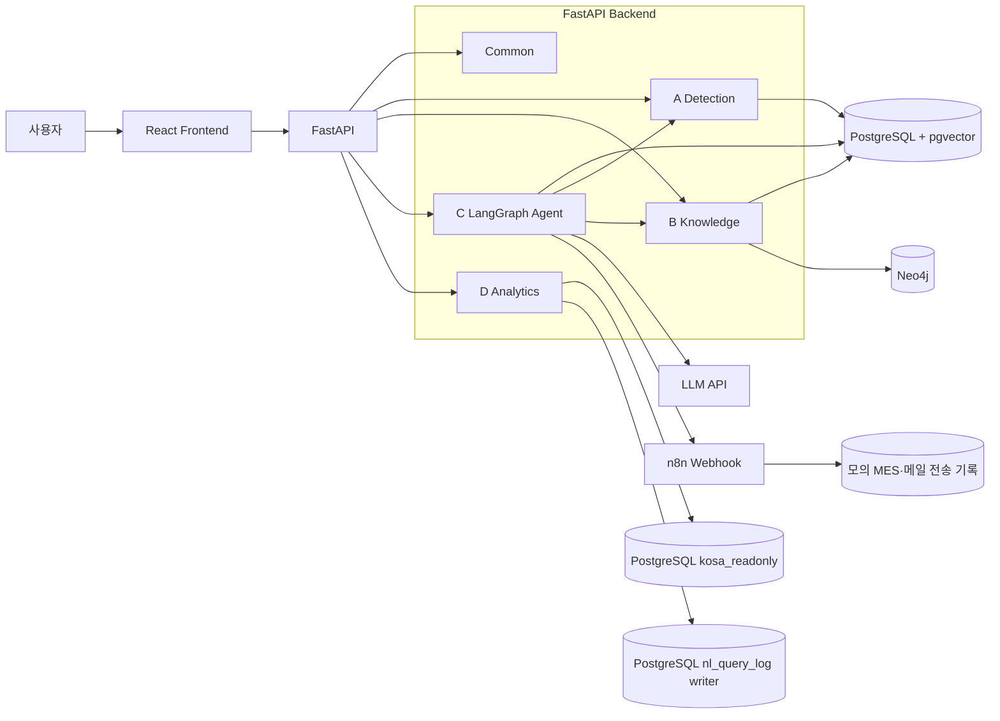
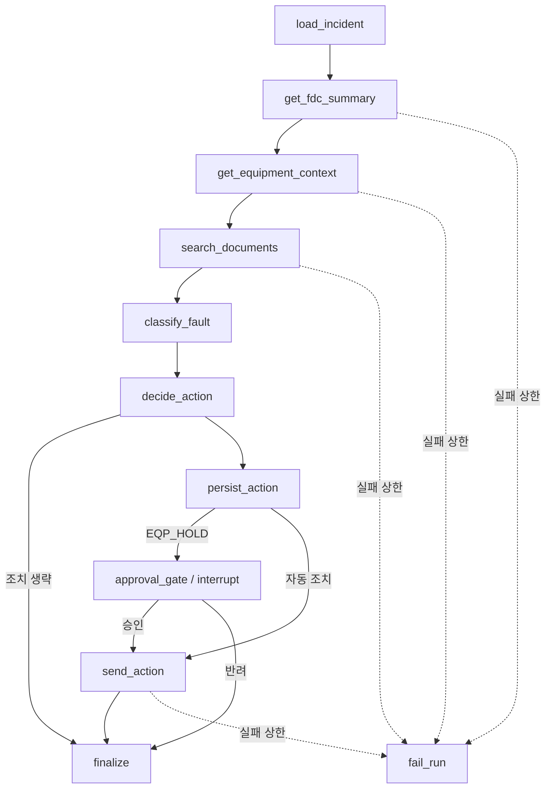
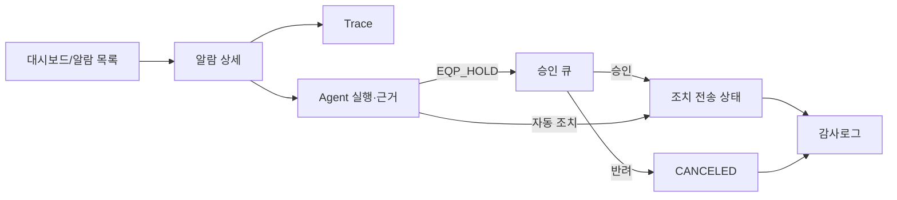

# LangGraph 기반 반도체 FDC 이상감지 에이전트 시스템 설계서

> 문서 버전: v1.2 (최종)  
> 작성일: 2026-08-05  
> 기준 문서: `요구사항정의서_v1_8_최종.md`, `FDC_프로젝트_역할분담_v9.5(최종).md`  
> 목표 제출일: 2026-08-14  
> 저장소: `bistel-final` 모노레포

---

## 개정 이력

| 버전 | 일자 | 내용 |
|---|---|---|
| v0.1 | 2026-08-04 | 요구사항 v1.7 기반 아키텍처·도메인·Agent·데이터·배포 설계 초안 |
| v1.0 | 2026-08-05 | Text2SQL 단일 모델·기록 범위 명시, SENDING·승인 재개 복구, API DTO 타입·nullability, IsolationForest 분할·파라미터, 모델·n8n 배포 산출물, 전체 이미지 태그·digest 확정 |
| v1.1 | 2026-08-05 | 멘토 자료·수행계획서·배포패키지 실물 교차검토 반영: R01/R02·대시보드 산식, Knowledge 기반 검증·임베딩 provenance, Tool 5종 계약·7화면 흐름, Agent 실행·승인·전송 복구, Text2SQL 이중 DB pool, 평가/E2E DB 분리, fresh Compose 초기화·KOSA LLM·Nginx reverse proxy, readiness·추적성 정합화 |
| v1.2 | 2026-08-05 | 운영 Analytics와 평가 DB·Compose 환경 주입 분리, nullable incident key의 NOT NULL 보강, 반복 LOT·정상 복귀 판정 DTO·양성/음성 fixture, Tool 8회 단계별 예산·영속 시도 복원·전송 예약, 공용 서버 최소권한 role 4종·기본 자격증명 전환 절차, `audit_log` append-only DB 권한, Backend/n8n `request_hash` 신뢰 경계, Agent Tool 4종+독립 Analytics Tool 1종의 변경 사유 반영. 후속 정합 보정 3건: 운영·평가 DB의 `action_history` 스키마 차이에 따른 allowlist 컬럼 캐시·스키마 컨텍스트 pool별 분리(9.3·9.5), Agent E2E 초기화 대상의 `nl_query_log` 표기 통일(14.1), 2.1 목표 트리를 실제 저장소 구조로 갱신(`docs/specifications/`·`docs/ai-context/`·`CLAUDE.md`·`AGENTS.md`·`backend/pytest.ini`) |

---

## 0. 문서 목적과 적용 원칙

이 문서는 요구사항정의서에서 확정한 사용자 동작과 수용 기준을 변경하지 않고, 구현에 필요한 구조·데이터 연결·상태 전이·트랜잭션·API DTO를 구체화한다.

문서 간 우선순위는 다음과 같다.

1. 기능 동작과 수용 기준: `요구사항정의서_v1_8_최종.md`
2. 역할과 Tool 소유권: `FDC_프로젝트_역할분담_v9.5(최종).md`
3. 구현 구조와 기술적 결정: 본 시스템 설계서

설계 과정에서 기능 범위나 결과를 바꿔야 하면 본 문서만 수정하지 않고 요구사항정의서를 먼저 개정한다. 반대로 라이브러리 사용법, 저장 위치, 잠금 방식처럼 사용자 관점 결과를 바꾸지 않는 결정은 본 문서에서 확정한다.

### 0.1 설계 상태 표기

| 표기 | 의미 |
|---|---|
| 확정 | 바로 구현·테스트 기준으로 사용 |
| 구현 시 검증 | 설계는 확정하되 실제 데이터·라이브러리 동작을 테스트로 확인 |
| 멘토 확인 | 공용 DB 변경 또는 제공 환경과 관련되어 실행 전에 확인 필요 |

### 0.2 범위 경계

- 현재 개발 단계: 멘토 배포패키지의 PostgreSQL·Neo4j·n8n을 공용 서버에서 실행하고, FastAPI와 React는 각 개발 PC에서 실행한다.
- 최종 통합 단계: 저장소 루트의 `docker-compose.yml`에서 PostgreSQL·Neo4j·n8n·FastAPI·React를 통합 실행한다.
- 배포패키지 `01_schema.sql`, 원본 CSV, Neo4j 원본 관계 파일, 최초 문서 적재 자료는 수정하지 않는다.
- 추가 테이블·컬럼·인덱스는 저장소의 별도 마이그레이션으로만 관리하며 공용 DB 적용 전에 팀 공유와 멘토 확인을 거친다.

### 0.3 UI 전환 결정 기록(ADR-001)

멘토 원안과 수행계획서는 Streamlit 7화면을 기본 범위로 두고 React 풀스택을 확장 범위로 분류한다. 그러나 **2026-07-31 멘토링에서 FastAPI+React 전환을 초기 필수 범위로 확정**했으므로, 본 설계는 원안의 도메인 기능과 7화면 구성을 유지하면서 UI·API 구현 방식만 FastAPI+React로 대체한다. 이 결정은 사용자 인증·클라우드 배포·실제 MES/메일 연동까지 범위를 넓히는 근거가 아니며, 기존 7화면은 12장의 React 라우트에 1:1로 대응한다.

---

## 1. 시스템 아키텍처

### 1.1 논리 구성



### 1.2 설계 원칙

- 도메인별 `Router → Service → Repository` 계층을 유지한다.
- SQL·Cypher는 Repository에서만 실행하고 Router에서 DB에 직접 접근하지 않는다.
- 조치 결정, 승인 게이트, SQL 안전성은 규칙 코드로 처리하고 LLM에 맡기지 않는다.
- LLM은 이상 유형 분류·원인 설명·분석 계획처럼 확률적 판단이 허용되는 영역에만 사용한다.
- Agent가 호출하는 A·B·C Tool은 고정된 `{ok, ..., reason}` 계약을 사용한다.
- 같은 로직을 REST API와 Tool에서 공유하되 오류 표현은 분리한다.
  - Tool: `{ok:false, reason}`
  - REST: HTTP 상태코드와 공통 오류 본문
- 감사로그는 append-only이며 애플리케이션에 수정·삭제 API를 만들지 않는다.

### 1.3 현재 개발 구성과 최종 배포 구성

| 구분 | 현재 개발 | 최종 통합 |
|---|---|---|
| PostgreSQL·Neo4j·n8n | 멘토 Compose가 공용 서버에서 실행 | 루트 Compose 서비스로 포함 |
| FastAPI | 개발 PC에서 Uvicorn 실행 | Backend 이미지로 실행 |
| React | 개발 PC에서 Vite 실행 | 정적 빌드 후 Nginx 서비스로 실행 |
| 환경변수 | 저장소 루트 `.env` | 루트 `.env`는 Compose 보간 원본으로만 사용하고 서비스별 `environment` allowlist로 필요한 키만 주입 |
| 접속 주소 | 공용 서버 IP·외부 포트 | 컨테이너 내부 서비스명 사용 |

현재 개발 단계에서는 공용 PostgreSQL의 기존 기준·생산·문서 데이터를 재적재하거나 수정하지 않고 읽기 전용으로 검증한다. 팀·멘토 승인 후 별도 migration으로 추가한 Agent·승인·감사·전송 runtime table에는 최소권한 애플리케이션 쓰기를 허용한다. 최종 격리 Compose에서는 한 PostgreSQL 서비스 안에 `kosa_agent`와 `kosa_text2sql` 두 데이터베이스를 만든다. `kosa_agent`는 Agent·승인·감사와 **운영 자연어 질의**가 함께 보는 최신 상태이고, `kosa_text2sql`은 골드 평가 재현을 위해 배포 초기 상태를 보존하는 evaluation 전용 DB다. 연결·권한은 14.1에서 분리한다.

---

## 2. 모노레포 및 Backend 계층 설계

### 2.1 목표 디렉터리

```text
bistel-final/
├── .env.example
├── .nvmrc
├── docker-compose.yml                 # 최종 통합 단계에 추가
├── docker-compose.test.yml            # 격리 DB·n8n stub 장애 주입
├── README.md
├── CLAUDE.md                          # Claude Code 진입점 (얇은 포인터)
├── AGENTS.md                          # Codex 진입점 (CLAUDE.md와 동일 내용)
├── backend/
│   ├── Dockerfile
│   ├── requirements.txt
│   ├── pytest.ini                     # 기본 실행에서 E2E 제외 (-m "not e2e")
│   ├── migrations/
│   │   └── 001_agent_runtime.sql
│   ├── scripts/
│   │   ├── bootstrap_environment.py
│   │   ├── init_checkpoint.py
│   │   ├── prefetch_embedding_model.py
│   │   ├── recover_stale_runs.py
│   │   ├── recover_stale_sending.py
│   │   ├── resume_approved_runs.py
│   │   ├── configure_public_db_roles.py
│   │   ├── reset_agent_e2e_db.py
│   │   ├── run_pending_incidents.py
│   │   ├── evaluate_text2sql.py
│   │   ├── verify_detection_rules.py
│   │   ├── verify_knowledge_base.py
│   │   ├── verify_migrations.py
│   │   ├── verify_n8n_ready.py
│   │   ├── verify_public_credentials.py
│   │   ├── verify_source_data.py
│   │   └── train_anomaly_model.py
│   ├── artifacts/
│   │   ├── isolation_forest.joblib
│   │   ├── model_manifest.json
│   │   ├── embedding_model_manifest.json
│   │   └── knowledge_corpus_manifest.json
│   ├── model-cache/                   # Git 제외, 사전 다운로드한 bge-m3
│   ├── app/
│   │   ├── main.py
│   │   ├── common/
│   │   │   ├── config.py
│   │   │   ├── db.py
│   │   │   ├── tool_contracts.py
│   │   │   ├── neo4j.py
│   │   │   ├── exceptions.py
│   │   │   ├── audit.py
│   │   │   └── ids.py
│   │   ├── detection/
│   │   ├── knowledge/
│   │   ├── agent/
│   │   └── analytics/
│   └── tests/
│       ├── unit/
│       ├── contract/
│       ├── fixtures/
│       │   └── expected_actions.json
│       ├── integration/
│       └── e2e/
├── frontend/
│   ├── Dockerfile
│   ├── package.json
│   ├── package-lock.json
│   └── src/
│       ├── app/
│       ├── features/
│       └── shared/
├── infra/
│   ├── bootstrap/
│   │   ├── README.md
│   │   ├── source-data-manifest.json
│   │   ├── verify_source_hashes.py
│   │   └── reset_agent_e2e.sql
│   ├── nginx/
│   │   └── default.conf
│   └── n8n/
│       ├── README.md
│       └── workflows/
│           └── equipment-alert.json
└── docs/
    ├── specifications/                # 원본 사양 3종
    │   ├── 요구사항정의서_v1_8_최종.md
    │   ├── 시스템설계서_v1_2_최종.md
    │   └── FDC_프로젝트_역할분담_v9.5(최종).md
    ├── ai-context/                    # AI 코딩 도구·팀원 공용 요약
    │   ├── README.md                  # 라우팅 표·문서 우선순위·동기화 절차
    │   ├── 01-project-rules.md        # 강제 규칙 단일 출처
    │   ├── 02-domain-rules.md         # 도메인 규칙과 불변 수치
    │   ├── 03-database-rules.md
    │   ├── 04-api-tool-contracts.md
    │   ├── 05-agent-workflow.md
    │   ├── 06-frontend-guide.md
    │   ├── 07-testing-guide.md
    │   ├── PROMPT_TEMPLATE.md
    │   └── tasks/
    │       ├── A-detection.md
    │       ├── B-knowledge.md
    │       ├── C-agent.md
    │       └── D-analytics.md
    ├── development-guide.md           # Git·PR·테스트 실행 흐름
    ├── evaluation/                    # 평가 artifact (<run_id>.json|csv)
    │   ├── detection/
    │   ├── knowledge/
    │   ├── agent/
    │   └── analytics/
    ├── ops/
    │   └── db-role-transition/
    └── troubleshooting/
```

현재 스캐폴딩의 도메인 폴더명(`detection`, `knowledge`, `agent`, `analytics`)은 유지한다. 설계서 승인 후 필요한 공통 파일과 테스트 하위 폴더만 추가한다.

원본 사양 3종은 `docs/requirements/`·`docs/design/`으로 나누지 않고 `docs/specifications/` 하나로 관리한다. 역할분담을 포함한 세 문서가 같은 우선순위 체계 안에 있고, AI 작업 문서가 단일 경로로 참조하기 때문이다. 제출용 사본은 저장소 밖에서 별도 공유한다.

`docs/ai-context/`는 세 원본의 요약이며 원본을 대체하지 않는다. 요구사항 번호·상태 전이·임계값을 새로 해석하지 않고 원본 절 번호를 인용하며, 각 문서 상단에 기준 버전을 기록해 동기화 상태를 드러낸다. 문서 우선순위는 요구사항정의서 → 시스템설계서 → 역할분담 → AI 작업 문서 → 코드 순으로 고정한다.

저장소 루트의 `CLAUDE.md`(Claude Code)와 `AGENTS.md`(Codex)는 `docs/ai-context/`를 가리키는 얇은 포인터이며 내용이 동일해야 한다. 규칙 본문을 두 파일에 복제하지 않는다.

`evaluation/`·`ops/`·`troubleshooting/`은 해당 산출물이 실제로 생성되는 시점에 만든다. Git은 빈 디렉터리를 추적하지 않는다.

### 2.2 Backend 계층 책임

| 계층 | 책임 | 금지 사항 |
|---|---|---|
| Router | HTTP 입력 검증, Service 호출, 상태코드 변환 | SQL·Cypher 직접 실행, 업무 규칙 구현 |
| Schema | 요청·응답 Pydantic 모델 | DB 세션 접근 |
| Service | 업무 흐름, 트랜잭션 경계, 도메인 조합 | 문자열 SQL 직접 작성 |
| Repository | PostgreSQL·Neo4j 조회·저장 | HTTP 응답 생성, LLM 호출 |
| Tool | Service를 Agent 계약으로 감싸기 | DB 규칙 중복 구현 |
| Model/Rules | IsolationForest, 규칙 판정, `decide_action` | HTTP·DB 상태 변경 |

`common/db.py`는 운영용 `AppSessionFactory`, `Text2SqlRuntimeReadonlySessionFactory`, `RuntimeQueryLogSessionFactory`를 서로 다른 타입과 dependency로 제공한다. 평가 profile은 별도 `Text2SqlEvaluationReadonlySessionFactory`, `EvaluationQueryLogSessionFactory`를 생성한다. D의 generated SQL executor는 실행 목적에 맞는 readonly dependency만 생성자에서 받을 수 있고 QueryLogRepository는 같은 목적의 고정 INSERT dependency만 받는다. 일반 API에서 평가 factory를 import·주입하지 못하게 모듈과 설정을 분리한다.

### 2.3 공통 예외와 REST 오류 계약

```json
{
  "code": "INCIDENT_ALREADY_RUNNING",
  "message": "동일 incident의 실행이 진행 중입니다.",
  "details": {
    "agent_run_id": "RUN-..."
  }
}
```

| 상황 | HTTP |
|---|---:|
| 존재하지 않는 리소스 | 404 |
| 진행 중 incident 수동 재실행, 승인 중복·EXPIRED | 409 |
| 요청 본문·쿼리 형식 오류 | 422 |
| Text2SQL 정책 위반 | 422 |
| 의존성 준비 실패(`/health/ready`) | 503 |
| 기능별 모델·LLM 산출물 미준비 | 503 |
| 예기치 못한 서버 오류 | 500 |

500 응답과 로그에는 비밀번호, 전체 DB URL, API 키, 내부 SQL 원문에 포함된 민감정보를 노출하지 않는다.

---

## 3. 데이터 및 마이그레이션 설계

### 3.1 원본 스키마 보존

`01_schema.sql`은 수정하지 않는다. 신규 런타임 구조는 `backend/migrations/001_agent_runtime.sql`로 관리한다. 공용 DB 적용 순서는 다음과 같다.

1. 팀에 SQL과 영향 범위를 공유한다.
2. 멘토 확인을 받는다.
3. 쓰기 권한 계정으로 적용한다. `kosa_readonly`는 사용하지 않는다.
4. `verify_migrations.py`로 컬럼·인덱스·제약을 검증한다.
5. 적용 결과와 실행 시각을 팀 문서에 기록한다.

Migration runner는 PostgreSQL 세션의 `ON_ERROR_STOP`에 해당하는 fail-fast 설정과 **단일 `BEGIN ... COMMIT` 트랜잭션**을 사용한다. DDL 전에 `agent_run.alarm_id IS NULL` legacy 행, 같은 incident의 활성 run 중복, 같은 incident의 비CANCELED action 중복을 조회하고 하나라도 존재하면 아무 DDL도 적용하지 않고 중단한다. 모든 컬럼·FK·CHECK·인덱스 생성과 backfill, 후검증이 성공한 경우에만 커밋하며 중간 실패를 부분 적용 상태로 남기지 않는다.

### 3.2 신규 연결 테이블과 컬럼

#### 3.2.1 `agent_run_alarm`

incident에 포함된 모든 알람을 실행과 연결한다.

```sql
CREATE TABLE IF NOT EXISTS agent_run_alarm (
    agent_run_id       varchar(20) NOT NULL
                       REFERENCES agent_run(agent_run_id) ON DELETE CASCADE,
    alarm_id           varchar(20) NOT NULL REFERENCES fdc_alarm(alarm_id),
    is_representative  boolean NOT NULL DEFAULT false,
    created_at         timestamp NOT NULL DEFAULT now(),
    PRIMARY KEY (agent_run_id, alarm_id)
);

CREATE INDEX IF NOT EXISTS ix_agent_run_alarm_alarm
    ON agent_run_alarm (alarm_id, agent_run_id);

CREATE UNIQUE INDEX IF NOT EXISTS ux_agent_run_one_representative
    ON agent_run_alarm (agent_run_id)
    WHERE is_representative;
```

`alarm_id` 단독 UNIQUE는 두지 않는다. FAILED 실행의 명시적 수동 재실행은 같은 알람 집합을 새 `agent_run`에 연결할 수 있어야 하기 때문이다. 부분 고유 인덱스로 한 실행에 대표 알람이 최대 1건임을 DB에서도 보장한다. 자동 배치 제외 여부는 해당 incident에 `agent_run_alarm` 이력이 하나라도 있는지로 판정한다.

#### 3.2.2 `approval_request.action_id`

승인 요청과 조치의 연결을 유일하게 만들기 위해 컬럼을 추가한다.

```sql
ALTER TABLE approval_request
    ADD COLUMN IF NOT EXISTS action_id varchar(20);

DO $$
BEGIN
    IF NOT EXISTS (
        SELECT 1
        FROM pg_constraint
        WHERE conname = 'fk_approval_request_action'
          AND conrelid = 'public.approval_request'::regclass
    ) THEN
        ALTER TABLE public.approval_request
            ADD CONSTRAINT fk_approval_request_action
            FOREIGN KEY (action_id) REFERENCES public.action_history(action_id);
    END IF;
END $$;

CREATE UNIQUE INDEX IF NOT EXISTS ux_approval_request_action
    ON approval_request (action_id)
    WHERE action_id IS NOT NULL;
```

승인 조회·결정은 `lot_id`나 `agent_run_id`만으로 조치를 추측하지 않고 `action_id`로 직접 연결한다.

Migration 사전검사는 위 신규 table·column·constraint 이름이 일부만 존재하는 과거 부분 적용 상태도 탐지한다. 정의가 본 계약과 정확히 같지 않으면 자동 보정하지 않고 트랜잭션 시작 전에 중단하여 팀이 원인을 확인하게 한다.

#### 3.2.3 전송 시작 시각·시도 횟수

원본 `action_history`에는 SENDING 진입 시각이 없어 고착 시간을 계산할 수 없다. 별도 마이그레이션으로 다음 컬럼을 추가한다.

```sql
ALTER TABLE action_history
    ADD COLUMN IF NOT EXISTS send_started_at timestamp,
    ADD COLUMN IF NOT EXISTS send_attempt_count integer NOT NULL DEFAULT 0;
```

- `WAITING|FAILED → SENDING`: `send_started_at=now()`, `send_attempt_count=send_attempt_count+1`
- `SENDING → SENT|FAILED`: `send_started_at`은 마지막 시도 감사 근거로 유지
- 고착 판정: `send_status='SENDING' AND send_started_at <= now() - make_interval(secs => :stale_sec)`
- 기존 SENDING 행에 `send_started_at IS NULL`이면 자동 재전송하지 않고 운영 확인 대상으로 반환한다.

#### 3.2.4 incident별 유효 조치 고유 인덱스

아래 인덱스 SQL은 설명상 이 절에 두지만 실제 `001_agent_runtime.sql`에서는 3.2.6의 incident key backfill·NOT NULL 전환이 성공한 **이후** 실행한다.

```sql
CREATE UNIQUE INDEX IF NOT EXISTS ux_action_incident_active
    ON action_history (lot_id, chamber_id)
    WHERE send_status IS DISTINCT FROM 'CANCELED';
```

`send_status`가 NULL인 과거·비정상 행도 유효 조치로 간주해야 하므로 `<> 'CANCELED'`가 아니라 `IS DISTINCT FROM`을 사용한다. 반려되어 CANCELED인 조치는 유효 조치 불변식에서 제외한다.

#### 3.2.5 n8n 모의 전송 멱등 기록

```sql
CREATE TABLE IF NOT EXISTS action_delivery (
    action_id       varchar(20) PRIMARY KEY
                    REFERENCES action_history(action_id),
    send_channel    varchar(20) NOT NULL,
    request_hash    varchar(64) NOT NULL,
    delivered_at    timestamp NOT NULL DEFAULT now(),
    result_json     jsonb
);
```

이 행 자체가 초기 범위의 모의 MES·메일 downstream 효과다. 실제 외부 메일·MES 호출은 하지 않는다. n8n은 `action_id`로 `INSERT ... ON CONFLICT DO NOTHING`을 수행하며, 이미 행이 있으면 모의 전송을 다시 실행하지 않고 기존 결과를 반환한다. **Backend `send_action`이 State의 중간값을 신뢰하지 않고 저장된 `action_history`를 다시 조회하여** downstream 효과 필드인 `action_id`·`lot_id`·`equipment_id`·`chamber_id`·`action_code`·`send_channel`·`reason`을 확정하고 `request_hash`를 계산한다. 이 효과 필드는 action 생성 후 변경하지 않고 승인·전송 상태와 승인자·시각만 갱신한다. n8n은 `action_history` 조회 권한을 갖지 않으며, `X-Webhook-Secret` 인증을 통과한 요청의 같은 효과 필드를 독립적으로 canonicalize하여 hash를 재계산한 뒤 전달받은 `request_hash`와 일치할 때만 `action_delivery`를 생성한다. 불일치 시 어떤 downstream 효과도 만들지 않고 409 `IDEMPOTENCY_CONFLICT`를 반환한다. 모든 문자열을 Unicode NFC로 정규화하고, key 오름차순·공백 없음·UTF-8 한글 원문 유지(`ensure_ascii=false`)인 canonical JSON으로 직렬화한 뒤 SHA-256을 계산한다. Python은 `json.dumps(..., sort_keys=True, separators=(',', ':'), ensure_ascii=False)`와 동등한 결과를, n8n JavaScript는 같은 key 정렬·NFC·UTF-8 규칙을 사용한다. 한글 `reason`을 포함한 golden payload/hash fixture로 두 구현의 byte sequence와 digest가 같음을 계약 테스트한다. 수동 재실행에서 같은 action_id를 다른 run이 재사용할 수 있으므로 추적용 `agent_run_id`는 payload에는 포함하되 hash에서는 제외한다. 같은 action_id의 재요청 hash가 기존 값과 다르면 재전송하지 않고 `IDEMPOTENCY_CONFLICT` 오류를 반환한다.

#### 3.2.6 incident key NOT NULL·원 요청 알람·심각도 보존

`agent_run.alarm_id`는 incident 대표 알람으로 사용하므로 수동 실행에서 사용자가 전달한 비대표 알람을 별도로 보존해야 한다.

```sql
UPDATE agent_run AS ar
SET lot_id = COALESCE(ar.lot_id, fa.lot_id),
    chamber_id = COALESCE(ar.chamber_id, fa.chamber_id)
FROM fdc_alarm AS fa
WHERE ar.alarm_id = fa.alarm_id
  AND (ar.lot_id IS NULL OR ar.chamber_id IS NULL);

UPDATE action_history AS ah
SET chamber_id = lh.chamber_id
FROM lot_history AS lh
WHERE ah.trigger_alarm_lot_hist_id = lh.lot_hist_id
  AND ah.chamber_id IS NULL;

DO $$
BEGIN
    IF EXISTS (
        SELECT 1 FROM public.agent_run
        WHERE lot_id IS NULL OR chamber_id IS NULL
    ) THEN
        RAISE EXCEPTION 'agent_run incident key backfill failed';
    END IF;
    IF EXISTS (
        SELECT 1 FROM public.action_history
        WHERE chamber_id IS NULL
    ) THEN
        RAISE EXCEPTION 'action_history chamber_id backfill failed';
    END IF;
    IF EXISTS (
        SELECT 1
        FROM public.agent_run AS ar
        JOIN public.fdc_alarm AS fa ON fa.alarm_id = ar.alarm_id
        WHERE ar.lot_id IS DISTINCT FROM fa.lot_id
           OR ar.chamber_id IS DISTINCT FROM fa.chamber_id
    ) THEN
        RAISE EXCEPTION 'agent_run incident key conflicts with representative alarm';
    END IF;
    IF EXISTS (
        SELECT 1
        FROM public.action_history AS ah
        JOIN public.lot_history AS lh
          ON lh.lot_hist_id = ah.trigger_alarm_lot_hist_id
        WHERE ah.lot_id IS DISTINCT FROM lh.lot_id
           OR ah.chamber_id IS DISTINCT FROM lh.chamber_id
    ) THEN
        RAISE EXCEPTION 'action_history incident key conflicts with trigger lot history';
    END IF;
    IF EXISTS (
        SELECT 1
        FROM public.agent_run
        WHERE status IN ('RUNNING','WAITING_APPROVAL')
        GROUP BY lot_id, chamber_id
        HAVING COUNT(*) > 1
    ) THEN
        RAISE EXCEPTION 'duplicate active agent_run incident after backfill';
    END IF;
    IF EXISTS (
        SELECT 1
        FROM public.action_history
        WHERE send_status IS DISTINCT FROM 'CANCELED'
        GROUP BY lot_id, chamber_id
        HAVING COUNT(*) > 1
    ) THEN
        RAISE EXCEPTION 'duplicate active action incident after backfill';
    END IF;
END $$;

ALTER TABLE agent_run
    ALTER COLUMN lot_id SET NOT NULL,
    ALTER COLUMN chamber_id SET NOT NULL;

ALTER TABLE action_history
    ALTER COLUMN chamber_id SET NOT NULL;

ALTER TABLE agent_run
    ADD COLUMN IF NOT EXISTS requested_alarm_id varchar(20),
    ADD COLUMN IF NOT EXISTS severity varchar(10),
    ADD COLUMN IF NOT EXISTS last_active_at timestamp NOT NULL DEFAULT now();

DO $$
BEGIN
    IF NOT EXISTS (
        SELECT 1
        FROM pg_constraint
        WHERE conname = 'fk_agent_run_requested_alarm'
          AND conrelid = 'public.agent_run'::regclass
    ) THEN
        ALTER TABLE public.agent_run
            ADD CONSTRAINT fk_agent_run_requested_alarm
            FOREIGN KEY (requested_alarm_id) REFERENCES public.fdc_alarm(alarm_id);
    END IF;

    IF NOT EXISTS (
        SELECT 1
        FROM pg_constraint
        WHERE conname = 'ck_agent_run_severity'
          AND conrelid = 'public.agent_run'::regclass
    ) THEN
        ALTER TABLE public.agent_run
            ADD CONSTRAINT ck_agent_run_severity
            CHECK (severity IS NULL OR severity IN ('LOW','MEDIUM','HIGH'));
    END IF;
END $$;

UPDATE agent_run
SET requested_alarm_id = alarm_id
WHERE requested_alarm_id IS NULL
  AND alarm_id IS NOT NULL;

DO $$
BEGIN
    IF EXISTS (SELECT 1 FROM public.agent_run WHERE requested_alarm_id IS NULL) THEN
        RAISE EXCEPTION 'requested_alarm_id backfill failed: legacy alarm_id is NULL';
    END IF;
END $$;

ALTER TABLE agent_run
    ALTER COLUMN requested_alarm_id SET NOT NULL;
```

- 수동 실행: API로 받은 `alarm_id`
- 자동 배치: 대표 `alarm_id`
- `AgentRunDetailResponse.requested_alarm_id`: 위 컬럼에서 반환
- `agent_run.severity`: `decide_action`의 규칙 결과를 저장하며 LLM 출력으로 직접 채우지 않음
- `agent_run.last_active_at`: run 생성·각 Node 진입/종료·Tool 시도 전후·승인 재개 시 현재 시각으로 갱신하며 7.5의 stale run 판정에 사용

기존 행은 `requested_alarm_id=alarm_id`로 backfill한 후 NOT NULL 불변식을 적용한다. legacy `agent_run.alarm_id` 자체가 NULL인 행이 발견되면 임의 값을 만들지 않고 migration을 중단해 팀 확인 후 정리한다. 원본 `01_schema.sql`은 수정하지 않고 동일한 `001_agent_runtime.sql`에서 처리한다.

원본 스키마에서 `agent_run.lot_id`, `agent_run.chamber_id`, `action_history.chamber_id`는 nullable이다. PostgreSQL UNIQUE 인덱스는 기본적으로 NULL을 서로 같은 값으로 보지 않으므로 애플리케이션의 “항상 채운다” 규칙만으로는 incident 중복을 막을 수 없다. 위 결정론적 backfill과 `SET NOT NULL`이 성공한 뒤에만 3.2.4·3.2.8의 부분 고유 인덱스를 생성한다. `verify_migrations.py`는 세 컬럼 NULL 0건, 대표 알람·trigger lot 이력과 incident key 불일치 0건, 활성 incident 중복 0건을 모두 검증한다.

#### 3.2.7 Tool 호출 순서 제약

```sql
CREATE UNIQUE INDEX IF NOT EXISTS ux_agent_tool_call_run_seq
    ON agent_tool_call (agent_run_id, call_seq);
```

`call_seq`는 run 안에서 1부터 단조 증가하며 재시도를 포함한 실제 호출마다 새 번호를 사용한다. 동시 callback이 같은 순서를 기록하면 두 번째 INSERT가 실패하도록 DB에서도 순서를 보호한다.

#### 3.2.8 incident 활성 실행 고유 제약

```sql
CREATE UNIQUE INDEX IF NOT EXISTS ux_agent_run_incident_active
    ON agent_run (lot_id, chamber_id)
    WHERE status IN ('RUNNING','WAITING_APPROVAL');
```

3.2.6에서 `lot_id`와 `chamber_id`를 NOT NULL로 강제한 뒤 이 인덱스를 생성한다. advisory lock과 트랜잭션 재조회 뒤에도 경쟁이 남으면 이 인덱스가 같은 incident의 활성 run 2건 생성을 차단한다. FAILED 수동 재실행은 기존 run이 터미널 상태이므로 새 run을 만들 수 있고, COMPLETED 재실행은 4.2의 서비스 정책으로 409 처리한다.

### 3.3 ID 생성 규칙

원본 varchar 길이를 바꾸지 않는다.

| 대상 | 형식 | 최대 길이 |
|---|---|---:|
| agent_run_id | `RUN-` + UUID 앞 16 hex | 20 |
| action_id | `ACT-` + UUID 앞 16 hex | 20 |
| approval_id | `APR-` + UUID 앞 16 hex | 20 |
| tool_call_id | `TOOL-` + UUID 앞 24 hex | 29 |
| thread_id | UUID 문자열 | 36 |

생성은 `INSERT ... ON CONFLICT DO NOTHING RETURNING <id>`로 수행하고 반환 행이 없을 때 새 UUID를 만들어 제한 횟수 내 다시 시도한다. PostgreSQL unique violation을 그대로 발생시켜 트랜잭션 전체를 aborted 상태로 만들지 않는다. 대안으로 savepoint를 사용할 수 있으나, 예외를 잡기만 한 채 같은 트랜잭션에서 재INSERT하는 구현은 금지한다. 배포 fixture의 `ACT-0001` 형식과 신규 형식이 함께 존재해도 문자열 PK가 충돌하지 않는다.

### 3.4 시간 처리

원본 테이블이 `timestamp without time zone`이므로 DB에는 Asia/Seoul 현지 시각을 naive timestamp로 저장한다. 애플리케이션에서는 `ZoneInfo("Asia/Seoul")`로 생성·해석하고 API에서는 `+09:00`이 포함된 ISO 8601 문자열로 반환한다.

- 정렬 기준은 DB timestamp와 결정론적 ID 보조 정렬을 함께 사용한다.
- 경과시간은 시스템 시각이 아니라 `time.perf_counter()`로 측정한다.
- 컨테이너와 애플리케이션의 `TZ`는 모두 `Asia/Seoul`로 고정한다.

---

## 4. incident 집계·동시성·배치 설계

### 4.1 incident와 대표 알람

- incident key: `(lot_id, chamber_id)`
- 포함 알람: 해당 key의 `fdc_alarm` 전체
- 대표 알람: `occurred_at ASC, alarm_id ASC` 첫 행
- `agent_run.alarm_id`: 대표 알람의 `alarm_id`
- `action_history.trigger_alarm_lot_hist_id`: 대표 알람의 `lot_hist_id`
- 전체 `alarm_ids`: `agent_run_alarm`과 `agent_run.evidence_json.incident.alarm_ids`에 모두 보존

대표 규칙은 배포 expected fixture ACT-0001~0010의 `trigger_alarm_lot_hist_id` 10건과 일치한다. R03 알람을 무조건 대표로 선택하지 않는다.

### 4.2 동시 실행 방지

PostgreSQL transaction advisory lock과 부분 고유 인덱스를 함께 사용한다.

잠금 순서는 모든 실행에서 다음과 같이 고정한다.

1. `(lot_id, chamber_id)`를 PostgreSQL에서 `hashtextextended(:lot_id || E'\\x1f' || :chamber_id, 0)`으로 64-bit 키로 변환한다.
2. `SELECT pg_advisory_xact_lock(hashtextextended(:lot_id || E'\\x1f' || :chamber_id, 0))`로 잠금을 획득한다.
3. 같은 incident의 모든 과거 `agent_run_alarm` 이력과 `started_at DESC, agent_run_id DESC` 기준 최신 `agent_run.status`를 다시 조회한다.
4. 자동 배치는 이력이 하나라도 있으면 RUNNING·WAITING_APPROVAL·COMPLETED·FAILED 상태와 무관하게 건너뛴다.
5. 수동 실행은 아래 상태표로 판정한다.

| 최신 실행 | 수동 실행 처리 |
|---|---|
| 이력 없음 | 신규 실행 허용 |
| RUNNING·WAITING_APPROVAL | 409 `INCIDENT_ALREADY_RUNNING` |
| COMPLETED | 409 `INCIDENT_ALREADY_PROCESSED` |
| FAILED | 명시적 수동 재실행 허용 |

6. `agent_run`과 모든 `agent_run_alarm` 행을 같은 트랜잭션에서 생성한다. 이때 실제 호출 예정인 설정 모델명을 `agent_run.llm_model`에 먼저 기록해 LLM 호출 전 실패에도 모델명이 남게 한다.
7. 수동 실행은 `agent_run.requested_alarm_id`에 요청 알람을, 자동 배치는 대표 알람을 기록한다.
8. 트랜잭션 커밋으로 advisory lock을 해제한다.

조치 생성 시에도 같은 incident advisory lock을 먼저 얻고 유효 `action_history`를 재조회한다. 인덱스 위반은 동시성 경쟁의 최종 방어선이며 409 또는 기존 action 재사용으로 변환한다.

### 4.3 자동 배치 2단계 계산

배치 처리 순서와 무관하게 연쇄 근거를 제공하기 위해 다음 방식을 확정한다.

#### 1단계: 전체 incident 계획 계산

1. 자동 처리 이력이 없는 알람을 모두 조회한다.
2. `(lot_id, chamber_id)`로 그룹화한다.
3. 각 그룹의 기본 조치와 반복 LOT·계측·하류 전파 조건을 계산한다.
4. 결과를 `BatchIncidentPlan` 메모리 객체로 만든다.
5. 상류·하류 incident를 lot·공정 관계로 연결한다.

#### 2단계: Agent 실행과 근거 결합

1. 실제 실행 순서와 관계없이 1단계 전체 계획을 각 Agent State에 제공한다.
2. ALM-0031 분석은 상류 PHOTO incident의 계획된 LOT_HOLD를 근거로 사용한다.
3. 근거에 `source="batch_plan"`과 상류 incident key를 기록한다.
4. 실제 action_history가 이미 생성되어 있으면 해당 action_id도 함께 기록한다.
5. 최종 계획과 사용한 상류 근거를 `agent_run.evidence_json`에 저장한다.

이 구조로 전체 51건의 incident 처리 순서를 섞어도 ALM-0031 분석 결과가 동일하게 유지된다. 수동 단독 E2E에서는 요구사항에 따라 PHOTO incident를 먼저 실행하여 실제 선행 조치를 만든 뒤 ALM-0031을 실행한다.

### 4.4 자동 배치 실행 위치

초기 범위에서는 외부 스케줄러·상시 polling을 추가하지 않는다. `backend/scripts/run_pending_incidents.py --once` 관리 명령이 C의 `AgentBatchService.run_pending_incidents()`를 명시적으로 1회 호출한다. 공개 REST API와 React에는 전체 배치 엔드포인트·주기 실행 버튼을 추가하지 않는다. 추후 스케줄링은 범위 확장으로 별도 합의한다.

---

## 5. A Detection 상세 설계

### 5.1 요약 재계산

`fdc_trace`를 `(lot_hist_id, sensor_id, recipe_step_no)`로 그룹화한다.

- `value_mean`: 평균
- `value_std`: 표본표준편차 `ddof=1`
- `value_min`, `value_max`
- `point_cnt`
- `ooc_point_cnt`: LCL·UCL 밖이면서 LSL·USL 안인 점
- `oos_point_cnt`: LSL 미만 또는 USL 초과인 점
- `judgement`: OOS > OOC > IN_CONTROL 우선순위

ET_REFL은 센서 특성에 따라 상한만 판정한다. 숫자형 비교 허용오차는 0.0001이다.

#### 5.1.1 R01·R02 규칙 판정과 51건 비파괴 재현

`RuleDetectionService`는 재계산한 `fdc_summary`를 입력받아 R01·R02를 서로 배타적으로 판정하고, 5.2의 R03 결과를 별도 행으로 결합한다.

| 규칙 | 발행 조건 | `hit_cnt` | `occurred_at` |
|---|---|---:|---|
| R01_OOS | `oos_point_cnt >= 1` | `oos_point_cnt` | `lot_history.track_out_at` |
| R02_OOC | `oos_point_cnt = 0 AND ooc_point_cnt >= 2` | `ooc_point_cnt` | `lot_history.track_out_at` |

`ooc_point_cnt`는 규격한계를 벗어난 OOS 포인트를 제외하고 관리한계만 벗어난 포인트 수다. R01과 R02는 같은 summary 행에 동시에 생성하지 않지만, R01과 R03은 서로 다른 규칙이므로 같은 WAFER·센서·Recipe Step에도 각각 1행씩 생성할 수 있다.

재현 검증은 공용 기준 DB에 알람을 다시 INSERT하지 않는다. `backend/scripts/verify_detection_rules.py`가 메모리 또는 임시 스키마에서 후보 알람을 만들고 다음 canonical key를 원본 fixture와 순서 무관 집합 비교한다.

```text
(lot_hist_id, chamber_id, sensor_id, recipe_step_no, rule_id,
 judgement, hit_cnt, occurred_at)
```

완료 기준은 R01 34건·R02 14건·R03 3건·합계 51건 전부 일치이며, 같은 입력으로 두 번 실행해도 후보 집합이 동일해야 한다. 실제 운영 INSERT를 추가하는 경우에는 별도 마이그레이션으로 canonical key 고유 제약을 먼저 설계하며, 초기 프로젝트에서는 fixture 비교만 수행한다.

### 5.2 R03_CONSEC 결정론적 판정

- 그룹 키: `(chamber_id, sensor_id, recipe_step_no)`
- 정렬: `chamber_wafer_cum ASC, track_in_at ASC, lot_hist_id ASC`
- LOT 경계: 초기화하지 않음
- OOS: 연속 수 증가
- OOS 외 판정: 연속 수 0으로 초기화하고 재무장
- 알람: 연속 수가 `2 → 3`이 되는 시점에 1회만 생성
- 4장 이상 연속: 추가 R03 미생성

초기 구현은 `fdc_summary + lot_history` 전체를 정렬해 매번 결정론적으로 재계산한다. 별도 연속 카운터 테이블은 두지 않는다. 배치 데이터 규모에서 충분하며 상태 유실 문제를 피할 수 있다.

### 5.3 IsolationForest 입력과 단일 anomaly score

WAFER의 센서·RECIPE STEP별 복수 행을 먼저 물리 범위로 정규화하고, WAFER 단위 고정 벡터로 집계한다.

행별 파생값은 다음과 같다. 분모가 0이면 `epsilon=1e-9`를 사용한다.

```text
spec_width      = spec_upper - spec_lower
target_dev      = abs(value_mean - target) / max(spec_width / 2, epsilon)
std_norm        = value_std / max(spec_width, epsilon)
range_norm      = (value_max - value_min) / max(spec_width, epsilon)
ooc_ratio       = ooc_point_cnt / max(point_cnt, 1)
oos_ratio       = oos_point_cnt / max(point_cnt, 1)
```

WAFER당 최종 feature는 다음 11개로 고정한다.

```text
target_dev_mean, target_dev_max,
std_norm_mean, std_norm_max,
range_norm_mean, range_norm_max,
ooc_ratio_mean, ooc_ratio_max,
oos_ratio_mean, oos_ratio_max,
coverage_ratio
```

`coverage_ratio`의 분모는 학습 데이터의 동일 `(model_code, recipe_id)`에서 관측된 `(sensor_id, recipe_step_no)` 개수의 최빈값이다. 누락 행을 0으로 채워 정상처럼 보이게 하지 않고 coverage 저하 자체를 feature로 반영한다. 개별 파생값의 결측치는 동일 학습 그룹 중앙값으로 대체하며 대체값도 모델 artifact에 저장한다.

학습·평가 규칙:

- `lot_id` 단위 Group 분할로 같은 LOT가 양쪽에 섞이지 않게 하며 다음 방식을 고정한다.

```python
GroupShuffleSplit(
    n_splits=1,
    test_size=0.3,
    random_state=42,
)
```

- 위 splitter가 반환한 첫 번째 split의 train index로 학습하고 test index로 평가한다. 표본 수가 달라도 같은 LOT가 학습·평가 양쪽에 들어가면 안 된다.
- `scikit-learn==1.5.2`의 `IsolationForest`를 다음 파라미터로 고정한다.

```python
IsolationForest(
    n_estimators=200,
    max_samples="auto",
    contamination="auto",
    max_features=1.0,
    bootstrap=False,
    n_jobs=-1,
    random_state=42,
)
```

- `lot_history.fault_code`는 분할 후 평가에만 사용하고 feature 생성·Agent 입력에서 제외한다.
- 모델은 전체 학습 표본을 사용하되 정답 라벨은 fit에 사용하지 않는다.
- `decision_function` 방향을 뒤집어 원시 이상도를 만들고, 학습 데이터의 1·99 백분위로 0~1 robust min-max 정규화 후 clip한다. `p1 == p99`이면 분모를 임의 보정하지 않고 해당 모델의 `anomaly_score`를 전부 `0.0`으로 반환하며, manifest와 평가 결과에 `DEGENERATE_SCORE_RANGE` 경고를 기록한다.
- `is_anomaly`는 IsolationForest 자체 `predict()` 결과가 아니라 정규화 점수 `anomaly_score >= ANOMALY_SCORE_THRESHOLD(0.62)`로 판정해 A·C의 축을 통일한다.
- 모델, feature 순서, 중앙값, 백분위, scikit-learn 버전, 학습 시각을 하나의 joblib bundle로 저장한다.
- ML 실행은 `fdc_alarm`을 변경하지 않는다.
- 평가 라벨은 `fault_code != 'NRM'`을 이상으로 두고 Precision·Recall·F1을 산출한다. 각 0.80 이상은 비강제 성능 목표이며 미달 시 데이터 규모·feature·threshold 원인과 개선 계획을 평가 결과에 기록한다.
- 동일 LOT·WAFER의 `metrology.judgement` PASS/FAIL과 anomaly score·판정의 연관성을 2차 보조 지표로 산출하되, 계측 결과를 학습 feature나 런타임 이상 정답으로 사용하지 않는다.
- 설정·분할 LOT·지표·경고는 `docs/evaluation/detection/<run_id>.json|csv`에 저장한다.

### 5.4 `get_fdc_summary` Tool

입력·출력은 요구사항 6.1을 그대로 사용한다. Repository가 요약·센서 한계선·lot_history를 조회하고, ModelService가 정확히 하나의 anomaly score를 반환한다.

- 없는 `lot_hist_id`: `{ok:false, reason:"NOT_FOUND: ..."}`
- 모델 파일 없음·불일치: `{ok:false, reason:"MODEL_NOT_READY: ..."}`
- 호출 예외: Tool 경계에서 잡아 `{ok:false, reason}`으로 변환

### 5.5 대시보드 조회 설계

`DashboardService`가 A의 KPI와 C의 `ApprovalService.count_pending()`을 조합한다. 승인 대기 SQL을 A에 복제하지 않는다.

`reference_date` 결정 순서:

1. date 지정: 해당 날짜 사용
2. date 미지정·area 지정: 해당 AREA 알람의 최신 날짜
3. 둘 다 미지정: 전체 알람의 최신 날짜
4. 데이터 없음: `reference_date=null`, KPI 0 또는 N/A와 빈 목록 반환

KPI Repository 산식은 다음으로 고정한다.

- 알람 수: 조회 기준일·AREA의 `fdc_alarm` 행 수
- OOS/OOC 수: 같은 범위에서 `judgement='OOS'/'OOC'`인 알람 행 수
- 계측 PASS율: `metrology.measured_at`의 조회일과 `metrology.step_id → dim_process_step.area_id`를 적용한 `PASS / (PASS + FAIL) × 100`, 소수 첫째 자리 반올림
- 계측 분모 0: API `null`, React `N/A`
- 승인 대기: 날짜·AREA와 무관한 전체 `approval_request.status='PENDING'` 수
- 최근 알람: 조회 범위에서 `occurred_at DESC, alarm_id DESC` 상위 5건
- 챔버 상태: `CRITICAL=R03_CONSEC 존재`, `ALARM=OOS`, `WARNING=OOC`, `NORMAL=무알람`; 한 챔버에 여러 상태가 있으면 이 순서의 최고 상태

챔버 상태는 `dim_chamber`를 기준으로 LEFT JOIN하여 알람이 없는 챔버도 NORMAL로 반환한다. 배포 기본일 `2026-06-04`의 전체 AREA 기준 회귀 기대값은 알람 6건·OOS 6건·OOC 0건·계측 PASS율 70.0%다.

---

## 6. B Knowledge 상세 설계

### 6.1 Neo4j 조회

`GraphQueryRepository`에서 parameterized Cypher만 사용한다.

- 챔버 조회: Chamber → Equipment·Area·Step, 같은 Equipment의 sibling chamber, UPSTREAM_OF 양방향
- 장비 조회: Equipment → Area·Step·Chamber, upstream·downstream
- 입력 ID는 문자열 parameter로 전달하고 쿼리에 직접 삽입하지 않는다.

`get_equipment_context`는 Neo4j 결과를 정렬된 목록으로 반환해 동일 입력의 JSON 순서를 고정한다. upstream/downstream은 `equipment_id ASC`, sibling은 `chamber_id ASC`로 정렬한다.

배포 `master.cypher`의 Chamber는 `chamber_id/chamber_no`, Equipment는 장비 중심 속성만 직접 보유하므로 REST DTO를 노드 속성 하나에서 그대로 만들지 않는다. Cypher map projection에서 `Chamber-[:PART_OF]->Equipment-[:LOCATED_IN]->Area`, `Equipment-[:PERFORMS]->ProcessStep` 관계를 따라 `equipment_id`, `model_code`, `area_id`, `step_id`를 조합한다. 관계가 없는 선택 필드는 `null`, 필수 식별자가 없으면 데이터 무결성 오류로 처리한다.

### 6.2 임베딩 모델 싱글턴

`EmbeddingModelProvider.get()`에 process-local lazy singleton과 lock을 적용한다.

1. 첫 요청에서만 `EMBEDDING_MODEL_PATH`의 사전 다운로드된 `BAAI/bge-m3` 고정 revision을 로드한다. 런타임 네트워크 다운로드는 하지 않는다.
2. 생성 완료 전 동시 요청은 같은 lock을 기다린다.
3. 이후 요청은 같은 객체를 재사용한다.
4. 테스트에서는 provider dependency를 교체할 수 있게 한다.

### 6.3 문서 검색

배포패키지 `load_documents.py`의 검색 SQL을 서비스 계약에 맞게 감싼다.

- query embedding 1024차원 검증
- cosine distance 오름차순
- `score = 1 - cosine_distance`
- `model_code` 지정 시 `(document.model_code = :model_code OR document.model_code = 'COMMON')`
- top_k 기본 4, 허용 범위 1~10
- 동률 정렬: `score DESC, doc_id ASC, chunk_seq ASC`

`search_documents` Tool은 content와 함께 title·section·score를 반환한다. REST 상세 조회는 document와 chunk 목록을 반환한다.

### 6.4 품질 평가

- 문서 골드셋: 10문항 이상, 기대 문서·절·복수 정답 여부·top_k 기록
- 관계 골드셋: 챔버 4건 + 장비 2건
- 경계 필수: PHO-01-C1 downstream 존재, ETC-01-C1 downstream 없음·upstream 존재
- 완료 기준: Recall@4 0.80 이상, MRR 0.70 이상, 관계 골드 6건 정확도 100%
- 결과: Recall@4, MRR, 관계 정확도와 실패 사례를 `docs/evaluation/knowledge/<run_id>.json|csv`로 저장

### 6.5 기반 데이터·임베딩 provenance 검증

`backend/scripts/verify_knowledge_base.py`는 애플리케이션 기동 전 또는 배포 검증 단계에서 다음을 확인한다.

| 대상 | 완료 기준 |
|---|---|
| Neo4j | 노드 24개, 관계 26개, `UPSTREAM_OF` 양방향 조회 결과 정상 |
| 문서 | document 3건, chunk 39건(ET 13·PHOTO 12·TROUBLE 14) |
| 청크 | 저장 `document_chunk.content`는 loader 원문 기준 120~1,200자이고 `model_code` 또는 COMMON 필터 가능. 임베딩 입력을 만들 때만 제목·절 접두어를 결합 |
| 임베딩 | NULL 0건, 전부 1024차원 |
| smoke query | 멘토 가이드 고정 질문 3종에서 기대 문서·절이 top 4에 포함 |

고정 smoke query는 다음 원문을 그대로 사용한다.

1. `반사파가 올라가면 무슨 문제인가`
2. `포커스가 벗어나면 CD가 어떻게 되나`
3. `장비를 세우려면 승인이 필요한가`

기존 `load_documents.py`는 모델 revision을 기록하지 않는다. 현재 공용 DB는 3/39/1024·고정 질문 결과만 읽기 전용으로 검증하고 기존 벡터의 revision을 알 수 없다는 한계를 기록하며 즉시 변경하지 않는다. **새 volume으로 만드는 최종 Compose DB에서만** 원본 Markdown을 수정하지 않은 채 고정 revision 모델로 39개 청크를 통제 재적재한다. 공용 DB 재적재가 필요하면 백업·팀 공유·멘토 확인을 거쳐 별도 작업으로 수행한다. 적재는 한 트랜잭션에서 기존 문서·청크를 교체하고 실패하면 롤백한다. `backend/artifacts/knowledge_corpus_manifest.json`에는 다음을 기록한다.

- 모델 ID·revision·임베딩 차원
- 원본문서 3건의 SHA-256
- 청킹 기준(`##/###`, 120~1,200자, 제목·절 접두어)
- 문서·청크 개수와 적재 시각

검색 시 사용하는 query 모델 manifest와 corpus manifest의 모델 ID·revision·차원이 다르면 검색을 실행하지 않고 `MODEL_NOT_READY`로 안전 실패한다.

---

## 7. C LangGraph Agent 상세 설계

### 7.1 Agent State

```python
class AgentState(TypedDict):
    agent_run_id: str
    thread_id: str
    requested_alarm_id: str
    representative_alarm_id: str
    alarm_ids: list[str]
    lot_hist_ids: list[str]
    lot_id: str
    chamber_id: str
    equipment_id: str

    representative_fdc_evidence: FdcSummaryToolResult | None
    incident_alarm_evidence: IncidentAlarmEvidence
    equipment_context: EquipmentContextToolResult | None
    document_hits: list[DocumentHit]
    batch_incident_plans: list[BatchIncidentPlan]
    upstream_evidence: list[UpstreamEvidence]

    fault_code: str | None
    cause_summary: str | None
    confidence: float | None
    recommended_action: str | None
    action_reason: str | None
    severity: str | None
    approval_required: bool
    action_id: str | None
    approval_id: str | None
    approval_decision: Literal["APPROVE", "REJECT"] | None

    tool_call_count: int
    retry_counts: dict[str, int]
    active_latency_ms: int
    input_tokens: int | None
    output_tokens: int | None
    errors: list[dict]
```

Checkpoint에 비밀번호·API 키·DB URL은 저장하지 않는다. 전체 alarm_ids는 State와 `agent_run_alarm`에, 설명용 스냅샷은 `evidence_json`에 보존한다. `requested_alarm_id`는 checkpoint에만 의존하지 않고 `agent_run.requested_alarm_id`에도 저장한다.

원본 `agent_run`에는 별도 `failure_stage` 컬럼이 없으므로 본 문서의 `failure_stage=...` 표기는 모두 `agent_run.evidence_json.runtime.failure_stage`와 `evidence_json.runtime.errors[]`에 저장한다는 뜻이다. 동일 값과 사용자에게 노출해도 되는 요약 사유를 `AGENT_RUN_FAILED.after_json`에도 기록하며, 비밀번호·DSN·원문 stack trace는 저장하지 않는다.

### 7.2 Node와 Edge



| Node | 책임 | LLM 사용 |
|---|---|---|
| load_incident | incident 조회, 대표 알람·전체 알람과 고유 OOS/OOC·R03 집계 확정 | 아니오 |
| get_fdc_summary | 대표 `lot_hist_id`의 A Tool 호출·로그 | 아니오 |
| get_equipment_context | B Tool 호출·로그 | 아니오 |
| search_documents | B Tool 호출·로그 | 아니오 |
| classify_fault | FOC·RFM·MFD·TMD 구조화 분류와 설명 | 예 |
| decide_action | 확정 결정표·상향·하향·충돌 우선순위 | 아니오 |
| persist_action | 유효 조치 1건 생성 또는 FAILED action 재사용. 기존 `APPROVED/FAILED` EQP_HOLD와 자동조치 FAILED는 승인 게이트를 우회 | 아니오 |
| approval_gate | 요청 생성 후 checkpoint interrupt | 아니오 |
| send_action | C Tool 호출, n8n 멱등 전송 | 아니오 |
| finalize/fail_run | 실행·감사·성능 기록 마감 | 아니오 |

incident 전체 판정 근거는 `load_incident`가 모든 `fdc_alarm` 행을 Repository로 읽어 `IncidentAlarmEvidence`에 집계한다. `get_fdc_summary` Tool은 대표 알람의 `lot_hist_id`에 정확히 1회 호출해 센서 요약·한계선·anomaly score를 보강한다. 이 구분으로 LOT-260004·260005처럼 알람이 여러 WAFER에 걸친 incident도 전체 계수하면서 A Tool 호출 폭주를 피한다. 추가 WAFER 상세가 반드시 필요한 진단은 Level 2에서 최대 1회만 추가 호출하며, 총 Tool 상한의 잔여 횟수가 없으면 대표 근거와 incident 집계로 계속하거나 근거 부족으로 안전 종료한다.

### 7.3 자율성 Level

- Level 1: 위 Node를 고정 순서로 호출하며 실패 시 정해진 재시도만 수행한다.
- Level 2: 아래 근거 충분성 표에 따라 관계·문서 Tool 호출 또는 재시도를 조건 분기한다. `decide_action`과 승인 게이트는 Level과 무관하게 동일하다.
- Level 3: ReAct는 도전 과제로 초기 그래프에 연결하지 않는다.

모든 Level은 같은 State와 Tool 함수를 사용한다. 환경변수는 그래프 빌드 시 경로만 선택한다.

| 판정 | 조건 | 다음 동작 |
|---|---|---|
| FDC 근거 부족 | 대표 요약 실패 또는 incident 알람 집계 없음 | 허용 재시도 후 `fail_run` |
| 관계 근거 필요 | 연쇄 이상 판단 또는 장비 문맥 없음 | `get_equipment_context` 1회 |
| 문서 근거 부족 | fault 후보를 뒷받침할 문서 hit 없음 | 서로 다른 질의로 `search_documents` 추가 호출, 전체 최대 3회이되 7.4의 전송 예약을 침범하지 않음 |
| 근거 충분 | 규칙 집계 + 관계/문서 중 필요한 근거 확보 | `classify_fault` 진행 |

관계·문서 추가 호출도 `AGENT_MAX_TOOL_CALLS=8`에 포함되며, 근거 충분성은 LLM 자유판단이 아니라 위 조건과 hit 개수·score 유효성 규칙으로 판정한다.

### 7.4 Tool 호출 상한과 로그

Tool wrapper의 한 번의 실제 호출마다 먼저 총 호출 가능 여부를 확인한다.

- `AGENT_MAX_TOOL_CALLS=8`: 재시도를 포함한 전체 실제 호출 수
- `AGENT_MAX_RETRY=3`: 같은 Tool의 최초 실패 후 추가 시도 수
- 동일 Tool 최대 4회이지만 총 8회가 먼저 소진되면 즉시 중단
- timeout은 `agent_tool_call.status='TIMEOUT'`
- 그 밖의 실패는 `ERROR`, 정상 반환은 `SUCCESS`
- Tool이 `ok=false`를 반환해도 예외로 그래프를 강제 종료하지 않고 분기 규칙이 처리

각 호출은 input/output JSON, call_seq, latency_ms, error_msg를 기록한다. Tool wrapper는 외부 호출보다 먼저 `ToolCallBudgetService.reserve_call()`을 실행한다. 이 함수는 `agent_run` 행을 잠그고 기존 `agent_tool_call`을 집계해 상한을 확인한 뒤 다음 `call_seq` 행을 `status='ERROR'`, `error_msg='CALL_RESERVED_NOT_COMPLETED'`, output·latency NULL로 커밋한다. 실제 반환 후 같은 행을 `SUCCESS`·`ERROR`·`TIMEOUT`과 최종 output·latency로 갱신한다. 프로세스가 호출 전후에 종료되어 예약 행이 남아도 실패 시도 1회로 보수적으로 계수하므로 재개 후 상한이 늘어나지 않는다. 새 status enum은 추가하지 않는다.

`AGENT_MAX_RETRY`는 Tool 호출 재시도에만 사용한다. `classify_fault`의 구조화 출력 스키마 실패는 `CLASSIFICATION_OUTPUT_RETRY=1`로 최초 응답 이후 최대 1회 교정 요청하며, 두 번째도 실패하면 `agent_run=FAILED`와 `failure_stage='CLASSIFICATION_OUTPUT'`으로 종료한다. LLM 교정 요청은 Tool retry 수에는 포함하지 않지만 토큰·지연시간에는 포함한다.

#### 7.4.1 8회 호출 예산 배분

`AGENT_MAX_RETRY=3`은 잔여 총예산 안에서의 Tool별 최대치이지 모든 Tool에 4회를 보장한다는 뜻이 아니다. 선택 조회가 조치 전송 기회를 소진하지 않도록 다음 우선순위를 코드로 고정한다.

| 단계 | 기본 호출 | 예산 규칙 |
|---|---|---|
| 필수 진단 | `get_fdc_summary` 1회 | 실패 시 근거 부족 규칙에 따라 재시도하되 총예산 적용 |
| 조건 진단 | `get_equipment_context` 0~1회, `search_documents` 0~1회 | Level 1은 각 1회, Level 2는 근거 필요 조건일 때만 호출 |
| 선택 확장 | 추가 WAFER 요약·다른 문서 질의·진단 재시도 | `send_action` 예약 1회를 제외한 잔여분에서만 허용 |
| 조치 전송 | `send_action` 최초 1회 | action 생성 가능 경로에서는 처음부터 1회를 예약하며 진단 단계가 소비할 수 없음 |
| 전송 재시도 | 동일 `send_action` 최대 3회 추가 | 전송 단계 진입 시 예약 1회와 사용하지 않은 잔여 예산을 합쳐 수행, 전체 8회가 먼저면 중단 |

구현 절차:

1. `agent_tool_call`이 총 호출 수와 Tool별 시도 수의 영속 단일 기준이다. State의 `tool_call_count`·`retry_counts`는 캐시일 뿐이며 Node 진입·HITL 재개·운영 복구 때 `COUNT(*)`·`GROUP BY tool_name`으로 다시 계산해 State 값과 DB 값 중 큰 값으로 보정한다. `retry_counts[tool_name]`은 해당 run에서 같은 Tool의 성공·서로 다른 선택 질의·실패를 모두 포함한 누적 행 수에서 최초 1회를 뺀 값으로 정의하며, 논리 질의별 별도 재시도 묶음은 두지 않는다. 따라서 같은 Tool은 용도와 관계없이 run 전체 최대 4회다. checkpoint 유실 시에도 0으로 초기화하지 않는다.
2. 조치 생성 가능 경로는 `reserved_send_calls=1`로 시작한다. 진단·선택 Tool은 예약 행을 만들기 전에 `persisted_tool_call_count + 1 <= AGENT_MAX_TOOL_CALLS - reserved_send_calls`인지 검사한다.
3. 근거 부족인데 예약을 제외한 예산이 없으면 불충분한 근거로 action을 만들지 않고 `fail_run`으로 안전 종료한다.
4. action이 생성되면 논리 예약을 해제하고 남은 전체 예산을 `send_action` 최초 호출·재시도에 사용한다. `send_action`도 반드시 같은 `reserve_call()` wrapper를 거치며 같은 action_id를 유지한다. 현재 run의 예산·재시도 계산은 해당 `agent_run_id`의 Tool 로그만 기준으로 하고, action에 누적되는 `send_attempt_count`는 교차검증·운영 추적에 사용한다. 둘이 설명되지 않게 어긋나면 남은 예산을 늘리지 않고 운영 경고를 남긴다.
5. 조치 생략 또는 반려로 전송하지 않는 경로는 예약을 해제하고 추가 Tool을 호출하지 않은 채 finalize한다.
6. 독립 D Tool `generate_analysis_plan`은 LangGraph 밖에서 실행되므로 이 8회와 `agent_tool_call`에 포함하지 않고 `nl_query_log`에만 기록한다.

### 7.5 조치 생성과 승인 트랜잭션

#### 자동 조치 또는 EQP_HOLD 결정

1. incident advisory lock 획득
2. 유효 action_history 재조회
3. 없으면 action 1건 생성
4. 자동 조치: `AUTO/WAITING`, `approved_by='system'`, `approved_at=created_at`
5. EQP_HOLD: `PENDING/WAITING`, 승인자 NULL
6. EQP_HOLD이면 action과 approval_request(action_id 포함)를 같은 트랜잭션에서 생성
7. 감사로그 추가 후 커밋
8. EQP_HOLD는 커밋 이후 interrupt

FAILED incident를 명시적으로 수동 재실행할 때 유효 action이 이미 있으면 신규 행을 만들지 않는다. 자동조치의 `AUTO/FAILED`와 승인 완료 EQP_HOLD의 `APPROVED/FAILED`는 같은 action_id를 State에 넣고 `approval_gate`를 우회하여 곧바로 `send_action`으로 보낸다. 신규 EQP_HOLD의 `PENDING/WAITING`만 approval_request를 만들고 interrupt한다. 따라서 이미 승인된 EQP_HOLD를 다시 승인시키거나 기존 action 때문에 고유 인덱스에서 막히는 경로가 없다.

#### 승인·반려 결정

1. `approval_request`를 `FOR UPDATE`로 잠근다.
2. status가 PENDING이 아니면 409로 종료하고 아무 행도 변경하지 않는다.
3. `approval_request.action_id`로 action을 `FOR UPDATE` 조회한다.
4. APPROVE: approval APPROVED, action APPROVED/WAITING, 승인자·시각 동기화
5. REJECT: approval REJECTED, action REJECTED/CANCELED, action 승인자 NULL 유지
6. agent_run을 WAITING_APPROVAL → RUNNING으로 변경하고 감사로그를 추가한다.
7. 커밋 후 같은 thread_id로 그래프를 재개한다.

동시 승인 요청은 첫 트랜잭션만 PENDING을 변경하며 나머지는 409가 된다.

커밋 후 재개하기 전에 `graph.update_state()`로 기존 checkpoint에 `approval_id`, `action_id`, `approval_decision="APPROVE"|"REJECT"`를 함께 주입한다. 승인 결과는 대화 메시지 문자열을 다시 해석하지 않고 이 구조화 필드로만 분기한다.

#### 승인 커밋 후 그래프 재개 복구

승인·반려 트랜잭션은 성공했지만 프로세스가 그래프 재개 전에 종료될 수 있다. 이 경우 승인 결과를 되돌리거나 새 `agent_run`·action을 만들지 않고 `backend/scripts/resume_approved_runs.py`로 기존 실행을 복구한다.

1. `agent_run.status='RUNNING'`이면서 연결된 `approval_request.status IN ('APPROVED','REJECTED')`인 후보를 조회한다.
2. incident advisory lock을 획득한 뒤 실행·approval·action 상태를 다시 확인한다.
3. 같은 `thread_id`의 checkpoint가 있으면 DB 최종 상태에서 APPROVED는 `approval_decision='APPROVE'`, REJECTED는 `approval_decision='REJECT'`를 생성해 기존 State에 `approval_id`·`action_id`와 함께 주입하고 그래프를 재개한다. APPROVED는 기존 action을 전송 경로로, REJECTED는 기존 CANCELED action을 finalize 경로로 보낸다.
4. checkpoint가 없거나 읽을 수 없으면 DB 확정 상태로 복구한다. REJECTED/CANCELED는 외부 전송 없이 기존 run을 COMPLETED로 마감하고 `AGENT_RUN_COMPLETED`를 기록한다. APPROVED/WAITING은 새 action·approval을 만들지 않고 기존 action_id를 **ToolCallBudgetService를 거쳐** `send_action`에 전달한다. 기존 `agent_tool_call`에서 총 호출·Tool별 시도를 복원하며 잔여 총예산이 0이거나 send_action 최대 시도를 이미 소진했으면 외부 호출 없이 FAILED와 `failure_stage='APPROVAL_RESUME_SEND_BUDGET'`을 기록한다. 예산 안에서 성공하면 COMPLETED로 마감한다.
5. 반복 실행해도 COMPLETED·FAILED 실행은 다시 재개하지 않는다. 기존 SENT·CANCELED action의 상태와 외부 효과는 변경하지 않되, RUNNING 실행의 그래프는 멱등 Node를 거쳐 finalize할 수 있다.

초기 범위에서는 자동 스케줄러를 두지 않는다. 승인 API가 커밋 후 재개에 실패하면 오류를 운영 로그에 남기고, 운영자가 위 스크립트를 실행하는 명시적 복구 절차로 관리한다.

#### 일반 RUNNING 고착 복구

run 생성 커밋 뒤 Background 실행이 시작되기 전 또는 Node 사이에서 프로세스가 종료될 수 있다. `AGENT_RUN_STALE_SEC=900`으로 확정하고 `backend/scripts/recover_stale_runs.py`를 운영자가 명시적으로 실행한다. 자동 스케줄러는 두지 않는다.

1. `status='RUNNING'`이고 `last_active_at`이 stale 기준을 지난 후보만 찾는다. 모든 Node와 Tool wrapper는 진입·종료 시 heartbeat를 갱신한다.
2. incident advisory lock 후 status·heartbeat·checkpoint·action·approval·delivery를 재조회한다. WAITING_APPROVAL은 대상에서 제외한다.
3. checkpoint가 있으면 같은 thread_id를 재개한다. action이 SENDING이면 이 스크립트가 전송하지 않고 `recover_stale_sending.py`에 맡긴다.
4. checkpoint가 없고 action이 SENT 또는 CANCELED이면 외부 효과를 반복하지 않고 run을 COMPLETED로 마감한다.
5. checkpoint가 없고 action이 AUTO/WAITING 또는 APPROVED/WAITING이면 기존 `agent_tool_call` 예산을 복원한 뒤 ToolCallBudgetService를 통해 같은 action_id로 `send_action`을 호출하고 결과에 따라 COMPLETED 또는 예산·재시도 상한 소진 후 FAILED로 마감한다. 잔여 총예산이 0이면 외부 호출하지 않는다.
6. checkpoint가 없고 action이 FAILED이면 run을 FAILED로 마감해 수동 재실행이 같은 action_id를 재사용하게 한다. action이 아직 없으면 run만 FAILED로 마감하며 수동 재실행에서 신규 action 생성이 가능하다.
7. 각 전이는 기존 run/action만 변경하며 새 run·action·approval을 생성하지 않는다. 반복 실행 시 터미널 run은 건너뛴다.

### 7.6 Fault 분류와 오프라인 평가

`classify_fault`는 LLM 구조화 출력으로 다음 스키마만 허용한다.

```json
{
  "fault_code": "FOC",
  "cause_summary": "PH_FOCUS OOS와 관련 문서 근거를 바탕으로 포커스 이상으로 분류",
  "confidence": 0.91,
  "evidence_ids": ["ALM-...", "CHK-..."]
}
```

- `fault_code`: `FOC | RFM | MFD | TMD`
- `confidence`: 0~1
- 입력: 알람·요약·관계·문서·계측 근거
- 입력 금지: `lot_history.fault_code`
- JSON Schema 검증 실패는 `CLASSIFICATION_OUTPUT_RETRY=1`에 따라 교정 요청을 최대 1회 수행하며, Tool 재시도 한도와 합산하지 않는다. 임의 기본 fault로 대체하지 않는다.
- 런타임은 incident당 한 번 분류하며 `agent_run.fault_code`에 기록한다.

오프라인 평가는 같은 prompt·분류 함수를 `fdc_alarm` 51개 행에 적용하되 `agent_run`을 만들지 않는 별도 evaluation service로 실행한다. 정답 라벨은 추론이 끝난 뒤 `fdc_alarm.lot_hist_id → lot_history.fault_code`로 결합한다. FOC 22·RFM 15·MFD 14를 기준으로 Accuracy, 클래스별 Precision·Recall·F1, Macro-F1, 혼동행렬을 산출한다. Accuracy·Macro-F1 각 0.80 이상은 비강제 목표이며 미달 시 오류 유형과 개선 계획을 기록한다. TMD는 배포 표본이 없으므로 TROUBLE 3.4 기반 합성 fixture로만 검증한다. 결과는 provider·model·prompt_version·temperature·실행 시각과 함께 `docs/evaluation/agent/<run_id>.json|csv`에 저장한다.

### 7.7 조치 결정 함수

`decide_action(IncidentDecisionInput) -> ActionDecision`은 순수 함수로 구현한다. 입력에는 알람 집계, 계측, 반복 LOT, 하류 전입, 다음 WAFER 정상 복귀, batch upstream 계획, anomaly_score가 포함되며 DB·LLM에 직접 접근하지 않는다. `ActionDecision`은 `action_code:str|null`, `reason:str`, `severity:Severity|null`, `approval_required:bool`, `send_channel:EMAIL|MES|null`, `skip_action:bool`을 반환한다.

Repository·Service 계층은 DB 조회 결과를 다음의 구조화된 증거로 바꾼 뒤 순수 함수에 전달한다. `decide_action()` 안에서 SQL을 실행하거나 문자열 설명을 다시 파싱하지 않는다.

```python
class RepeatedLotEvidence(BaseModel):
    chamber_id: str
    sensor_id: str
    recipe_step_no: int
    rule_id: str
    previous_lot_id: str | None
    current_lot_id: str
    previous_lot_order: int | None
    current_lot_order: int
    previous_has_same_alarm: bool
    current_has_same_alarm: bool
    is_immediately_previous_lot: bool
    matched: bool

class NormalRecoveryProbe(BaseModel):
    source_alarm_id: str
    chamber_id: str
    sensor_id: str
    recipe_step_no: int
    source_lot_hist_id: str
    source_chamber_wafer_cum: int
    next_lot_hist_id: str | None
    next_chamber_wafer_cum: int | None
    next_judgement: Literal["IN_CONTROL", "OOC", "OOS"] | None
    matched: bool

class IncidentDecisionInput(BaseModel):
    lot_id: str
    chamber_id: str
    alarm_ids: list[str]
    distinct_oos_wafer_count: int
    has_ooc: bool
    has_r03_consec: bool
    pure_propagation: bool
    cd_aei_direct_match: bool
    downstream_track_in_match: bool
    repeated_lot_evidence: list[RepeatedLotEvidence]
    normal_recovery_probes: list[NormalRecoveryProbe]
    anomaly_score: float
```

#### 반복 LOT 증거 조회

1. 같은 `chamber_id`에서 처리된 모든 LOT을 `MIN(lot_history.chamber_wafer_cum) ASC`, `MIN(track_in_at) ASC`, `lot_id ASC`로 정렬하고 1부터 `lot_order`를 부여한다. 알람이 발생한 LOT만 정렬하면 중간 정상 LOT을 건너뛰므로 금지한다.
2. 현재 LOT의 `lot_order - 1`인 **바로 이전 처리 LOT**만 후보로 삼는다. 이전 LOT이 없거나 중간에 다른 LOT이 있으면 반복 조건은 거짓이다.
3. 이전·현재 LOT 모두에 같은 `(chamber_id, sensor_id, recipe_step_no, rule_id)` 알람이 있을 때만 `matched=true`다. 서로 다른 센서·Recipe Step·규칙은 합치지 않는다.
4. incident에 여러 판별 키가 있으면 키별 `RepeatedLotEvidence`를 만들고 하나 이상이 `matched=true`일 때 반복 LOT 상향 조건이 성립한다.

#### 단발 후 정상 복귀 증거 조회

1. 하향 검사는 기본 결정이 `NOTIFY`이고 상향 조건이 전혀 없을 때만 수행한다. `OOS` 고유 WAFER가 2개 이상이면 단발로 보지 않아 하향하지 않는다.
2. OOS 알람의 판별 키는 `(chamber_id, sensor_id, recipe_step_no)`다. 현재 웨이퍼 다음에 해당 챔버에서 실제로 처리된 WAFER를 `chamber_wafer_cum`의 **최소 큰 값**으로 1개 선택하고, 동률은 `track_in_at ASC, lot_hist_id ASC`로 결정한다. 같은 센서의 다음 관측 행을 찾아 중간 WAFER를 건너뛰는 방식은 금지한다.
3. 선택한 바로 다음 WAFER에 같은 `sensor_id`·`recipe_step_no`의 `fdc_summary`가 존재하고 그 `judgement`가 `IN_CONTROL`일 때만 해당 probe의 `matched=true`다. 다음 WAFER 없음, 같은 판별 키 요약 없음, `OOC`·`OOS`, 판별 키 불일치는 모두 거짓이다.
4. 동일 OOS WAFER에 복수 판별 키 알람이 있으면 관련 probe가 **모두** 참이어야 정상 복귀로 본다. 하나라도 거짓이면 하향하지 않는다.

두 조회는 parameterized Repository query로 구현하고 반환 순서를 위 정렬 키로 고정한다. 반복 LOT·정상 복귀 조건은 자연어 사유가 아니라 위 DTO의 boolean과 원본 식별자를 근거로 감사로그에 남긴다.

적용 순서:

1. 순수 연쇄 이상: 조치 없음
2. R03_CONSEC: EQP_HOLD
3. 같은 incident의 고유 OOS WAFER 수로 기본 결정
4. CD_AEI 직접 연결·반복 LOT·하류 전파: 한 단계 상향, 최대 LOT_HOLD
5. 상향 조건이 없고 바로 다음 WAFER 정상 복귀: MONITOR
6. anomaly_score 0.80 이상은 설명의 보조 신호이며 단독 상향 금지

동일 WAFER 복수 알람은 `COUNT(DISTINCT wafer_no)`로 센다. 조치·심각도·send_channel은 action_history 생성 전에 확정한다.

| action_code | severity | send_channel | 승인 |
|---|---|---|---|
| MONITOR | LOW | EMAIL | 자동 |
| NOTIFY | MEDIUM | EMAIL | 자동 |
| LOT_HOLD | MEDIUM | MES | 자동 |
| EQP_HOLD | HIGH | MES | HITL |
| 조치 생략 | NULL | NULL | 미요청 |

`resolve_send_channel(action_code)`와 `resolve_severity(action_code)`는 DB·LLM에 접근하지 않는 순수 함수다. 최종 severity가 `HITL_REQUIRED_SEVERITY=HIGH`와 같을 때만 interrupt한다. 초기 범위에서는 이 환경변수의 다른 값을 허용하지 않고 설정 검증 오류로 기동을 거부해 EQP_HOLD 승인 게이트가 설정 변경으로 우회되지 않게 한다. `SEVERITY_HIGH_THRESHOLD=0.80`과 높은 anomaly score는 설명의 보조 위험 신호이며 단독으로 HIGH·EQP_HOLD를 만들지 않는다.

### 7.8 전송 멱등성과 SENDING 복구

`send_action(action_id, agent_run_id)` 흐름:

1. action을 `FOR UPDATE`로 조회하고 저장된 효과 필드로 canonical payload와 `request_hash`를 계산한다. State가 가진 조치 필드는 사용하지 않는다.
2. SENT이면 n8n을 호출하지 않고 `{ok:true, sent:true}` 반환한다.
3. CANCELED이거나 EQP_HOLD가 APPROVED가 아니면 n8n을 호출하지 않고 `{ok:false}` 반환한다.
4. FAILED 재시도라면 `action_delivery`를 먼저 조회한다.
   - 같은 action_id·같은 request_hash가 있으면 action을 SENT로 복구하고 재호출하지 않는다.
   - 같은 action_id·다른 hash가 있으면 409 `IDEMPOTENCY_CONFLICT`로 종료한다.
   - delivery가 없으면 다음 단계로 진행한다.
5. WAITING 또는 FAILED를 다음 조건부 UPDATE로 SENDING 전환하고 커밋한다.

```sql
UPDATE action_history
SET send_status = 'SENDING',
    send_started_at = now(),
    send_attempt_count = send_attempt_count + 1
WHERE action_id = :action_id
  AND send_status IN ('WAITING', 'FAILED')
RETURNING *;
```

변경 행이 0건이면 상태를 다시 조회해 SENT·진행 중 SENDING·CANCELED를 각각 처리한다.

6. Backend가 1번에서 확정한 효과 필드·canonical `request_hash`와 추적용 agent_run_id를 n8n에 POST한다.
7. n8n은 인증된 요청의 효과 필드로 hash를 재계산해 요청 hash와 비교하고, 일치할 때만 `action_delivery.action_id` PK와 request_hash를 멱등 키로 사용한다. n8n은 `action_history`를 직접 조회하지 않는다.
8. 성공 또는 동일 payload 중복 성공이면 action을 SENT로 갱신하고 `sent_at=action_delivery.delivered_at`으로 맞춘 뒤 `agent_tool_call=SUCCESS`로 기록한다. Backend 수신 시각을 별도로 넣어 동일 delivery의 재현 시각이 달라지지 않게 한다.
9. HTTP 4xx/5xx 등 명확한 실패이면 action을 `FAILED`로 갱신하고 해당 시도의 `agent_tool_call=ERROR`, `ACTION_SEND_FAILED`를 기록한다. 재시도 한도가 남아 있으면 **같은 run·같은 action_id**로 4번부터 다시 수행하며, 이 중간 단계에서는 `agent_run`을 FAILED로 마감하지 않는다.
10. 응답 timeout이면 action을 `FAILED`로 갱신하고 해당 시도의 `agent_tool_call=TIMEOUT`, `ACTION_SEND_FAILED`를 기록한다. 처리 여부가 불명확하므로 신규 action은 만들지 않고, 재시도 전 반드시 4번의 `action_delivery` 조회부터 같은 action_id로 수행한다.
11. 재시도 중 성공하거나 기존 delivery를 확인하면 action을 SENT로 복구하고 그래프를 정상 완료한다. `AGENT_MAX_RETRY` 또는 `AGENT_MAX_TOOL_CALLS` 상한을 모두 적용한 뒤에도 실패한 경우에만 `agent_run=FAILED`, `ended_at`, `failure_stage='ACTION_SEND'`, `AGENT_RUN_FAILED`를 기록한다.

`SENDING` 고착은 프로세스가 WAITING/FAILED → SENDING 커밋 뒤 응답 상태를 기록하기 전에 종료된 경우다. `ACTION_SENDING_STALE_SEC=60`으로 확정하고 `backend/scripts/recover_stale_sending.py`가 다음 순서로 복구한다.

1. stale action과 연결된 run·incident를 조회하고 incident advisory lock을 획득한다.
2. `action_delivery`에 같은 action_id와 hash가 있으면 action을 SENT로 복구하고 `sent_at=action_delivery.delivered_at`으로 맞춘 뒤 기존 run/thread를 finalize한다.
3. delivery가 없으면 SENDING → FAILED로 변경하고 기존 run을 FAILED로 마감해 명시적 수동 재실행이 가능하게 한다.
4. hash 충돌이면 전송하지 않고 action·run을 FAILED로 마감한다.
5. 어떤 경로에서도 새 action_id를 생성하지 않는다.

`resume_approved_runs.py`는 승인 결정 후 그래프 재개 전 장애만 담당하고, 자동조치와 승인조치의 SENDING 고착은 `recover_stale_sending.py`가 모두 담당한다. 따라서 n8n이 처리 후 응답만 유실한 경우 downstream 효과는 한 번이며, 처리 전 실패한 경우에만 같은 ID로 다시 시도한다.

### 7.9 실행 지연시간과 토큰

`latency_ms`는 사람 승인 대기를 제외한 활성 실행 구간의 합이다.

- 최초 실행: graph 진입 직전 `perf_counter()` 시작
- interrupt 직전: 첫 활성 구간을 누적하고 checkpoint에 `active_latency_ms` 저장
- 승인 재개: 새 `perf_counter()` 시작
- 종료·실패: 마지막 구간을 더해 정수 ms로 저장
- Tool별 시간은 각각 agent_tool_call에 저장하고, agent_run 시간은 그래프·LLM·Tool·코드 전체 활성 경과시간으로 측정하므로 Tool 시간을 다시 더하지 않는다.
- input/output tokens는 모든 LLM 응답의 제공자 usage를 합산한다. 제공자가 usage를 주지 않으면 NULL로 둔다.
- 성공과 실패 모두 `ended_at`, `llm_model`, `latency_ms`를 기록한다.

### 7.10 Level 1·2 평가 프로토콜

고정 시나리오 집합은 다음 4건을 사용한다.

1. ALM-0001 자동조치
2. ALM-0022 승인 fixture
3. ALM-0048 반려 fixture
4. ALM-0031 복합 이상

각 Level에서 각 시나리오를 3회 실행한다. 승인·반려 응답은 테스트 fixture가 즉시 제공해 사람 반응시간을 제거한다. temperature 0.1, 동일 모델·prompt·데이터를 사용한다.

기록값:

- 완료율 = COMPLETED 건수 / 전체 실행 건수
- 평균 Tool 호출 수
- 평균·중앙 latency_ms
- 평균 input/output tokens(제공될 때)
- 결과 일치 여부(fault_code·recommended_action)

성능 하한으로 합격·불합격을 나누지 않고 차이와 원인을 평가 보고서에 기록한다.

---

## 8. PostgreSQL Checkpoint 초기화

`PostgresSaver.setup()`은 애플리케이션 시작 시 호출하지 않는다. `backend/scripts/init_checkpoint.py`라는 명시적 운영 명령으로만 수행한다.

현재 고정 패키지 `langgraph-checkpoint-postgres==2.0.9`의 실제 `MIGRATIONS`를 확인한 결과 setup 대상은 다음과 같다.

| 객체 | 용도 |
|---|---|
| `checkpoint_migrations` | 적용한 내부 migration version 기록 |
| `checkpoints` | thread·namespace·checkpoint별 State·metadata |
| `checkpoint_blobs` | channel별 직렬화 데이터 |
| `checkpoint_writes` | task별 pending write |
| `checkpoints_thread_id_idx` | thread 조회 인덱스 |
| `checkpoint_blobs_thread_id_idx` | thread 조회 인덱스 |
| `checkpoint_writes_thread_id_idx` | thread 조회 인덱스 |

패키지는 중간 migration에서 `checkpoint_blobs.blob`의 NOT NULL을 제거한다. 또한 thread 인덱스를 `CREATE INDEX CONCURRENTLY`로 생성하므로 setup 연결은 패키지의 `PostgresSaver.from_conn_string()`과 동일하게 `autocommit=True`, `prepare_threshold=0` 조건을 사용한다.

절차:

1. Text2SQL 평가 DB가 아닌 Agent E2E/개발 DB를 대상으로 지정한다.
2. 공용 DB 백업 또는 스키마 덤프를 확보한다.
3. 쓰기 권한 계정으로 최초 1회 실행한다.
4. setup 전후 `information_schema.tables`를 비교해 생성·변경된 체크포인트 테이블 목록을 기록한다.
5. 같은 명령을 한 번 더 실행해 오류·추가 변경이 없는지 확인한다.
6. 간단한 thread 저장·조회·재개 테스트를 수행한다.
7. 결과를 `docs/troubleshooting/checkpoint-init.md`에 기록한다.

실패 시 신규 생성 테이블 목록과 백업을 대조하고, 팀 확인 후 체크포인트 전용 테이블만 제거하거나 백업으로 복구한다. 불명확한 상태에서 `01_schema.sql`을 재실행하거나 공용 DB 전체를 초기화하지 않는다.

위 목록은 설치된 `langgraph-checkpoint-postgres==2.0.9` 소스 기준이다. 실제 공용 DB에서는 setup 전후를 다시 비교하여 패키지 교체·환경 차이가 없는지 확인한다.

---

## 9. D Text2SQL·Analytics 상세 설계

### 9.1 파이프라인

D의 독립 Tool은 `generate_analysis_plan(question: str)`이며 다음 고정 계약을 사용한다.

```text
입력: question: str
출력: {ok, sql, metric:{type,column,p?}, group_by:[...],
      visualization:{chart_type,x,y}, reason}
```

성공·실패 모두 `nl_query_log`에 기록하고, 핵심 Agent에 연결하지 않으므로 `agent_tool_call`에는 기록하지 않는다. 추후 Agent 연결은 스트레치 범위이며 그때만 agent_tool_call 기록을 추가한다.

```text
자연어 질문
  → LLM 구조화 계획 생성
  → Pydantic 스키마 검증
  → sqlglot 안전성 검증
  → 필요 시 교정 재생성 1회
  → kosa_readonly + timeout 5초 실행
  → metric 계산·차트 호환성 보정
  → nl_query_log 저장
  → 결과 반환
```

LLM은 SQL과 분석 계획만 생성한다. 실행 가능 여부, LIMIT, 통계 계산, chart 강등은 코드가 결정한다.

### 9.2 허용 테이블

정확히 다음 16개 base table만 허용한다.

```text
dim_process_step, dim_recipe, dim_recipe_step, dim_equipment,
dim_chamber, dim_sensor, dim_metrology_item, fdc_rule,
code_fault, code_action,
lot_history, fdc_trace, fdc_summary, fdc_alarm, metrology, action_history
```

agent·approval·audit·document·checkpoint·action_delivery 테이블과 시스템 카탈로그는 허용하지 않는다.

### 9.3 sqlglot 검증 순서

1. 빈 SQL 거부
2. `sqlglot.parse()` 결과가 정확히 1문장인지 검사
3. 최상위가 SELECT 또는 SELECT를 반환하는 허용 Query인지 검사
4. AST 전체 재귀 순회로 INSERT·UPDATE·DELETE·MERGE·CREATE·ALTER·DROP·TRUNCATE·COPY·COMMAND·TRANSACTION·SELECT INTO·LOCK 계열 차단
5. 함수 노드를 재귀 순회해 `pg_sleep`, 파일·프로그램 실행, advisory lock 등 위험 함수 차단
6. 모든 `Table` 노드를 `catalog.db.name`으로 정규화
7. CTE 이름과 base table을 분리하고 base table만 16종 allowlist와 비교
8. 스키마가 명시되면 `public`만 허용하고 `pg_catalog`, `information_schema` 등은 거부
9. 스키마 없는 `pg_class`도 allowlist에 없으므로 거부
10. **실행 대상 pool의** information_schema에서 캐시한 allowlist 컬럼과 alias scope로 컬럼 검증(9.5의 pool별 캐시 규칙 적용)
11. 외부 LIMIT이 없거나 500을 초과하면 최상위 SELECT에 LIMIT 500 적용
12. 정규화 SQL을 다시 parse해 동일 검증 수행

`Table.name`만 비교하지 않는다. `catalog`, `db`, `name`을 결합해야 `pg_catalog.pg_tables`가 `pg_tables`로 축약되어 우회되는 문제를 막을 수 있다.

### 9.4 교정 재생성

- 교정 허용: SQL 구문 오류, 존재하지 않는 컬럼, 읽기 의도의 스키마 불일치
- 교정 금지: 쓰기 의도, 다중 문장, 비허용 테이블, 위험 함수, 시스템 카탈로그
- 교정은 1회만 수행하며 두 번째 결과도 전체 검증을 처음부터 통과해야 한다.
- 이 횟수는 Agent의 `AGENT_MAX_RETRY`와 무관하다.

### 9.5 DB 실행 방어

- 일반 `/analytics/query`의 생성 SQL engine은 `TEXT2SQL_DATABASE_URL`의 `kosa_readonly`로 생성하며 **운영 `kosa_agent` DB**의 현재 16개 base table만 조회한다. 따라서 `action_history` 질의는 승인·조치 전용 화면이 사용하는 운영 상태와 일치한다. `approval_request`·`audit_log`는 allowlist 밖이므로 해당 질문은 `POLICY_REJECTED`로 종료하고 전용 화면/API를 안내한다.
- 골드 12문항·방어 6종을 실행하는 evaluation one-shot만 `TEXT2SQL_EVAL_DATABASE_URL`로 **배포 초기 상태의 `kosa_text2sql` DB**를 조회한다. 일반 Router·Service는 이 DSN을 사용하지 않는다.
- **allowlist 컬럼 캐시와 스키마 컨텍스트는 pool별로 분리한다.** `001_agent_runtime.sql`은 `kosa_agent`에만 적용하므로(13.2.1) 운영 DB의 `action_history`에는 `send_started_at`·`send_attempt_count`가 존재하고 평가 DB에는 없으며 `chamber_id` nullability도 다르다. `action_history`는 9.2 allowlist에 포함되므로 9.3 10번의 컬럼 캐시와 LLM 프롬프트에 주입하는 스키마 컨텍스트를 **실행 대상 pool의 `information_schema`에서 각각 생성하고 두 pool 간에 공유하지 않는다.** 캐시는 pool별 key로 보관하고 프로세스·one-shot 기동 시 각각 1회 조회한다. **캐시 key에는 사용자명·비밀번호가 포함된 전체 DSN을 사용하지 않고 `runtime`·`evaluation` 같은 고정 논리 식별자 또는 pool 객체 식별자를 사용하며, DSN을 캐시 진단 로그에도 출력하지 않는다.** 운영 캐시로 평가 SQL을 검증해 평가 DB에 없는 컬럼이 실행 단계까지 통과하거나, 평가 캐시로 운영의 실재 컬럼을 거부하는 경로를 만들지 않는다. 두 pool의 allowlist 컬럼 집합 차이는 migration 적용 결과이므로 불일치 자체를 오류로 처리하지 않는다.
- 두 DB 모두 원본의 전체 SELECT grant와 future default SELECT를 회수한 뒤 9.2의 16개 base table에만 `kosa_readonly` SELECT를 다시 부여한다. readonly pool은 LLM이 생성한 단일 SELECT 실행에만 사용하며 로그 INSERT나 애플리케이션 쓰기에 사용하지 않는다.
- 운영 `nl_query_log`는 고정 `QueryLogRepository`가 `TEXT2SQL_LOG_DATABASE_URL`의 `kosa_query_logger`로 운영 `kosa_agent`에 parameterized INSERT한다. 평가 실행 로그는 `TEXT2SQL_EVAL_LOG_DATABASE_URL`로 `kosa_text2sql`에 기록한다. 두 Repository 모두 생성 SQL 문자열을 실행하는 인터페이스를 제공하지 않으며 `nl_query_log` INSERT와 필요한 sequence USAGE만 갖는다.
- 트랜잭션 시작 직후 `SET LOCAL statement_timeout = '5s'`를 적용한다.
- 한 요청에서 한 문장만 실행한다.
- 결과 최대 500행을 보장한다.
- DB 오류는 사용자용 reason으로 변환하고 서버 주소·계정·SQL traceback은 반환하지 않는다.
- 성공·거부·실행 오류 모두 `nl_query_log`에 기록한다.
- 로그 기록 실패 시 생성 SQL을 write pool로 재실행하지 않는다. 질의 결과는 운영 오류로 마감하고 민감정보를 제외한 서버 로그를 남긴다.

`nl_query_log` 상태 조합은 다음으로 고정한다.

| 결과 | is_valid | is_rejected | reject_reason | error_msg | row_cnt |
|---|---:|---:|---|---|---:|
| 성공 | true | false | NULL | NULL | 실제 반환 행 수 |
| 정책 거부 | false | true | 필수 | NULL | NULL |
| 파싱·컬럼 검증 실패 | false | false | NULL | 사용자용 검증 사유 | NULL |
| DB 실행 오류 | true | false | NULL | 사용자용 실행 사유 | NULL |

일반 `/health/ready`의 PostgreSQL 구성요소는 애플리케이션 write pool, **운영** Text2SQL readonly pool, 운영 QueryLog write pool에 각각 `SELECT 1`을 수행한다. 평가 전용 두 pool은 상시 Backend readiness에 포함하지 않고 evaluation one-shot 시작 시 별도 점검한다. 하나라도 실패하면 해당 실행을 시작하지 않되 자격증명이나 DSN을 응답·로그에 노출하지 않는다.

### 9.6 분석 결과와 차트

- metric은 SQL 결과의 명시된 column에만 적용한다.
- percentile은 `p`를 0~100 범위로 검증한다.
- ratio는 SQL 결과가 0으로 나누기 방어까지 적용한 비율 alias를 직접 반환해야 하며 `metric.column`은 그 alias를 가리킨다. Backend가 질문만 보고 분자·분모를 다시 추정하지 않는다.
- `group_by=[]`이면 `metric_result`는 단일 숫자 또는 null, 그룹이 있으면 `[{group:{...}, value:number|null}]` 목록으로 반환한다.
- chart 조건 위반 시 요구사항 8.4 규칙으로 강등·보정한다.
- API 응답은 `columns`, `rows`, `metric_result`, `visualization`, `row_count`를 반환한다.
- 프론트는 chart_type을 임의로 다시 판단하지 않고 Backend 계획을 렌더링한다.

### 9.7 Text2SQL 모델 사용·기록 범위

Text2SQL은 최종 E2E·평가에서 `.env`의 `LLM_MODEL_MAIN` 단일 고정 모델을 사용하며 **모델별 정확도 비교는 수행하지 않는다.** `LLM_MODEL_DEV`는 로컬 개발 루프에만 사용할 수 있고 공식 평가 결과에는 포함하지 않는다. 따라서 원본 스키마와 동일하게 `nl_query_log`에 `llm_model` 컬럼을 추가하지 않는다.

- 요청별 DB 기록: `nl_query_log`의 기존 필드만 사용
- 평가 결과 메타데이터: provider, model, temperature, prompt_version, 실행 시각을 평가 JSON·결과서에 1회 기록
- Agent: Text2SQL과 별개로 `agent_run.llm_model`을 성공·실패 모두 필수 기록
- 향후 모델 비교로 범위를 변경할 경우: 요구사항 FR-D-05·FR-D-08을 먼저 개정하고 별도 마이그레이션으로 `nl_query_log.llm_model`을 추가

즉 현재 설계에서 Text2SQL의 `llm_model` 미기록은 누락이 아니라 단일 모델 평가 범위에 따른 의도적인 결정이다.

### 9.8 평가 실행·결과 artifact

`backend/scripts/evaluate_text2sql.py`는 `TEXT2SQL_EVAL_DATABASE_URL`·`TEXT2SQL_EVAL_LOG_DATABASE_URL`만 설정 입력으로 읽고 운영 URL로 fallback하지 않는다. 루트 shell에 운영 URL이 존재하더라도 평가 코드가 이를 참조하지 않는다. 시작 전 다음을 모두 검증한다.

1. 평가 readonly·log DSN의 host·port·DB가 서로 같고 DB명이 정확히 `kosa_text2sql`인지 확인한다.
2. 선택적 `--runtime-target-check <host_alias>:<port>/<db_name>`가 명시된 경우에만 URI가 아닌 비밀 없는 비교값으로 운영 DB명이 `kosa_agent`이고 평가 DB명과 다른지 확인한다. 이 값은 engine·pool 생성에 전달하지 않으며 shell의 운영 URL 존재 여부는 평가 동작에 영향을 주지 않는다.
3. `verify_source_data.py --profile evaluation`으로 16개 평가 대상 base table의 행 수와 canonical content hash, `action_history=10`을 `infra/bootstrap/source-data-manifest.json`과 비교한다. `nl_query_log`는 평가 이력 누적 테이블이므로 이 hash에서 제외한다.
4. 검증한 host 별칭·port·DB명, source manifest SHA-256과 기준 건수를 결과 artifact에 남기되 사용자명·비밀번호·전체 DSN은 기록하지 않는다.

하나라도 어긋나면 골드·방어 실행을 시작하지 않는다. 통과하면 같은 run_id로 평가하고 결과는 `docs/evaluation/analytics/<run_id>.json`에 원자적으로 저장한다.

각 결과 항목은 다음 필드를 갖는다.

```text
case_type: GOLD | DEFENSE
case_id: Q01..Q12 | D1..D6
question, generated_sql, attempt_count,
expected_result, actual_result,
expected_visualization, actual_visualization,
passed, reason, latency_ms
```

- 골드 통과: 12건 중 10건 이상
- 정수·문자열·ID: 정확 비교
- 실수: 절대오차 0.001 이하
- 결과 순서: 질문이 정렬을 요구한 문항만 순서 비교, 나머지는 집합 비교
- 시각화 문항: 결과와 `chart_type/x/y` 모두 비교
- 방어: D1~D6 6/6 안전 차단·처리, 정책 위반은 LLM 재생성·DB 실행 각 0회
- 교정 가능 오류: 총 시도 최대 2회이며 `attempt_count`와 두 SQL을 모두 결과에 기록

`EvaluationItem`은 위 `case_type`, `case_id`, expected/actual 결과·시각화, `attempt_count`를 포함하도록 확장한다. 대용량 rows는 결과 해시와 핵심 비교값만 저장해 평가 파일 크기를 제한한다.

---

## 10. API 상세 DTO

### 10.1 공통

공통 Pydantic v2 규칙:

- 모든 모델은 `extra='forbid'`로 정의해 계약 밖 필드를 거부한다.
- ID는 공백 제거 후 빈 문자열을 허용하지 않는다.
- API datetime은 Asia/Seoul offset이 포함된 ISO 8601, date는 `YYYY-MM-DD`다.
- 목록 query는 `page: int = 1 (ge=1)`, `size: int = 20 (ge=1, le=100)`으로 고정한다.
- 페이지 응답은 `{items: list[T], total: int, page: int, size: int}`다.
- 숫자 집계는 `int >= 0`, 비율·점수는 별도 표기가 없으면 `float | null`이다.
- FastAPI OpenAPI는 비활성화하지 않으며 호스트에서 `/docs`·`/openapi.json`, 최종 Nginx 경유 시 `/api/docs`·`/api/openapi.json`을 제공한다.

공통 Enum:

```text
Judgement       = IN_CONTROL | OOC | OOS
AgentRunStatus  = RUNNING | WAITING_APPROVAL | COMPLETED | FAILED
ApprovalStatus  = PENDING | APPROVED | REJECTED | EXPIRED
ActionApprovalStatus = AUTO | PENDING | APPROVED | REJECTED
SendStatus      = WAITING | SENDING | SENT | FAILED | CANCELED
Decision        = APPROVE | REJECT
Severity        = LOW | MEDIUM | HIGH
ChamberStatus   = NORMAL | WARNING | ALARM | CRITICAL
ToolCallStatus  = SUCCESS | ERROR | TIMEOUT
ChartType       = table | bar | line | histogram
```

#### `GET /health`

```json
{
  "status": "ok",
  "service": "bistel-final-backend",
  "timestamp": "2026-08-04T15:00:00+09:00"
}
```

#### `GET /health/ready`

```json
{
  "status": "ready",
  "dependencies": {
    "postgres": {"status": "up", "latency_ms": 4},
    "neo4j": {"status": "up", "latency_ms": 8},
    "n8n": {"status": "up", "latency_ms": 12}
  }
}
```

하나라도 실패하면 같은 구조로 `status="not_ready"`, 실패 의존성 `status="down"`, HTTP 503을 반환한다.

세 점검은 `asyncio.gather()`로 병렬 실행하고 의존성별 제한시간은 2초, 전체 readiness 제한시간은 3초로 한다.

| 의존성 | 실제 점검 | 성공 기준 |
|---|---|---|
| PostgreSQL | 애플리케이션 write·Text2SQL readonly·QueryLog write pool에서 각각 `SELECT 1 AS ok` | 세 값 모두 1 반환 |
| Neo4j | `driver.verify_connectivity()` 후 read session에서 `RETURN 1 AS ok` | 값 1 반환 |
| n8n | `GET {N8N_BASE_URL}/healthz/readiness` | HTTP 200 |

n8n liveness용 `/healthz`가 아니라 DB 연결·migration 준비까지 확인하는 `/healthz/readiness`를 사용한다. 실패 reason은 `TIMEOUT`, `CONNECTION_FAILED`, `UNEXPECTED_RESPONSE`처럼 정규화하고 접속 주소·계정·원본 예외문은 API 응답에서 제외한다. readiness 실패는 FastAPI 프로세스를 종료하지 않는다.

`/health/ready`의 필수 대상은 요구사항에서 확정한 PostgreSQL·Neo4j·n8n 세 구성요소뿐이다. IsolationForest·임베딩 모델·LLM credential은 readiness 항목에 추가하지 않는다. 이 산출물이 준비되지 않은 경우에도 세 외부 의존성이 정상이면 readiness는 200이며, 해당 기능 API만 HTTP 503 `MODEL_NOT_READY` 또는 `LLM_NOT_READY`, Tool은 `{ok:false, reason}`으로 안전 실패한다.

### 10.2 A Detection API

| API | 주요 입력 | 주요 응답 |
|---|---|---|
| `GET /dashboard/summary` | `date?`, `area?` | reference_date, alarm_count, oos_count, ooc_count, metrology_pass_rate, pending_approval_count, chamber_statuses, recent_alarms |
| `GET /summaries/{lot_hist_id}` | path | wafer, sensors, anomaly_score, threshold, is_anomaly |
| `GET /alarms` | date?, area?, equipment_id?, chamber_id?, sensor_id?, judgement?, page=1, size=20 | items, total, page, size |
| `GET /alarms/{alarm_id}` | path | alarm 상세 + incident key + 최신 Agent 실행 연결 |
| `GET /traces/{lot_hist_id}` | sensor_id?, recipe_step_no? | series와 센서 한계선 5개 |

목록 size 허용 범위는 1~100이다.

정확한 A DTO:

| Model | 필드와 타입 |
|---|---|
| `AlarmItem` | `alarm_id:str`, `lot_hist_id:str`, `lot_id:str`, `wafer_no:int\|null`, `chamber_id:str\|null`, `equipment_id:str\|null`, `sensor_id:str\|null`, `recipe_step_no:int\|null`, `recipe_step_name:str\|null`, `rule_id:str\|null`, `judgement:Judgement\|null`, `hit_cnt:int\|null`, `detail:str\|null`, `occurred_at:datetime` |
| `ChamberStatusItem` | `chamber_id:str`, `equipment_id:str`, `area_id:str\|null`, `status:ChamberStatus`, `alarm_count:int` |
| `DashboardSummaryResponse` | `reference_date:date\|null`, `area:str\|null`, `alarm_count:int`, `oos_count:int`, `ooc_count:int`, `metrology_pass_rate:float\|null`, `pending_approval_count:int`, `chamber_statuses:list[ChamberStatusItem]`, `recent_alarms:list[AlarmItem]` |
| `WaferContext` | `lot_hist_id:str`, `lot_id:str`, `wafer_no:int`, `chamber_id:str`, `equipment_id:str`, `step_id:str`, `recipe_id:str\|null` |
| `SensorSummaryItem` | `sensor_id:str`, `sensor_name:str`, `recipe_step_no:int`, `recipe_step_name:str\|null`, `value_mean:float\|null`, `value_std:float\|null`, `value_min:float\|null`, `value_max:float\|null`, `spec_lower:float\|null`, `ctrl_lower:float\|null`, `target:float\|null`, `ctrl_upper:float\|null`, `spec_upper:float\|null`, `judgement:Judgement` |
| `FdcSummaryResponse` | `wafer:WaferContext`, `sensors:list[SensorSummaryItem]`, `anomaly_score:float(0..1)`, `anomaly_threshold:float(0..1)`, `is_anomaly:bool` |
| `TracePoint` | `seq_no:int`, `recipe_step_no:int\|null`, `recipe_step_name:str\|null`, `measured_at:datetime\|null`, `value:float` |
| `TraceSeries` | `sensor_id:str`, `sensor_name:str`, `unit:str\|null`, `spec_lower:float\|null`, `ctrl_lower:float\|null`, `target:float\|null`, `ctrl_upper:float\|null`, `spec_upper:float\|null`, `points:list[TracePoint]` |
| `TraceResponse` | `wafer:WaferContext`, `series:list[TraceSeries]` |

`GET /alarms`는 `Page[AlarmItem]`을 `occurred_at DESC, alarm_id DESC`로 반환한다. 상세는 `AlarmItem`에 `incident:{lot_id:str,chamber_id:str}`, `latest_agent_run_id:str|null`, `agent_run_status:AgentRunStatus|null`을 추가한 `AlarmDetailResponse`를 반환한다. 최신 실행은 `agent_run_alarm`을 통해 `started_at DESC, agent_run_id DESC` 첫 행으로 결정한다. `reference_date=null`은 필터 범위에 알람 데이터가 전혀 없을 때만 허용한다.

### 10.3 B Knowledge API

| API | 주요 입력 | 주요 응답 |
|---|---|---|
| `GET /relations/chambers/{chamber_id}` | path | equipment, area, step, sibling_chambers, upstream, downstream |
| `GET /relations/equipment/{equipment_id}` | path | equipment, chambers, area, step, upstream, downstream |
| `POST /documents/search` | query, model_code?, top_k=4 | hits |
| `GET /documents/{document_id}` | path | document 메타데이터와 chunk 목록 |

정확한 B DTO:

| Model | 필드와 타입 |
|---|---|
| `AreaNode` | `area_id:str`, `area_name:str\|null` |
| `ProcessStepNode` | `step_id:str`, `step_name:str`, `step_seq:int\|null`, `layer:str\|null` |
| `EquipmentNode` | `equipment_id:str`, `equipment_name:str`, `model_code:str`, `area_id:str`, `step_id:str\|null` |
| `ChamberNode` | `chamber_id:str`, `equipment_id:str`, `chamber_no:int\|null`, `model_code:str\|null`, `area_id:str\|null`, `step_id:str\|null` |
| `ChamberRelationResponse` | `chamber:ChamberNode`, `equipment:EquipmentNode`, `area:AreaNode\|null`, `step:ProcessStepNode\|null`, `sibling_chambers:list[ChamberNode]`, `upstream:list[EquipmentNode]`, `downstream:list[EquipmentNode]` |
| `EquipmentRelationResponse` | `equipment:EquipmentNode`, `chambers:list[ChamberNode]`, `area:AreaNode\|null`, `step:ProcessStepNode\|null`, `upstream:list[EquipmentNode]`, `downstream:list[EquipmentNode]` |
| `DocumentSearchRequest` | `query:str(min_length=1,max_length=1000)`, `model_code:str\|null`, `top_k:int=4(ge=1,le=10)` |
| `DocumentHit` | `chunk_id:str`, `document_id:str`, `title:str`, `section:str\|null`, `score:float(-1..1)`, `content:str`, `model_code:str\|null` |
| `DocumentSearchResponse` | `hits:list[DocumentHit]`, `count:int` |
| `DocumentDetailResponse` | `document_id:str`, `title:str`, `doc_type:str\|null`, `model_code:str\|null`, `source_path:str\|null`, `version:str\|null`, `chunks:list[{chunk_id:str,chunk_seq:int,section_title:str\|null,content:str}]` |

Neo4j에 존재하지 않는 ID와 PostgreSQL에 존재하지 않는 document_id는 404다. 검색 결과 0건은 오류가 아니며 HTTP 200과 빈 hits를 반환한다.

### 10.4 C Agent API

Agent 실행은 HTTP 요청 안에서 LLM·Tool 전체를 동기 수행하지 않는다. `POST /agent/runs`는 run·incident 연결 행을 커밋한 뒤 단일 Backend replica의 `AgentExecutionService` background task에 같은 `agent_run_id/thread_id` 실행을 등록하고 즉시 202를 반환한다. 초기 범위에서는 외부 broker를 추가하지 않으며, 응답 이후 task 등록 전 프로세스가 종료된 경우도 7.5의 `last_active_at`과 `recover_stale_runs.py`로 복구한다. React는 `GET /agent/runs/{run_id}`를 2초 간격으로 polling하고 `WAITING_APPROVAL`, `COMPLETED`, `FAILED`에서 중지한다. 승인 결정 API도 DB 커밋 후 `RUNNING`을 반환하고 같은 방식으로 background 재개하며 화면은 상세 API를 polling한다.

#### `POST /agent/runs`

요청:

```json
{"alarm_id": "ALM-0022"}
```

응답 HTTP 202:

```json
{
  "agent_run_id": "RUN-...",
  "thread_id": "...",
  "incident": {"lot_id": "LOT-260007", "chamber_id": "PHO-01-C1"},
  "requested_alarm_id": "ALM-0022",
  "representative_alarm_id": "ALM-...",
  "status": "RUNNING"
}
```

FAILED incident의 명시적 수동 재실행도 같은 API를 사용한다. RUNNING·WAITING_APPROVAL이면 409 `INCIDENT_ALREADY_RUNNING`, COMPLETED이면 409 `INCIDENT_ALREADY_PROCESSED`다.

#### 나머지 C API

| API | 주요 입력 | 주요 응답 |
|---|---|---|
| `GET /agent/runs/{run_id}` | path | 실행, 전체 alarm_ids, Tool calls, evidence, action, approval |
| `GET /approvals` | status=PENDING?, page, size | 승인 목록·total |
| `POST /approvals/{approval_id}/decision` | decision(APPROVE/REJECT), decided_by, decision_comment? | 승인·action·agent 상태 |
| `GET /actions/{action_id}` | path | action_history와 delivery 상태 |

`GET /approvals`는 `requested_at DESC, approval_id DESC`로 정렬한다. 동일 시각에도 페이지 중복·누락이 없도록 마지막 ID를 보조 키로 사용한다.

정확한 C DTO:

| Model | 필드와 타입 |
|---|---|
| `AgentRunCreateRequest` | `alarm_id:str(min_length=1,max_length=20)` |
| `IncidentRef` | `lot_id:str`, `chamber_id:str` |
| `AgentRunAcceptedResponse` | `agent_run_id:str`, `thread_id:str`, `incident:IncidentRef`, `requested_alarm_id:str`, `representative_alarm_id:str`, `status:AgentRunStatus` |
| `IncidentAlarmEvidence` | `alarm_ids:list[str]`, `lot_hist_ids:list[str]`, `rule_ids:list[str]`, `distinct_oos_wafer_count:int`, `distinct_ooc_wafer_count:int`, `has_r03_consec:bool` |
| `BatchIncidentPlan` | `incident:IncidentRef`, `representative_alarm_id:str`, `alarm_ids:list[str]`, `base_action_code:str\|null`, `final_action_code:str\|null`, `severity:Severity\|null`, `action_reason:str` |
| `UpstreamEvidence` | `source:batch_plan\|action_history`, `upstream_incident:IncidentRef`, `downstream_incident:IncidentRef`, `relationship:str`, `same_wafer:bool`, `action_id:str\|null`, `action_code:str\|null` |
| `EvidenceError` | `stage:str`, `code:str`, `message:str`, `retryable:bool` |
| `AgentEvidence` | `representative_fdc:FdcSummaryToolResult\|null`, `incident:IncidentAlarmEvidence`, `equipment_context:EquipmentContextToolResult\|null`, `document_hits:list[DocumentHit]`, `batch_incident_plans:list[BatchIncidentPlan]`, `upstream:list[UpstreamEvidence]`, `errors:list[EvidenceError]` |
| `DeliveryResult` | `action_id:str`, `send_channel:str`, `request_hash:str`, `delivered_at:datetime`, `result:dict\|null` |
| `ToolCallItem` | `tool_call_id:str`, `call_seq:int`, `tool_name:str`, `input:dict\|null`, `output:dict\|null`, `status:ToolCallStatus`, `latency_ms:int\|null`, `called_at:datetime`, `error_msg:str\|null` |
| `AgentRunDetailResponse` | `agent_run_id:str`, `requested_alarm_id:str`, `representative_alarm_id:str`, `alarm_ids:list[str]`, `incident:IncidentRef`, `equipment_id:str\|null`, `thread_id:str`, `status:AgentRunStatus`, `fault_code:str\|null`, `cause_summary:str\|null`, `recommended_action:str\|null`, `action_reason:str\|null`, `severity:Severity\|null`, `approval_required:bool`, `confidence:float\|null`, `evidence:AgentEvidence\|null`, `llm_model:str`, `input_tokens:int\|null`, `output_tokens:int\|null`, `latency_ms:int`, `started_at:datetime`, `ended_at:datetime\|null`, `tool_calls:list[ToolCallItem]`, `action:ActionDetailResponse\|null`, `approval:ApprovalItem\|null` |
| `ApprovalItem` | `approval_id:str`, `agent_run_id:str`, `action_id:str\|null`, `lot_id:str`, `equipment_id:str\|null`, `action_code:str`, `requested_at:datetime`, `status:ApprovalStatus`, `decided_by:str\|null`, `decided_at:datetime\|null`, `decision_comment:str\|null` |
| `ApprovalDecisionRequest` | `decision:Decision`, `decided_by:str(min_length=1,max_length=40)`, `decision_comment:str\|null(max_length=1000)` |
| `ApprovalDecisionResponse` | `approval_id:str`, `action_id:str`, `approval_status:ApprovalStatus`, `send_status:SendStatus`, `agent_run_status:AgentRunStatus`, `decided_by:str`, `decided_at:datetime` |
| `ActionDetailResponse` | `action_id:str`, `incident:IncidentRef`, `equipment_id:str\|null`, `trigger_alarm_lot_hist_id:str\|null`, `action_code:str`, `reason:str\|null`, `approval_required:bool`, `approval_status:ActionApprovalStatus\|null`, `approved_by:str\|null`, `approved_at:datetime\|null`, `send_channel:str\|null`, `send_status:SendStatus\|null`, `send_started_at:datetime\|null`, `send_attempt_count:int`, `sent_at:datetime\|null`, `created_at:datetime\|null`, `delivery:DeliveryResult\|null` |

`agent_run.llm_model`과 `latency_ms`는 DB 종료 시점에는 필수다. 진행 중 응답에서 아직 계산되지 않은 `latency_ms`는 현재까지 누적 활성시간을 반환하며, 완료·실패 응답에서는 최종 정수값을 반환한다. 신규 approval은 action_id가 필수다. migration 이전 legacy 행은 목록 직렬화를 위해 `action_id=null`로 반환하되 결정 API에서는 409 `LEGACY_APPROVAL_NOT_LINKED`로 안전 실패한다. 최종 배포 전 backfill 가능한 행을 연결하고 검증한 뒤 `action_id NOT NULL` 전환 여부를 별도 migration으로 판단한다.

### 10.5 D Analytics API

| API | 주요 입력 | 주요 응답 |
|---|---|---|
| `POST /analytics/query` | question | sql, columns, rows, metric_result, visualization, row_count |
| `POST /analytics/validate` | sql | valid, normalized_sql?, reason |
| `GET /analytics/evaluations` | latest=true, page=1, size=20 | 골드 평가 run 목록과 문항 결과 |
| `GET /audit-logs` | event_type?, actor_type?, date_from?, date_to?, page, size | 감사로그 목록·통계 |

`/analytics/validate`는 검증만 수행하고 SQL을 실행하지 않는다.

평가 이력은 `executed_at DESC, run_id DESC`, 감사로그는 `occurred_at DESC, audit_id DESC`로 정렬한다. `event_type_counts`는 현재 페이지가 아니라 동일 필터가 적용된 전체 결과의 집계다.

정확한 D DTO:

| Model | 필드와 타입 |
|---|---|
| `AnalysisQueryRequest` | `question:str(min_length=1,max_length=1000)` |
| `MetricPlan` | `type:count\|sum\|mean\|median\|std\|min\|max\|percentile\|ratio`, `column:str\|null`, `p:float\|null(0..100)` |
| `GroupedMetricResult` | `group:dict[str,Any]`, `value:int\|float\|null` |
| `VisualizationPlan` | `chart_type:ChartType`, `x:str\|null`, `y:str\|null` |
| `AnalysisQueryResponse` | `question:str`, `sql:str`, `columns:list[str]`, `rows:list[dict[str,Any]]`, `row_count:int`, `metric:MetricPlan`, `metric_result:int\|float\|list[GroupedMetricResult]\|null`, `group_by:list[str]`, `visualization:VisualizationPlan`, `latency_ms:int` |
| `SqlValidateRequest` | `sql:str(min_length=1,max_length=20000)` |
| `SqlValidateResponse` | `valid:bool`, `normalized_sql:str\|null`, `reason:str` |
| `EvaluationItem` | `case_type:GOLD\|DEFENSE`, `case_id:str`, `question:str\|null`, `passed:bool`, `generated_sql:str\|null`, `attempt_count:int`, `expected_result:Any\|null`, `actual_result:Any\|null`, `expected_visualization:VisualizationPlan\|null`, `actual_visualization:VisualizationPlan\|null`, `reason:str\|null`, `latency_ms:int\|null` |
| `EvaluationResponse` | `run_id:str`, `executed_at:datetime`, `provider:str`, `model:str`, `temperature:float`, `prompt_version:str`, `correct:int`, `total:int`, `accuracy:float`, `defense_passed:int`, `defense_total:int`, `items:list[EvaluationItem]` |
| `EvaluationListResponse` | `items:list[EvaluationResponse]`, `total:int`, `page:int`, `size:int` |
| `AuditLogItem` | `audit_id:int`, `occurred_at:datetime`, `actor_type:SYSTEM\|AGENT\|HUMAN`, `actor_id:str\|null`, `event_type:str`, `entity_type:str\|null`, `entity_id:str\|null`, `before:dict\|null`, `after:dict\|null`, `detail:str\|null` |
| `AuditLogResponse` | `items:list[AuditLogItem]`, `total:int`, `page:int`, `size:int`, `event_type_counts:dict[str,int]` |

`GET /analytics/evaluations`는 항상 `EvaluationListResponse`를 반환한다. `latest=true`이면 최신 run을 `items`에 0건 또는 1건 담고 `total`도 0 또는 1로 반환한다. `latest=false`이면 `page`·`size`에 따라 저장된 run을 최신순으로 페이지 조회한다. 골드 평가 결과 파일이 없으면 HTTP 200과 `items=[]`, `total=0`을 반환한다.

### 10.6 Tool 5종 고정 계약

Tool은 `backend/app/common/tool_contracts.py`의 Pydantic 모델을 단일 기준으로 사용한다. 성공과 실패 모두 예외를 바깥으로 던지지 않고 `ok`와 `reason`을 포함한다. 성공 시 `reason=""`, 실패 시 도구별 데이터 필드는 `null` 또는 빈 목록이고 `reason`은 `NOT_FOUND:`, `TIMEOUT:`, `MODEL_NOT_READY:`, `LLM_NOT_READY:`, `DEPENDENCY_ERROR:`, `POLICY_REJECTED:`, `IDEMPOTENCY_CONFLICT:` 접두어 중 하나를 사용한다.

멘토 원안의 **Agent 핵심 Tool 4종**은 `get_fdc_summary`, `get_equipment_context`, `search_documents`, `send_action`이며 그대로 유지한다. 본 설계의 다섯 번째 `generate_analysis_plan`은 D가 자연어 분석 화면에서 독립 호출하는 Analytics Tool을 공통 계약 표에 함께 관리하기 위해 추가한 것이다. 초기 필수 범위에서는 LangGraph가 호출하지 않으므로 Agent의 `AGENT_MAX_TOOL_CALLS=8`과 `agent_tool_call` 집계에 포함하지 않고 `nl_query_log`에 기록한다. 추후 LangGraph 연결 시에만 별도 요구사항 개정 후 Agent 예산·로그 범위를 다시 정의한다.

| Tool | Input | Success Result 핵심 | timeout | 기록 |
|---|---|---|---:|---|
| `get_fdc_summary` | `lot_hist_id:str(1..20)` | `ok`, `wafer:WaferContext`, `sensors:list[SensorSummaryItem]`, `anomaly_score`, `anomaly_threshold`, `is_anomaly`, `reason` | `TOOL_DB_TIMEOUT_SEC=5` | Agent 호출 시 `agent_tool_call` |
| `get_equipment_context` | `chamber_id:str(1..20)` | `ok`, `equipment`, `area`, `step`, `sibling_chambers`, `upstream`, `downstream`, `reason` | `TOOL_DB_TIMEOUT_SEC=5` | Agent 호출 시 `agent_tool_call` |
| `search_documents` | `query:str(1..1000)`, `model_code:str\|null`, `top_k:int(1..10)=4` | `ok`, `hits:list[DocumentHit]`, `reason` | `TOOL_EMBEDDING_TIMEOUT_SEC=15` | Agent 호출 시 `agent_tool_call` |
| `send_action` | `action_id:str(1..20)`, `agent_run_id:str(1..20)` | `ok`, `action_id`, `sent:bool`, `reason` | `N8N_WEBHOOK_TIMEOUT_SEC=10` | 항상 `agent_tool_call` + 감사로그 |
| `generate_analysis_plan` | `question:str(1..1000)` | `ok`, `sql`, `metric:MetricPlan`, `group_by`, `visualization`, `reason` | LLM 60초 | 독립 실행은 `nl_query_log` |

세부 모델명은 `FdcSummaryToolInput/Result`, `EquipmentContextToolInput/Result`, `DocumentSearchToolInput/Result`, `SendActionToolInput/Result`, `AnalysisPlanToolInput/Result`로 고정한다. REST API와 Tool은 동일 Service를 사용하지만 Tool 실패를 HTTP 상태코드로 바꾸지 않는다. Tool wrapper가 실제 호출 직전·직후 시간을 재어 `agent_tool_call.latency_ms`를 기록하며, latency나 호출 상태는 Tool 반환 JSON에 넣지 않는다.

`AgentRunDetailResponse.evidence`, `ActionDetailResponse.delivery`, `AgentState`의 incident·상류 근거도 임의 dict로 새 필드를 추가하지 않는다. 각각 `AgentEvidence`, `DeliveryResult`, `IncidentAlarmEvidence`, `BatchIncidentPlan`, `UpstreamEvidence` 모델을 정의하고 OpenAPI와 checkpoint 직렬화 테스트로 호환성을 확인한다.

`DeliveryResult`는 저장된 `action_delivery`의 조회 DTO이며 n8n 호출 순간의 `duplicate` 플래그와 구분한다. 중복 여부는 Tool의 `reason`과 감사로그에 남기되 동일 delivery 행의 영속 DTO 구조를 바꾸지 않는다.

---

## 11. 감사로그 설계

배포 원본 `audit_log` 스키마는 수정하지 않고 다음 매핑을 사용한다.

| DB 컬럼 | 타입·의미 | API 필드 |
|---|---|---|
| `audit_id` | bigserial PK | `audit_id` |
| `occurred_at` | timestamp, 이벤트 발생 시각 | `occurred_at` |
| `actor_type` | SYSTEM·AGENT·HUMAN | `actor_type` |
| `actor_id` | varchar, 선택 | `actor_id` |
| `event_type` | varchar, 아래 9종 | `event_type` |
| `entity_type` | varchar, 선택 | `entity_type` |
| `entity_id` | varchar, 선택 | `entity_id` |
| `before_json` | jsonb, 변경 전 스냅샷 | `before` |
| `after_json` | jsonb, 변경 후 스냅샷 | `after` |
| `detail` | text, 비민감 설명 | `detail` |

원본 `ix_audit_time` 인덱스를 사용해 최신순 조회한다. 애플리케이션 Repository에는 INSERT·SELECT만 제공하고 UPDATE·DELETE 메서드와 수정·삭제 API를 만들지 않는 append-only 정책을 적용한다.

이벤트 이름은 다음 9종만 사용한다.

```text
DETECTION_COMPLETED
AGENT_RUN_STARTED
CLASSIFICATION_COMPLETED
APPROVAL_REQUESTED
APPROVAL_DECIDED
ACTION_SENT
ACTION_SEND_FAILED
AGENT_RUN_COMPLETED
AGENT_RUN_FAILED
```

| 이벤트 | entity_type / entity_id | after_json 핵심 |
|---|---|---|
| DETECTION_COMPLETED | LOT_HIST / lot_hist_id | 규칙 결과·anomaly score |
| AGENT_RUN_STARTED | AGENT_RUN / run_id | incident, alarm_ids, level |
| CLASSIFICATION_COMPLETED | AGENT_RUN / run_id | fault_code, confidence, recommended_action, skip reason |
| APPROVAL_REQUESTED | APPROVAL / approval_id | action_id, action_code |
| APPROVAL_DECIDED | APPROVAL / approval_id | decision, decided_by, comment |
| ACTION_SENT | ACTION / action_id | channel, sent_at |
| ACTION_SEND_FAILED | ACTION / action_id | reason, retry count |
| AGENT_RUN_COMPLETED | AGENT_RUN / run_id | final status, latency_ms |
| AGENT_RUN_FAILED | AGENT_RUN / run_id | failure stage, reason, latency_ms |

`audit_log` 작성 실패 시 업무 트랜잭션도 롤백하는 것을 원칙으로 한다. n8n 전송처럼 외부 효과 후 기록되는 감사 이벤트는 후속 트랜잭션에서 기록하고, 실패하면 action 상태 조회를 통해 재조정할 수 있게 한다.

---

## 12. React 화면·상태 설계

### 12.1 라우트와 담당

| 경로 | 화면 | 담당 |
|---|---|---|
| `/` | 운영 대시보드 | A |
| `/alarms`, `/alarms/:alarmId` | 알람 목록·상세·Agent 분석 연결 | A+C |
| `/traces/:lotHistId` | Trace | A |
| `/approvals` | 승인 큐·Agent 분석 | C |
| `/relations` | 관계·문서 근거 | B |
| `/analytics` | 자연어 질의·동적 차트 | D |
| `/audit-logs` | 감사로그 | D |

7화면의 데이터·사용자 동작 계약은 다음과 같다. `/alarms/:alarmId`는 알람 화면의 상세 상태이며 별도 8번째 화면으로 세지 않는다.

| 화면 | 주요 컴포넌트 | 호출 API | 사용자 동작·화면 전이 |
|---|---|---|---|
| 운영 대시보드 | 기준일/AREA 필터, KPI 카드, 전체 챔버 상태, 최근 5건 | `GET /dashboard/summary` | 자동·수동 날짜 상태 구분, 최근 알람 선택 시 알람 상세 이동 |
| 알람 목록·상세 | 필터 그리드, 알람 속성, 최신 Agent 상태·원인·조치·근거 요약 | `GET /alarms`, `GET /alarms/{id}`, 필요 시 `GET /agent/runs/{run_id}` | 미처리/FAILED만 실행 버튼 노출, RUNNING·WAITING·COMPLETED 409 메시지 구분, trace 이동 |
| Trace | 센서 선택, 5개 한계선과 측정값 차트 | `GET /traces/{lotHistId}` | 센서·Recipe Step 변경, Empty 센서 안내 |
| 승인 큐 | PENDING 목록, 관련 알람, 원인·관계·문서 근거, 권고 조치, 승인/반려 폼 | `GET /approvals`, `GET /agent/runs/{run_id}`, `POST /approvals/{id}/decision` | 항목 선택→근거 로드→결정, 처리/EXPIRED 409, 성공 후 목록·상세 동시 갱신 |
| 관계·문서 근거 | 장비/챔버 검색, upstream/downstream, sibling, 문서 hit·score·본문 | 관계 2종 GET, `POST /documents/search`, `GET /documents/{id}` | 노드 선택·문서 펼치기, 검색 결과 0건은 Empty |
| 자연어 분석 | 질문 입력, SQL·표·통계·동적 차트, 평가 이력 | `POST /analytics/query`, `POST /analytics/validate`, `GET /analytics/evaluations` | 실행·재질의, 정책 거부와 실행 오류 구분, Backend 계획 그대로 렌더링 |
| 감사로그 | 기간·이벤트·주체 필터, 이벤트 수, 상세 before/after | `GET /audit-logs` | 결정론적 페이지 이동, 필터 초기화, append-only 조회만 제공 |



### 12.2 프론트 상태 원칙

- 모든 비동기 화면은 Loading·Error·Empty·Success를 구분한다.
- API base URL은 `VITE_API_BASE_URL` 한 곳에서만 읽고 최종 Compose에서는 상대 경로 `/api`를 사용한다.
- Axios 공통 client가 REST 오류 계약을 변환한다.
- 화면에서 임의 Mock 데이터를 운영 경로에 남기지 않는다.
- 장애 시나리오용 Mock은 테스트 dependency에서만 사용한다.
- 대시보드 자동 날짜와 사용자가 선택한 날짜를 별도 상태로 관리한다.
- 관계 뷰와 차트 라이브러리는 각 담당자가 기능 구현 시 선택하되 API DTO는 바꾸지 않는다.
- 페이지 목록은 항상 Backend의 `total/page/size`를 기준으로 하고, 프론트가 임의 정렬·재집계해 API 결과를 바꾸지 않는다.
- 승인·Agent 실행처럼 요청 결과가 즉시 최종 상태가 아닐 수 있는 화면은 응답의 `agent_run_status`, `approval_status`, `send_status`를 각각 표시한다.
- Agent 실행·승인 재개 응답이 `RUNNING`이면 2초 간격으로 실행 상세를 polling하고 `WAITING_APPROVAL`·`COMPLETED`·`FAILED`에서 중지한다. 화면 이탈 시 polling을 취소하며 재진입 시 저장된 run_id의 현재 상태부터 조회한다.

---

## 13. 배포·환경변수 설계

### 13.1 환경변수 소유 위치

- 저장소 루트 `.env`: Backend와 최종 Compose의 비밀값·서버 주소를 Compose 보간용으로 보관
- 저장소 루트 `.env.example`: 키 이름과 비밀이 아닌 기본값
- `frontend/.env`: 개발용 `VITE_API_BASE_URL=/api`만 저장
- 실제 `.env`는 Git에 커밋하지 않는다.

추가 설계 변수:

```dotenv
APP_DATABASE_URL=postgresql+psycopg://kosa_app:<password>@<host>:<port>/kosa_agent
TEXT2SQL_DATABASE_URL=postgresql+psycopg://kosa_readonly:<password>@<host>:<port>/kosa_agent
TEXT2SQL_LOG_DATABASE_URL=postgresql+psycopg://kosa_query_logger:<password>@<host>:<port>/kosa_agent
TEXT2SQL_EVAL_DATABASE_URL=postgresql+psycopg://kosa_readonly:<password>@<host>:<port>/kosa_text2sql
TEXT2SQL_EVAL_LOG_DATABASE_URL=postgresql+psycopg://kosa_query_logger:<password>@<host>:<port>/kosa_text2sql
APP_DB_USER=kosa_app
APP_DB_PASSWORD=
READONLY_USER=kosa_readonly
READONLY_PASSWORD=
QUERY_LOGGER_USER=kosa_query_logger
QUERY_LOGGER_PASSWORD=
N8N_DELIVERY_DB_USER=kosa_n8n_delivery
N8N_DELIVERY_DB_PASSWORD=
MENTOR_PACKAGE_DIR=<교육생_배포패키지 절대경로>

LLM_PROVIDER=<KOSA 제공 provider>
LLM_MODEL_MAIN=<KOSA 제공 모델명>
LLM_MODEL_DEV=<KOSA 제공 모델명>
LLM_BASE_URL=<KOSA 제공 base URL>
LLM_API_KEY=
LLM_TEMPERATURE=0.1
LLM_MAX_TOKENS=1500
LLM_TIMEOUT_SEC=60
CLASSIFICATION_OUTPUT_RETRY=1
AGENT_AUTONOMY_LEVEL=2
AGENT_MAX_TOOL_CALLS=8
AGENT_MAX_RETRY=3
HITL_REQUIRED_SEVERITY=HIGH
SEVERITY_HIGH_THRESHOLD=0.80
ANOMALY_SCORE_THRESHOLD=0.62

ACTION_SENDING_STALE_SEC=60
AGENT_RUN_STALE_SEC=900
ANOMALY_MODEL_PATH=backend/artifacts/isolation_forest.joblib
EMBEDDING_MODEL_PATH=backend/model-cache/bge-m3
EMBEDDING_MODEL_REVISION=<확정 commit hash>
TEXT2SQL_STATEMENT_TIMEOUT_MS=5000
TEXT2SQL_MAX_ROWS=500
TOOL_DB_TIMEOUT_SEC=5
TOOL_EMBEDDING_TIMEOUT_SEC=15
N8N_WEBHOOK_TIMEOUT_SEC=10
N8N_BASE_URL=http://localhost:5678
N8N_WEBHOOK_URL=http://localhost:5678/webhook/equipment-alert
N8N_WEBHOOK_SECRET=
VITE_API_BASE_URL=/api
API_ROOT_PATH=
CORS_ORIGINS=http://localhost:5173
TZ=Asia/Seoul
LOG_LEVEL=INFO
```

최종 Compose의 Backend 서비스는 `ANOMALY_MODEL_PATH=/app/backend/artifacts/isolation_forest.joblib`, `EMBEDDING_MODEL_PATH=/models/bge-m3`, `API_ROOT_PATH=/api`, 내부 DB·Neo4j·n8n 서비스 주소를 `environment`로 override한다. 호스트 개발 경로는 저장소 루트 기준으로 resolve하고 현재 shell 위치에 의존하지 않는다. KOSA 지급 API가 최종 LLM이므로 Ollama 변수나 Ollama Compose 서비스를 기본 경로에 두지 않는다.

루트 Compose는 `.env`를 서비스에 `env_file`로 통째로 전달하지 않는다. `${VAR}` 보간과 서비스별 `environment` allowlist를 사용하여 일반 Backend에는 runtime DB URL 3개만, evaluation profile one-shot에는 evaluation DB URL 2개만 주입한다. 두 서비스에 공통으로 필요한 LLM·모델·비밀이 아닌 실행 설정도 키별로 명시한다. 평가 서비스는 runtime URL을 요구하지 않고, 일반 Backend는 `TEXT2SQL_EVAL_*`을 받지 않는다.

최종·테스트 Compose 설정 검증은 `N8N_WEBHOOK_SECRET`과 네 DB 계정 비밀번호가 공백, 일반 placeholder(`change_me` 등) 또는 팀이 등록한 배포 기본값과 같으면 기동 준비 실패로 처리한다. Backend와 n8n workflow는 같은 non-empty webhook secret을 주입받되 값을 로그·health 응답에 노출하지 않는다.

### 13.2 최종 Compose 서비스

| 서비스 | 확정 이미지·빌드 | 상태 |
|---|---|---|
| postgres | `pgvector/pgvector:0.8.5-pg16-bookworm@sha256:1d533553fefe4f12e5d80c7b80622ba0c382abb5758856f52983d8789179f0fb` | 확정 |
| neo4j | `neo4j:5.26.28-community@sha256:bc27160e06cbd0b33c8ef557384c73449542f0ba706f0f406b58960c202c91ad` | 확정 |
| n8n | `n8nio/n8n:2.32.7@sha256:882b126a8ddd0646e7d17ec47630e7704615e4647f3363471859fddc3f8946e2` | 확정 |
| backend base | `python:3.12.8-slim-bookworm@sha256:2199a62885a12290dc9c5be3ca0681d367576ab7bf037da120e564723292a2f0` | 확정 |
| frontend build base | `node:22.14.0-bookworm-slim@sha256:1c18d9ab3af4585870b92e4dbc5cac5a0dc77dd13df1a5905cea89fc720eb05b` | 확정 |
| frontend runtime base | `nginx:1.27.4-alpine@sha256:4ff102c5d78d254a6f0da062b3cf39eaf07f01eec0927fd21e219d0af8bc0591` | 확정 |

위 값은 2026-08-05 Docker Registry의 multi-architecture manifest index를 조회해 확인했다. Dockerfile의 `FROM`에도 tag와 digest를 함께 쓰며, amd64·arm64는 같은 index가 해당 플랫폼 manifest를 선택한다. 최종 애플리케이션 이미지는 `bistel-final-backend:1.0.0`, `bistel-final-frontend:1.0.0`으로 이름을 고정하고 첫 통합 빌드 후 생성 digest를 배포 실행 가이드에 추가 기록한다.

재검증 명령:

```bash
docker buildx imagetools inspect pgvector/pgvector:0.8.5-pg16-bookworm
docker buildx imagetools inspect neo4j:5.26.28-community
docker buildx imagetools inspect n8nio/n8n:2.32.7
docker buildx imagetools inspect python:3.12.8-slim-bookworm
docker buildx imagetools inspect node:22.14.0-bookworm-slim
docker buildx imagetools inspect nginx:1.27.4-alpine
```

#### 13.2.1 Fresh volume 초기화·영속화

최종 Compose는 `pgdata`, `neo4jdata`, `neo4jlogs`, `n8ndata` named volume과 공통 `bistel-net` network를 사용한다. 일반 `docker compose up`은 기존 데이터에 스키마·CSV를 다시 적재하지 않는다. 깨끗한 격리 환경의 최초 초기화만 `bootstrap` profile과 `backend/scripts/bootstrap_environment.py`로 명시적으로 실행한다.

멘토 SQL·Cypher의 **파일 내부 절대경로 계약을 유지**하도록 Compose long volume syntax를 서비스별로 고정한다.

- PostgreSQL: `${MENTOR_PACKAGE_DIR}/01_data:/data:ro`, `${MENTOR_PACKAGE_DIR}/03_db:/sql:ro` — `03_load_data.sql`의 서버측 `COPY '/data/postgres/*.csv'`가 그대로 동작
- Neo4j: `${MENTOR_PACKAGE_DIR}/01_data/neo4j:/import:ro` — `master.cypher`와 import 파일을 `/import` 기준으로 실행
- bootstrap one-shot: `${MENTOR_PACKAGE_DIR}/01_data:/mentor/01_data:ro`, `${MENTOR_PACKAGE_DIR}/02_docs_rag:/mentor/02_docs_rag:ro`, `${MENTOR_PACKAGE_DIR}/03_db:/mentor/03_db:ro` — hash 검증과 문서 적재용

한글·공백이 포함된 호스트 경로도 하나의 `source` 값으로 처리한다. 시작 전에 `01_schema.sql`, `02_master_data.sql`, `03_load_data.sql`, `master.cypher`, 문서 3건의 존재 여부와 SHA-256을 `infra/bootstrap/verify_source_hashes.py`가 대조한다. 초기화 순서는 다음으로 고정한다.

1. PostgreSQL·Neo4j·n8n 기동 후 각 healthcheck 통과 대기
2. PostgreSQL에 `kosa_text2sql`, `kosa_agent` 두 DB 생성
3. 두 DB에 원본 `01_schema.sql → 02_master_data.sql → 03_load_data.sql` 순서 적용
4. PUBLIC의 두 DB CONNECT를 회수하고 `kosa_app`·`kosa_readonly`·`kosa_query_logger`·`kosa_n8n_delivery`를 생성하거나 비밀번호를 갱신한다. `kosa_readonly`에는 운영 `kosa_agent`와 평가 `kosa_text2sql` CONNECT를 명시적으로 부여하되, 두 DB 모두 원본 ALL TABLE SELECT와 future default SELECT를 회수한 뒤 9.2의 16개 allowlist table에만 SELECT를 다시 부여한다
5. `kosa_agent`에만 원자적 `001_agent_runtime.sql`과 PostgresSaver setup을 적용한다. `kosa_app`에는 CONNECT·schema USAGE, 기준·생산·문서 테이블 SELECT, Agent·action·approval 상태 테이블 SELECT·INSERT·UPDATE, `audit_log` SELECT·INSERT(UPDATE·DELETE 금지), checkpoint table의 라이브러리 필수 DML, `action_delivery` SELECT와 관련 sequence USAGE만 부여한다. `kosa_n8n_delivery`에는 CONNECT·schema USAGE와 `action_delivery` SELECT·INSERT만, `kosa_query_logger`에는 두 DB CONNECT·schema USAGE와 각 DB의 `nl_query_log` INSERT 및 필요한 sequence USAGE만 부여한다. 네 계정 모두 SUPERUSER·CREATEDB·CREATEROLE·DDL 권한은 갖지 않는다
6. `master.cypher` 적용 후 Neo4j 노드 24·관계 26 확인
7. 고정 revision bge-m3로 `kosa_agent`의 문서 3·청크 39를 재적재하고 1024차원·NULL 0건 확인
8. `infra/bootstrap/source-data-manifest.json`의 16개 base table 행 수·canonical content hash와 두 DB를 비교한다. 평가 DB는 `action_history=10`을 포함한 초기 기준값을 유지하고, Agent E2E runtime 테이블 초기화 후 운영 DB의 입력 기준 건수도 검증한다
9. data bootstrap 성공 marker를 기록한다. 새 n8n volume은 팀 프로젝트 owner 계정을 만든 뒤 `infra/n8n/README.md` 절차로 workflow import → `kosa_n8n_delivery` credential 연결 → 활성화 → secret 인증·중복 action_id smoke test를 수행한다
10. `verify_n8n_ready.py`가 활성 workflow와 webhook smoke를 확인한 경우 integration-ready marker를 기록한다. Backend·Frontend는 일반 기동할 수 있지만 최종 E2E 합격은 이 marker 이후에만 판정한다

`03_load_data.sql`은 TRUNCATE를 포함하고 `02_master_data.sql`은 FK 자식 데이터가 있는 상태에서 재적용할 수 없으므로 애플리케이션 시작·재시작 경로에서 절대 자동 실행하지 않는다. 데이터가 있는 volume에서는 bootstrap을 기본 거부한다. 격리된 최종 Compose에서만 백업·팀 확인·명시적 reset token을 받은 force 절차가 대상 `kosa_agent`·`kosa_text2sql` DB와 Neo4j 대상 데이터를 **drop/recreate한 뒤 fresh-only 스크립트를 처음부터** 실행한다. populated DB 위에 02/03 SQL을 덮어 실행하지 않으며 공용 교육장 서버·외부 DB를 대상으로 한 force는 DB명·host allowlist로 즉시 거부한다. n8n volume은 별도 workflow reset 승인이 없으면 보존한다. 공용 교육장 서버 개발 모드에서는 source bootstrap을 실행하지 않고 `verify_source_data.py`로 기존 기준·생산 데이터만 읽기 전용 검증한다. 별도 승인된 `001_agent_runtime.sql`·Checkpoint 초기화와 그로 생성된 runtime table DML은 이 금지 대상이 아니다.

DB 계정 비밀번호 변경은 `.env` 값만 바꾸는 것으로 끝나지 않는다. bootstrap one-shot이 환경변수에서 값을 읽어 DB 세션 내부에서 role을 생성·변경하되 명령행·stdout·감사 문서에 비밀번호를 출력하지 않는다. 적용 후 계정별 허용 동작 성공과 타 DB CONNECT·허용 외 테이블·쓰기·DDL 실패를 별도 세션으로 검증한다. default privilege 회수는 실제 테이블 owner별로 수행해 향후 테이블이 `kosa_readonly`에 자동 노출되지 않게 한다.

서비스 의존성은 다음과 같다.

- PostgreSQL: `pg_isready`
- Neo4j: 인증 연결 후 `RETURN 1`
- n8n: `/healthz/readiness`
- bootstrap: 위 적재·migration·검증 전체 성공 시 exit 0
- Bootstrap profile의 one-shot 작업: 세 외부 의존성이 healthy일 때만 적재를 진행
- Backend: fresh 구축에서는 bootstrap 성공 marker 이후 시작하되, 일반 기동에서는 외부 의존성 health를 시작 조건으로 삼지 않는다. PostgreSQL·Neo4j·n8n이 장애 상태여도 FastAPI는 기동해 `/health` 200과 `/health/ready` 503을 제공한다.
- Frontend: Backend `/health` 응답 후 시작, 자체 `/` healthcheck 제공

#### 13.2.2 공용 교육장 서버 최소권한 계정·자격증명 전환

멘토 배포 원본의 `kosa_readonly` 기본 비밀번호와 전체/future table SELECT 권한은 NFR-01·9.2의 allowlist를 충족하지 않는다. 원본에는 `kosa_app`·`kosa_query_logger`·`kosa_n8n_delivery`도 없으므로 비밀번호만 바꾸면 runtime 세 pool과 n8n 권한이 완성되지 않는다. 원본 `01_schema.sql`·배포 `.env.example`은 수정하지 않고, `001_agent_runtime.sql`과 Checkpoint 초기화가 승인·적용된 뒤 다음의 1회 전환을 수행한다. 필요한 runtime table이 없으면 스크립트는 아무 role·grant도 바꾸지 않고 중단한다.

1. 변경 시각·예상 연결 중단·영향 범위를 팀·멘토님께 공유하고 모든 팀원의 `.env` 갱신 및 client 재접속 시간을 맞춘다.
2. `backend/scripts/configure_public_db_roles.py`는 변경 전에 운영 DB와 존재하는 평가 DB 각각의 필수 table·sequence·실제 owner·현재 grant, 대상 DB명·host·port와 네 project role의 기존 backend PID를 **읽기 전용 preflight**로 수집한다. 하나라도 기대와 다르면 변경을 시작하지 않는다. 새 비밀번호는 대화형 입력 또는 보호된 환경변수로만 받고 command argument·stdout·문서에 출력하지 않는다.
3. cluster role은 DB object 권한과 분리한다. admin DB의 첫 트랜잭션에서 `kosa_app`, `kosa_readonly`, `kosa_query_logger`, `kosa_n8n_delivery`를 생성하거나 갱신하되 임시 `NOLOGIN`으로 잠그고 SUPERUSER·CREATEDB·CREATEROLE 권한을 제거한다. 커밋 후 2번에서 캡처한 기존 project-role PID만 종료한다. admin 자신과 이후 생성된 PID, 다른 사용자·DB 세션은 종료하지 않는다.
4. 운영 DB에 새 연결을 열어 **운영 DB 전용 트랜잭션**으로 PUBLIC CONNECT 회수, role별 CONNECT·schema USAGE, readonly 전체/default SELECT 회수와 16개 base table 재GRANT를 적용한다. app에는 기준·생산·문서 SELECT, Agent·action·approval 상태 테이블 SELECT·INSERT·UPDATE, `audit_log` SELECT·INSERT만 부여하고 감사로그 UPDATE·DELETE는 명시적으로 회수하며, checkpoint에는 라이브러리 필수 DML만 부여한다. 이어 query logger `nl_query_log` INSERT와 n8n `action_delivery` SELECT·INSERT를 적용한다. 필수 object가 하나라도 없거나 후검증이 실패하면 이 DB 트랜잭션만 전부 롤백한다.
5. 평가 DB가 이미 있으면 별도 연결·**별도 트랜잭션**에서 PUBLIC CONNECT 회수, readonly 16개 SELECT와 query logger `nl_query_log` INSERT만 적용한다. PostgreSQL은 서로 다른 DB의 object grant를 한 트랜잭션으로 묶을 수 없으므로 “부분 grant 미커밋”은 각 DB 트랜잭션 내부에만 적용한다. 평가 DB가 없으면 이 단계를 건너뛰고 추후 clone 생성 시 별도 one-shot으로 실행한다.
6. DB별 성공 결과를 `docs/ops/db-role-transition/<run_id>/<db_alias>.json`에 비밀값 없이 기록한다. 뒤 DB 단계가 실패하면 이미 완료된 DB에서 네 project role의 CONNECT를 즉시 회수하고 role을 `NOLOGIN`으로 유지하여 애플리케이션 기동을 차단한 뒤, 원인을 수정하고 전체 idempotent 절차를 다시 실행한다.
7. 모든 대상 DB 권한 검증이 끝난 경우에만 admin DB의 마지막 트랜잭션에서 네 role에 새 비밀번호와 `LOGIN`을 적용한다. 그 다음 각 서비스 DSN을 새 값으로 교체하고 Backend·evaluation one-shot·n8n credential 및 팀원의 DB client pool을 시작한다. 즉 순서는 **기존 session 종료 → DB별 권한 완료 → 새 LOGIN/password 활성화 → DSN 갱신·pool 시작**이며 새 pool을 종료 대상으로 잡지 않는다.
8. `verify_public_credentials.py`를 새 별도 세션에서 실행해 이전 `kosa_readonly` 비밀번호 로그인 실패, 새 readonly의 16개 SELECT 성공·쓰기/비허용 접근 실패, app/logger/n8n 계정의 허용 작업 성공·금지 작업 실패, 특히 app의 `audit_log` INSERT 성공·UPDATE/DELETE 거부, runtime 세 pool readiness 성공을 확인한다. 운영 기록에는 서버 별칭·DB·role·검증 시각·항목별 결과만 남기고 비밀번호·전체 DSN은 남기지 않는다.

실패 시 새 비밀번호를 문서로 공유해 우회하지 않는다. 최종 LOGIN 활성화 전 실패는 project role을 `NOLOGIN`으로 유지하고, 활성화 후 client 검증이 실패하면 즉시 `NOLOGIN`으로 되돌린 뒤 원인을 해결한다. DB별 변경은 위 보상 절차와 기록을 기준으로 재실행한다.

공용 서버에 평가용 별도 DB가 아직 없으면 운영 `TEXT2SQL_DATABASE_URL`만 공용 운영 DB로 연결하고, 골드 평가는 격리 clone을 만든 뒤 `TEXT2SQL_EVAL_*`을 설정한다. 공용 운영 DB를 골드 기준 상태로 되돌리거나 원본 데이터를 삭제하지 않는다.

### 13.3 컨테이너 내부 접속

```text
POSTGRES_HOST=postgres
NEO4J_URI=bolt://neo4j:7687
N8N_BASE_URL=http://n8n:5678
N8N_WEBHOOK_URL=http://n8n:5678/webhook/equipment-alert
```

호스트 개발에서는 `.env`의 공용 서버 IP와 외부 포트를 사용한다. 컨테이너 내부에서는 `localhost`를 사용하지 않는다.

### 13.4 Backend·Frontend 빌드

- Backend는 위 Python 3.12.8 고정 이미지에서 `backend/requirements.txt`를 설치한다.
- 멘토 고정 패키지 버전을 유지하면서 `fastapi==0.115.6`, `uvicorn[standard]==0.32.1`을 추가하고 Streamlit·streamlit-agraph는 requirements 정리 PR에서 제거한다. 최종 `requirements.txt`는 모든 직접 의존성을 정확한 버전으로 고정한다.
- Frontend는 위 Node 22.14.0 고정 이미지, 루트 `.nvmrc`와 `package-lock.json`을 기준으로 `npm ci` 후 `npm run build`하고 위 Nginx 고정 이미지로 산출물만 복사한다.
- React는 최종 Compose와 Vite 개발 모두 `VITE_API_BASE_URL=/api` 상대 경로를 사용한다. Vite 개발 서버는 `/api`를 `http://localhost:8000`으로 proxy하면서 `rewrite: path => path.replace(/^\/api/, '')`를 적용해 Backend에는 prefix를 제거한 `/alarms`, `/agent/...` 경로로 전달한다.
- Nginx는 `/api/` 요청을 SPA fallback보다 먼저 매칭해 `http://backend:8000/`으로 prefix를 제거하여 전달한다. Host·`X-Forwarded-For`·`X-Forwarded-Proto`·`X-Forwarded-Prefix=/api`를 전달하고 `proxy_read_timeout=150s`로 Text2SQL의 최대 2회 LLM 시도와 DB 제한시간을 포괄한다. Agent 실행 API는 이 timeout에 기대지 않고 즉시 202 후 polling한다.
- 정적 `/` 요청만 `try_files $uri $uri/ /index.html`로 SPA fallback한다. 외부 브라우저는 배포 PC와 같은 Origin의 `/api`를 사용하며 Docker 서비스명이나 접속자 PC의 `localhost:8000`을 호출하지 않는다.
- Compose Backend는 `API_ROOT_PATH=/api`, 호스트 Uvicorn 개발은 빈 값을 사용한다. `/api/docs`, `/api/openapi.json`과 Backend 직접 `/docs`, `/openapi.json`을 계약 테스트한다.
- CORS는 `CORS_ORIGINS`의 명시적 Origin만 허용하며 `*`를 금지한다.
- 일반 Backend 서비스는 `./docs/evaluation:/app/docs/evaluation:ro`로 평가 결과를 읽는다. 평가 실행은 별도 `evaluation` profile one-shot 서비스가 같은 경로를 `rw`로 마운트해 artifact를 원자적 임시파일→rename 방식으로 기록하며, 일반 API 프로세스는 파일을 수정하지 않는다.

### 13.5 모델·n8n 배포 산출물

최종 Compose는 개발 PC의 암묵적 캐시나 n8n UI에만 존재하는 설정에 의존하지 않는다. 아래 산출물을 먼저 준비하고 검증한 뒤 컨테이너에 읽기 전용으로 전달한다.

#### IsolationForest

- `backend/scripts/train_anomaly_model.py`는 `backend/artifacts/isolation_forest.joblib`과 `backend/artifacts/model_manifest.json`을 함께 생성한다.
- manifest에는 feature 순서, 결측치 중앙값, p1·p99, 학습·평가 LOT 목록, splitter·IsolationForest 파라미터, scikit-learn 버전, 학습 시각, joblib SHA-256을 기록한다.
- Backend는 최초 모델 사용 시 manifest의 feature·버전·SHA-256을 검증한다. 불일치하면 `/summaries/{lot_hist_id}`는 HTTP 503 `MODEL_NOT_READY`, `get_fdc_summary`는 `{ok:false, reason}`을 반환하며 `/health/ready` 상태는 변경하지 않는다.
- Compose는 `./backend/artifacts:/app/backend/artifacts:ro`로 마운트하며 런타임에 모델을 재학습하지 않는다.
- `*.joblib`은 Git에 커밋하지 않는다. 최종 배포 PC에서 원본 데이터 hash를 검증한 뒤 학습 스크립트를 1회 실행하고, joblib·manifest를 한 쌍으로 배포한다. 파일 전달이 필요하면 두 파일의 SHA-256을 릴리스 문서에 기록하며 manifest와 다른 joblib을 혼합하지 않는다.

#### 임베딩 모델

- `backend/scripts/prefetch_embedding_model.py`가 `EMBEDDING_MODEL_REVISION`의 정확한 commit hash를 지정해 `BAAI/bge-m3`를 `backend/model-cache/bge-m3`에 1회 다운로드하고, 모델 ID·강제한 revision·다운로드 시각·파일 해시를 `backend/artifacts/embedding_model_manifest.json`에 기록한다.
- `backend/model-cache/`의 대용량 모델 파일은 Git에 커밋하지 않는다. 공용 배포 PC에서 최종 Compose 실행 전에 prefetch 스크립트를 실행한다.
- Compose는 `./backend/model-cache/bge-m3:/models/bge-m3:ro`로 마운트하고 Backend는 `/models/bge-m3`만 읽는다. 모델 경로 또는 query/corpus manifest 검증에 실패하면 `/documents/search`는 HTTP 503 `MODEL_NOT_READY`, `search_documents`는 `{ok:false, reason}`을 반환하며 `/health/ready` 상태는 변경하지 않는다.

#### n8n workflow

- 조치 webhook workflow는 credential을 제외한 `infra/n8n/workflows/equipment-alert.json`으로 export해 Git에서 관리한다.
- 필요한 PostgreSQL credential 이름·환경변수·활성화 절차는 `infra/n8n/README.md`에 기록하고 실제 비밀값은 `.env` 또는 n8n credential store에서 주입한다.
- 신규 n8n volume에서는 owner 계정 설정 후 다음 명령으로 import하고, UI에서 credential 연결과 workflow 활성화를 확인한다.

```bash
docker compose exec n8n n8n import:workflow --input=/files/equipment-alert.json
```

- Compose는 `./infra/n8n/workflows:/files:ro`로 마운트한다. 최종 E2E 전에 export JSON을 다시 import한 격리 환경에서 webhook·`action_delivery` 멱등 처리를 검증한다.

Webhook 계약은 다음으로 고정한다.

```json
{
  "action_id": "ACT-...",
  "agent_run_id": "RUN-...",
  "lot_id": "LOT-...",
  "equipment_id": "PHO-01",
  "chamber_id": "PHO-01-C1",
  "action_code": "EQP_HOLD",
  "send_channel": "MES",
  "reason": "...",
  "request_hash": "sha256..."
}
```

- 요청 인증: `X-Webhook-Secret`을 constant-time 비교하고 실패 시 401
- 최초 성공: 200 `{ok:true, duplicate:false, action_id, delivered_at}`
- 동일 action_id·동일 hash: downstream 작업 없이 200 `{ok:true, duplicate:true, ...}`
- 동일 action_id·다른 hash: 409 `{ok:false, code:"IDEMPOTENCY_CONFLICT"}`
- 내부 처리 실패: 5xx `{ok:false, code:"DELIVERY_FAILED"}`
- 채널: MONITOR·NOTIFY→EMAIL, LOT_HOLD·EQP_HOLD→MES
- Backend는 저장된 `action_history`를 다시 읽어 3.2.5의 effect field와 `request_hash`를 만들고, n8n은 인증된 요청의 같은 필드를 독립적으로 canonicalize하여 hash 일치 여부를 검증한다. n8n은 `action_history`를 조회하지 않으며 재실행 추적용 `agent_run_id`는 hash에서 제외한다

n8n PostgreSQL credential은 전체 쓰기 계정 대신 Agent DB의 `action_delivery` SELECT·INSERT만 가능한 `kosa_n8n_delivery` 최소권한 계정을 사용한다. credential 이름만 `infra/n8n/README.md`에 기록하고 실제 비밀번호는 n8n credential store에 둔다. owner 계정도 개인 이메일이 아닌 팀·프로젝트 계정을 사용한다.

n8n editor의 호스트 포트는 운영 필수 경로가 아니며 별도 관리 profile에서만 공개한다. 신뢰된 교육장 LAN에서 HTTP editor가 꼭 필요할 때만 `N8N_SECURE_COOKIE=false`와 방화벽 IP allowlist를 사용하고 인터넷에는 공개하지 않는다. HTTPS reverse proxy를 적용하면 secure cookie를 다시 활성화한다. Backend의 내부 webhook 호출에는 n8n 호스트 포트 공개가 필요 없다.

---

## 14. 장애 주입 및 테스트 환경 분리

### 14.1 DB 상태 분리

연결은 요청값으로 선택하지 않고 애플리케이션 설정과 Repository dependency로 고정한다.

| 설정 | 대상 DB | 계정·권한 | 사용 모듈 |
|---|---|---|---|
| `APP_DATABASE_URL` | `kosa_agent` | 애플리케이션 쓰기 | A·B·C, 감사, checkpoint, Knowledge 문서 |
| `TEXT2SQL_DATABASE_URL` | `kosa_agent` | `kosa_readonly`, 16개 allowlist 테이블 SELECT | 운영 `/analytics/query` generated SQL 실행 |
| `TEXT2SQL_LOG_DATABASE_URL` | `kosa_agent` | `kosa_query_logger`, `nl_query_log` INSERT만 | 운영 QueryLogRepository |
| `TEXT2SQL_EVAL_DATABASE_URL` | `kosa_text2sql` | `kosa_readonly`, 16개 allowlist 테이블 SELECT | evaluation one-shot 골드·방어 실행 |
| `TEXT2SQL_EVAL_LOG_DATABASE_URL` | `kosa_text2sql` | `kosa_query_logger`, `nl_query_log` INSERT만 | evaluation one-shot 로그 |

일반 Router의 생성 SQL은 `TEXT2SQL_DATABASE_URL` 이외의 pool에 전달하지 않는다. evaluation script는 반대로 `TEXT2SQL_EVAL_DATABASE_URL`만 허용한다. 두 QueryLogRepository는 SQL 문자열을 실행하는 메서드를 제공하지 않는다.

| Role | CONNECT DB | 허용 권한 | 명시적 금지 |
|---|---|---|---|
| `kosa_app` | `kosa_agent` | public schema USAGE, 기준·생산·문서 테이블 SELECT, `agent_run`·`agent_run_alarm`·`agent_tool_call`·`action_history`·`approval_request` SELECT·INSERT·UPDATE와 관련 sequence USAGE, `audit_log` SELECT·INSERT, checkpoint table의 라이브러리 필수 DML, `action_delivery` SELECT | `kosa_text2sql` CONNECT, `nl_query_log` 접근, 기준·생산·문서 쓰기, `audit_log` UPDATE·DELETE, checkpoint 외 DELETE, DDL·role 관리 |
| `kosa_readonly` | `kosa_agent`, `kosa_text2sql` | 각 DB public schema USAGE, allowlist 16개 table SELECT | allowlist 외 SELECT, 모든 쓰기·DDL |
| `kosa_query_logger` | `kosa_agent`, `kosa_text2sql` | 각 DB public schema USAGE, `nl_query_log` INSERT와 필요한 sequence USAGE | 임의 SELECT, 생성 SQL 실행, 다른 table 쓰기·DDL |
| `kosa_n8n_delivery` | `kosa_agent` | public schema USAGE, `action_delivery` SELECT·INSERT | 다른 table 접근, UPDATE·DELETE·DDL |

reset·migration·PostgresSaver 최초 setup은 위 runtime 계정이 아니라 별도 bootstrap/admin 세션으로만 수행한다. 권한 검증 테스트는 각 role의 허용 동작 1건과 금지 동작을 모두 실행해 SQLSTATE를 기록한다.

| 환경 | 유지 데이터 | 시작 시 비울 데이터 | 용도 |
|---|---|---|---|
| Text2SQL 평가 DB | 배포 원본 전체와 ACT-0001~0010 | 없음 | 골드 12문항·방어 6종 |
| Agent E2E DB | 기준정보, 생산 입력 6종, 문서 3·청크 39 | action·run·approval·tool·audit·delivery·`nl_query_log`·checkpoint 실행 데이터 | 골든 시나리오·51건 배치 |
| 단위 테스트 | fixture별 최소 입력 | fixture별 격리 | 결정표·SQL 검증 |

`backend/scripts/reset_agent_e2e_db.py`는 대상 DB명이 정확히 `kosa_agent`인지 확인하고 팀 확인 옵션을 받은 뒤 FK 순서에 맞춰 `action_delivery`, `approval_request`, `agent_run_alarm`, `agent_tool_call`, `audit_log`, `action_history`, `agent_run`, `nl_query_log`, checkpoint의 `checkpoint_writes/checkpoint_blobs/checkpoints` 실행 데이터를 초기화한다. PostgresSaver의 `checkpoint_migrations`, 입력 데이터·기준정보·document/document_chunk는 보존한다. 공용 DB나 `kosa_text2sql`을 대상으로 하면 즉시 거부한다.

Text2SQL DB 기대값은 `lot_history 200`, `fdc_trace 4,800`, `fdc_summary 1,600`, `fdc_alarm 51`, `metrology 40`, `action_history 10`이다. Agent E2E DB는 앞의 입력 건수와 문서 3·청크 39를 유지하면서 action/run/tool/approval/audit/delivery와 운영 `nl_query_log` 실행 행이 0이어야 한다. ACT-0001~0010은 Agent DB에 넣지 않고 `backend/tests/fixtures/expected_actions.json`에서 **incident·action_code·대표 trigger 근거만** 비교한다. 원본 ACT-0002의 APPROVED/SENT 상태는 복사하지 않는다. fresh E2E 런타임 상태 기대값은 별도로 자동조치 7건 `AUTO/SENT`, EQP_HOLD 3건 `PENDING/WAITING`과 approval_request PENDING 3건으로 고정한다.

초기화 전후 검증은 DB명·행수, readonly 쓰기 거부, logger의 `nl_query_log` 외 쓰기 거부를 확인하고 결과를 테스트 artifact에 기록한다.

### 14.2 장애 주입

- Neo4j 장애: dependency override로 실패 Repository 또는 잘못된 URI 주입
- Tool timeout: 테스트 Tool이 제한시간을 초과하도록 주입
- n8n 명확한 실패: 별도 테스트 webhook이 500 반환
- n8n 응답 유실: action_delivery 기록 후 응답만 timeout
- 통합 장애 테스트는 루트 `docker-compose.test.yml` override에서 `n8n-stub`과 격리 테스트 DB를 선택하도록 구성하며 기본 `docker-compose.yml`의 공용 서비스 이름·볼륨을 재사용하지 않는다.
- 공용 PostgreSQL·Neo4j·n8n 컨테이너를 `docker stop`하여 테스트하지 않는다.
- 정상 E2E 1~3은 실제 API·기준 데이터를 사용하고 UI·Backend Mock을 사용하지 않는다.

---

## 15. 테스트 전략과 추적성

### 15.1 테스트 계층

| 계층 | 대상 |
|---|---|
| Unit | 요약, R03, feature, decide_action, sqlglot, chart 규칙 |
| Contract | Tool 5종 정상·오류·timeout JSON |
| Integration | PostgreSQL Repository, Neo4j, pgvector, checkpoint, 승인 트랜잭션 |
| E2E | FastAPI+React+DB+n8n 골든 시나리오 |
| Evaluation | ML, Fault 분류, RAG, 관계, Text2SQL, Level 1·2 |

평가 산출물은 `docs/evaluation/{detection,knowledge,agent,analytics}/<run_id>.json|csv`에 저장하고 provider·model·prompt/규칙 버전·실행 설정·원본 fixture SHA-256을 함께 기록한다.

### 15.2 핵심 설계 검증

| 검증 | 기대 결과 |
|---|---|
| 대표 알람·lot_hist 선택 | 배포 action fixture 10/10 일치 |
| 비대표 알람 수동 실행 | requested_alarm_id와 representative_alarm_id 각각 보존, 상세에서 같은 run 조회 |
| Agent 비동기 API | POST 즉시 202/RUNNING, polling으로 WAITING_APPROVAL·COMPLETED·FAILED 관찰 |
| COMPLETED incident 수동 실행 | 409 INCIDENT_ALREADY_PROCESSED, 신규 run 0건 |
| 동시 incident 2회 시작 | agent_run·유효 action 각 1건 |
| 자동 배치 즉시 재실행 | 신규 run·action·delivery 각 0건 |
| 51건 배치 순서 shuffle | 10 incident·10 action, ALM-0031 상류 근거 유지 |
| 승인 동시 요청 | 하나만 성공, 나머지 409 |
| severity 승인 게이트 | EQP_HOLD=HIGH만 interrupt, anomaly 0.80 단독 interrupt 0건 |
| n8n HTTP 500 | 시도별 send_status FAILED·Tool ERROR·ACTION_SEND_FAILED, 한도 잔여 시 run RUNNING, 상한 소진 후 run FAILED |
| n8n timeout | 시도별 send_status FAILED·Tool TIMEOUT, delivery 선조회 후 같은 action_id 재시도, 상한 소진 후 run FAILED |
| n8n 응답 유실 | action_delivery 1건, downstream 효과 1회 |
| 한글 reason canonical hash | Python·n8n golden payload byte/hash 완전 일치 |
| stale SENDING | delivery 존재 시 SENT 복구, 없으면 FAILED; 신규 action 0건 |
| stale RUNNING | checkpoint 존재 시 같은 thread 재개, 없으면 기존 action 상태별 완료·전송·FAILED 복구; 신규 run/action 0건 |
| 승인 커밋 직후 프로세스 종료 | 같은 run·thread·action으로 재개, 신규 action·전송 없음 |
| 승인 재개 시 checkpoint 유실 | APPROVED/WAITING은 영속 Tool 예산 복원 후 같은 action_id를 budget wrapper로 전송(잔여 0이면 미호출 FAILED), REJECTED/CANCELED는 미전송 COMPLETED; 신규 action·approval 0건 |
| 실행당 대표 알람 2건 삽입 | 부분 고유 인덱스로 두 번째 삽입 실패 |
| incident key migration | `agent_run.lot_id/chamber_id`·`action_history.chamber_id` backfill 후 NULL·대표 알람/trigger 이력 불일치 0건, 이후 NULL INSERT 거부 |
| nullable incident 중복 방어 | 같은 `(lot_id,chamber_id)`의 활성 run·비CANCELED action 두 번째 INSERT가 각각 고유 인덱스로 실패 |
| R03 정렬·재무장 | ALM-0008·0022·0048만 생성 |
| 반복 LOT 상향 양성 fixture | 바로 이전 처리 LOT과 현재 LOT에 동일 `(chamber_id,sensor_id,recipe_step_no,rule_id)` 알람 → 기본 NOTIFY가 LOT_HOLD로 1단계 상향 |
| 반복 LOT 상향 음성 fixture | 중간 정상 LOT 존재 또는 센서·Recipe Step·rule_id 중 하나 불일치 → 상향 없음 |
| 단발 후 정상 복귀 양성 fixture | 기본 NOTIFY·OOS 고유 WAFER 1개·상향 조건 없음·바로 다음 챔버 WAFER의 동일 판별 키 IN_CONTROL → MONITOR |
| 단발 후 정상 복귀 음성 fixture | OOS WAFER 2개 이상, 다음 WAFER 없음, 동일 키 요약 없음, 다음 판정 OOC/OOS, 키 불일치 또는 상향 조건 동시 성립 중 하나 → 하향 없음 |
| Tool 예산·전송 예약 | 진단·선택 호출이 최대 허용 범위까지 발생해도 최초 `send_action` 1회가 남고 전체 실제 호출은 8회 이하 |
| HITL Tool 예산 누적 | interrupt 전 호출 수가 checkpoint 재개 후 유지되며 0으로 초기화되지 않음 |
| checkpoint 유실 Tool 예산 | 기존 `agent_tool_call` N건에서 호출 수·Tool별 시도를 복원해 N부터 이어 계산하고, 예약 미완료 행도 1회로 포함하여 총 8회 초과 없음 |
| 전송 재시도 예산 | `send_action` 최초 호출 후 잔여 총예산과 Tool별 최대 재시도 중 작은 범위에서만 재시도하고 8회 초과 없음 |
| 요약 재계산 | PK 1,600건, point/ooc/oos/judgement 완전 일치, 숫자 오차 0.0001 이하 |
| 규칙 알람 재현 | R01 34·R02 14·R03 3·총 51, ML 실행 전후 원본 51건 불변 |
| anomaly Tool | lot_hist_id당 score 정확히 1개 |
| anomaly LOT 분할 | 같은 lot_id가 train·test 양쪽에 없음 |
| anomaly p1=p99 fixture | score 0.0과 DEGENERATE_SCORE_RANGE 기록 |
| anomaly 평가 | Precision·Recall·F1 산출, 비강제 0.80 목표와 metrology 보조 결과 기록 |
| 대시보드 기본 조회 | 2026-06-04, 알람 6·OOS 6·OOC 0·PASS 70.0%, 최근 5·챔버 상태 일치 |
| Knowledge 기반 검증 | Neo4j 24/26, 문서 3/청크 39, 저장 content 길이·임베딩 입력 접두어·1024차원·NULL 0 통과 |
| Knowledge 평가 | Recall@4≥0.80, MRR≥0.70, 관계 6건 100% |
| Fault 분류 평가 | FOC22/RFM15/MFD14 전수, 설정 기록, Accuracy·Macro-F1 산출 |
| Text2SQL 골드 | 12건 중 10건 이상, 오차·정렬·chart 필드 규칙 통과 |
| Text2SQL 방어 | D1~D6 6/6 안전 처리 |
| Text2SQL 권한·로그 | readonly 쓰기 거부, 성공·거부·검증·실행 오류 로그 조합 일치 |
| 운영 Text2SQL 최신 상태 | Agent 승인·조치 갱신 직후 `/analytics/query`의 허용 `action_history` 결과가 전용 화면과 일치 |
| Text2SQL 평가 격리 | evaluation one-shot은 평가 URL 2개로만 `kosa_text2sql` 고정 기대값 재현, runtime URL 존재 여부와 무관하게 fallback 0회, 평가 URL이 `kosa_agent`이거나 기준 hash·건수 불일치면 실행 거부 |
| Compose DB 환경 격리 | Backend 컨테이너에는 runtime URL 3개만, evaluation 컨테이너에는 eval URL 2개만 존재하며 서로의 전용 URL은 미주입 |
| 공용 DB 최소권한 전환 | 기존 배포 기본 비밀번호 로그인 실패, readonly 16개 SELECT만 성공, app/logger/n8n role별 허용 작업 성공·금지 작업 실패, pool 재시작 후 runtime PostgreSQL readiness 성공 |
| 모델 산출물 미준비 | 세 외부 의존성 정상 시 readiness 200, 해당 기능 API만 503 |
| fresh Compose | 새 volume 전체 건수·role별 허용/거부·n8n workflow/secret smoke·health 통과, restart 재적재 0회 |
| React API 경로 | 브라우저→Nginx `/api`→FastAPI E2E, 접속자 localhost 호출 0건 |
| 통합 API 계약 | 허용/비허용 CORS, `/docs`·`/openapi.json`과 proxy 경로 접근 |
| 배포 산출물 재현 | 모델 manifest·SHA 검증, bge-m3 로컬 로드, n8n JSON import 성공 |

### 15.3 요구사항 추적

| 요구사항 | 설계 절 |
|---|---|
| FR-I-01~07 | 1, 2, 10.1, 12, 13, 14, 15 |
| FR-A-01~07·09 | 5, 10.2, 12, 15 |
| FR-B-01~08 | 6, 10.3, 12, 15 |
| FR-C-01~15 | 3, 4, 7, 8, 10.4, 11, 12, 14, 15 |
| FR-D-01~10 | 9, 10.5, 11, 12, 14, 15 |
| NFR-01~18 | 1~15 전반 |

---

## 16. 구현 순서

### 16.1 1단계 — 계약과 공통 기반

1. API Pydantic DTO와 Tool Schema를 코드로 고정
2. 공통 오류·설정·DB Session·감사로그 helper 구현
3. 마이그레이션 SQL 작성 및 리뷰(공용 DB에는 아직 미적용)
4. 도메인별 Repository 인터페이스와 테스트 fixture 작성

### 16.2 2단계 — A·B 독립 기능

1. A 요약·R01/R02/R03 비파괴 재현·대시보드·anomaly Tool
2. B Neo4j·문서 적재 검증·고정 revision 검색·Tool
3. 각 API와 React 화면 연결
4. Tool contract test 동결

### 16.3 3단계 — C Agent 핵심 경로

1. incident 조회·잠금·대표 알람
2. LangGraph Level 1
3. A·B Tool 연결과 호출 로그
4. decide_action·action 선생성
5. Checkpoint·HITL 승인/반려
6. n8n 멱등 전송·timeout·stale SENDING 및 stale RUNNING 복구
7. Level 2 분기와 비교 평가

### 16.4 4단계 — D와 통합

1. 운영 `kosa_agent`의 Text2SQL readonly·로그 write pool과 평가 `kosa_text2sql`의 별도 두 pool·검증·평가
2. 동적 통계·차트 화면
3. 감사로그 화면
4. fresh bootstrap·Nginx `/api`를 포함한 루트 Compose·통합 E2E

---

## 17. 운영 적용 전 확인할 항목

다음은 요구사항 변경이 아니라 공용 환경 적용 전 확인할 운영 항목이다.

1. `001_agent_runtime.sql`의 공용 DB 적용 승인
2. `PostgresSaver.setup()` 실행 계정·대상 DB·생성 테이블 실측
3. KOSA 지급 LLM의 provider·model·usage token 응답 형식
4. n8n workflow에서 PostgreSQL `action_delivery` 접근 credential 공유 방식
5. 최종 Compose 외부 포트와 교육장 방화벽·포트포워딩 값
6. `kosa_app`, `kosa_readonly`, `kosa_query_logger`, `kosa_n8n_delivery` 비밀번호·최소권한 적용 확인. 기존 공용 서버는 13.2.2의 절차로 배포 기본 자격증명 전환과 이전 로그인 실패까지 확인
7. 기존 공용 RAG 벡터 revision 미상 한계 기록과 fresh Compose 고정 revision 검증
8. `EMBEDDING_MODEL_REVISION`에 사용할 정확한 Hugging Face commit hash를 팀 배포 기록에 확정

이미지 태그와 기반 이미지 digest는 13.2에서 확정했다. 위 항목은 설계 미확정이 아니라 공용 환경에 실제 적용할 때 필요한 승인·실측 항목이며, 요구사항정의서의 기능 결과를 바꾸지 않는다.

---

## 18. v1.2 최종 설계 결정 요약

- incident 중복 방지는 advisory lock + transaction + 부분 고유 인덱스 3중 방어로 구현한다.
- 부분 고유 인덱스 적용 전에 nullable incident key를 결정론적으로 backfill하고 NOT NULL로 전환하여 PostgreSQL의 NULL 중복 허용을 차단한다.
- incident 전체 alarm은 `agent_run_alarm`에 저장하고 요청 알람과 대표 알람을 별도 컬럼으로 보존한다.
- 배치 연쇄 근거는 전체 incident 계획 계산 후 Agent 실행하는 2단계 방식으로 결합한다.
- 승인 요청은 `approval_request.action_id`로 action_history와 직접 연결한다.
- EQP_HOLD action은 승인 전에 PENDING/WAITING으로 생성하고 승인·반려 때 기존 행만 갱신한다.
- n8n 모의 전송 효과는 `action_delivery.action_id` PK로 멱등 처리한다.
- HTTP 500·timeout은 시도별 action을 FAILED로 갱신하고 같은 action_id 재시도 전에 delivery를 조회한다. run은 재시도 상한 소진 시에만 FAILED로 마감한다. 프로세스 종료로 남은 stale SENDING은 60초 후 delivery 결과에 따라 SENT 또는 FAILED로 복구한다.
- Agent POST는 즉시 202/RUNNING을 반환하고 background 실행·React polling으로 진행한다. stale RUNNING과 승인 결정 후 재개 실패는 기존 run·thread·action 및 DB 확정 상태를 사용하는 운영 스크립트로 복구한다.
- anomaly score는 센서별 물리 범위 정규화 후 11개 WAFER 집계 feature로 정확히 1개 생성한다.
- IsolationForest는 LOT 기준 70:30 GroupShuffleSplit과 scikit-learn 1.5.2의 고정 파라미터·random_state 42를 사용한다.
- R03는 상태 테이블 없이 전체 정렬 재계산하여 결정론적으로 구현한다.
- R01 34·R02 14·R03 3·총 51건은 공용 데이터를 변경하지 않고 fixture와 비파괴 비교한다.
- 문서 검색은 고정 bge-m3 revision과 corpus manifest를 함께 검증하고 fresh DB에서 3문서·39청크를 통제 적재한다.
- Text2SQL은 `catalog.db.name` 정규화와 base table allowlist, 재귀 AST 검증을 적용하며, allowlist 컬럼 캐시와 스키마 컨텍스트는 운영·평가 pool별로 각각 생성해 두 DB의 `action_history` 스키마 차이를 흡수한다.
- Text2SQL은 단일 모델 평가이므로 `nl_query_log.llm_model`을 추가하지 않고 평가 메타데이터에 모델을 기록한다.
- 운영 Text2SQL 생성 SQL과 로그는 최신 `kosa_agent`의 목적별 readonly/write pool을 사용하고, 골드 평가와 평가 로그만 기준 상태 `kosa_text2sql`의 별도 pool을 사용한다.
- 멘토 원안 Agent Tool 4종은 유지하며, 다섯 번째 Tool은 LangGraph 밖의 독립 Analytics Tool이다. 초기 범위에서는 Agent 호출 상한과 `agent_tool_call`에 포함하지 않는다.
- Agent 8회 Tool 예산은 최초 `send_action` 1회를 예약하고 HITL 재개 전후 누적하며, 반복 LOT·정상 복귀는 명시된 DTO·정렬 조회와 양성/음성 fixture로 검증한다.
- PostgresSaver setup은 앱 시작에서 분리한 최초 1회 운영 명령으로 관리한다.
- readiness는 PostgreSQL 세 pool SELECT 1, Neo4j 연결+RETURN 1, n8n `/healthz/readiness`만 병렬 점검하며 모델·LLM 미준비는 해당 API 503으로 격리한다.
- PostgreSQL·Neo4j·n8n·Python·Node·Nginx 이미지는 정확한 tag와 manifest digest로 고정한다.
- IsolationForest bundle·bge-m3 cache·n8n workflow JSON의 생성·검증·읽기 전용 마운트 절차를 배포 계약으로 고정한다.
- 최종 Compose는 `kosa_agent`·`kosa_text2sql`을 물리 분리하고 fresh bootstrap과 안전 reset을 일반 기동에서 분리한다.
- 기존 공용 교육장 서버도 원본 스키마를 수정하지 않고 기본 자격증명·전체 SELECT를 회수하여 최소권한 role 4종으로 1회 전환하고, 기존 pool 종료 후 권한·readiness를 재검증한다.
- React는 상대 `/api`와 Nginx reverse proxy를 사용하며 최종 Backend는 KOSA 지급 LLM API에 환경변수로 연결한다.
- 현재 공용 인프라+로컬 앱과 최종 루트 Compose를 분리해 개발한다.
