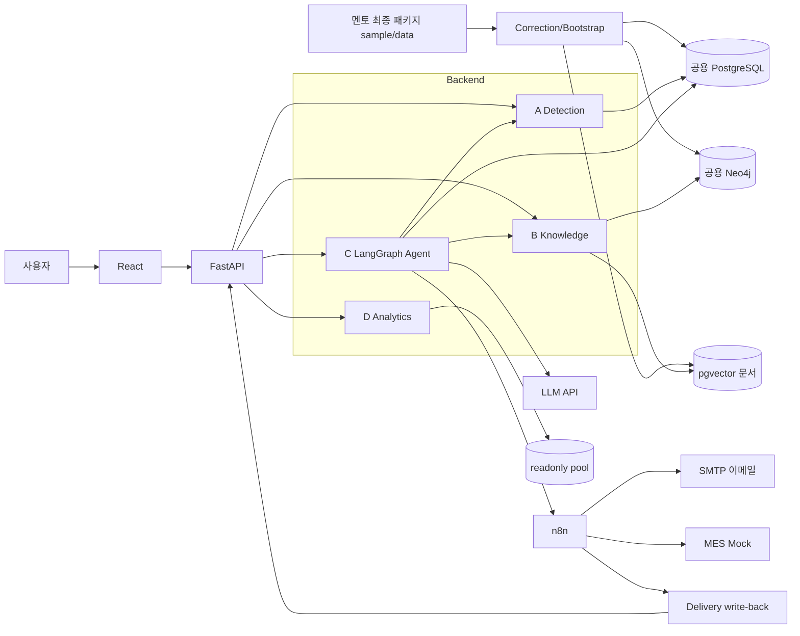
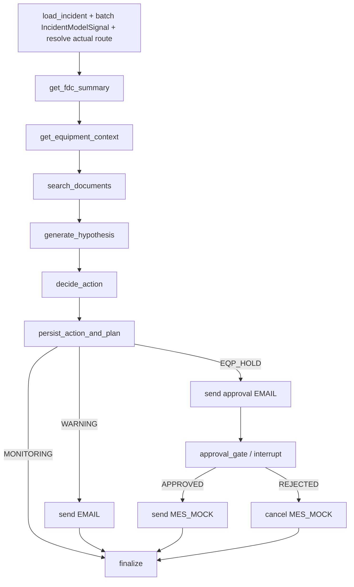

# LangGraph 기반 반도체 FDC 이상감지 에이전트 시스템 설계서

> [!IMPORTANT]
> **개정 고지 (2026-08-18)** — 멘토 최종 패키지 배포로 본 문서의 일부 절이 대체되었습니다.
> 본문은 kosa_0813 기준으로 작성되어 아래 항목은 **패키지가 우선**합니다. 전면 개정 전까지
> 현행 기준은 `docs/ai-context/README.md` 라우팅을 따르십시오.
>
> 대체된 주요 항목: 데이터 수치·표기(area Photo/Etch·wafer_id 문자열·recipe 4종·알람 51/138) ·
> 화면별 API(패키지 02 가이드가 정본, 5화면·골든 시나리오) · 조치 어휘 3단계 확정 ·
> fault_code 라벨 복원(평가 전용, OTH 포함) · 정본 프론트엔드(패키지 frontend/) ·
> MES=Kafka fdc.actions · 이메일=n8n 실 SMTP
>
> 전면 개정은 팀 협의 후 별도 Task로 진행합니다.


> 문서 버전: v2.0 작업본
>
> 작성일: 2026-08-14
>
> 기준 기획: `신규데이터_정답라벨제거_전환기획_v1.md`
>
> 기준 데이터: 멘토 최종 패키지 `sample/data/` (2026-08-18. manifest hash·epoch 명칭은 Common 재산정 예정 / 구 epoch: kosa_0813)
>
> 연결 요구사항: 요구사항정의서 v2.0 작업본의 FR-A-01~07·09, FR-B-01~08, FR-C-01~15, FR-D-01~10, FR-I-01~07, NFR 계열
>
> 저장소: `bistel-final` 모노레포

---

## 개정 이력

| 버전 | 일자 | 내용 |
|---|---|---|
| v2.0 작업본 | 2026-08-14 | 공개 Fault 정답이 없는 신규 데이터로 전환. corrected bootstrap, `AlarmRef`, clean runtime schema, 원인 가설·검토 라벨 분리, 3단계 조치, 검증된 anomaly score의 제한 상향, synthetic model benchmark, 채널별 delivery, 라벨 없는 평가를 설계 |

## 0. 문서 목적과 적용 원칙

본 문서는 신규 데이터에서 공개 Fault 정답이 제공되지 않는다는 전제 아래 구현 구조, 데이터 경계, 상태 전이, API·Tool 계약, 평가·복구 방식을 정의한다. 기존 v1.10의 다음 항목은 신규 구현 근거로 사용하지 않는다.

- 구 배포 데이터의 알람 51건, incident 10건, `ACT-0001~0010`
- `lot_history.fault_code`를 정답으로 사용한 Accuracy·Precision·Recall·F1
- `MONITOR | NOTIFY | LOT_HOLD | EQP_HOLD` 4단계 조치
- 단일 `fdc_alarm` 테이블과 이를 직접 참조하는 legacy migration
- 기존 R01·R02 명칭과 구 `sensor`·`judgement` 계약

충돌 시 적용 우선순위는 다음과 같다.

1. 요구사항정의서 v2.0의 사용자 동작·수용 기준
2. 본 문서의 구현·데이터·상태 전이 설계
3. 역할분담 v10.0의 소유권과 일정
4. `docs/planning/신규데이터_정답라벨제거_전환기획_v1.md`
5. 전환과 충돌하지 않는 기존 보안·Git·계층 규칙

### 0.1 설계 상태 표기

| 표기 | 의미 | 구현 방식 |
|---|---|---|
| `[자료 확정]` | 신규 ZIP의 DDL·CSV·가이드와 실측이 일치 | 수용 기준과 계약으로 고정 |
| `[팀 잠정]` | 개발 중단을 피하기 위한 가역적 결정 | Policy·Transformer·Adapter로 분리 |
| `[멘토 확인]` | 자료 충돌 또는 공식 기준 부재 | 외부 계약에 박지 않고 교체 지점 유지 |

### 0.2 핵심 불변식

1. 규칙 재계산용 reference output과 현실 Fault 정답을 구분한다.
2. `fault_code=NRM` 600건을 정상 정답으로 해석하지 않는다.
3. `metrology.alarm_result`는 계측 PASS/FAIL이며 Fault Mode 정답이 아니다.
4. 조치 코드·승인 게이트의 최종 결정 주체는 versioned 순수 규칙이다. 검증된 비지도 모델
   점수는 이 규칙 안에서 SUMMARY OOC-only의 `MONITORING`을 `WARNING`으로만 제한 상향하며,
   LLM 원인 가설은 결정에 관여하지 않는다.
5. 원본 ZIP과 압축 해제본은 수정하지 않는다. 모든 보정은 별도 corrected copy에 재현한다.
6. 조치는 incident당 최대 1건, 외부 효과는 `(action_id, channel)`당 최대 1건으로 관리한다.
7. `EQP_HOLD`는 사람 승인 전 MES Mock을 호출하지 않는다.
8. 분류 지표는 `ground_truth_available=true`인 별도 검토·Gold 데이터가 있을 때만 계산한다.
   Synthetic Model Gold는 Generator benchmark 전용이며 `production_ground_truth_available=false`다.
9. model signal은 조치를 낮추거나 incident·`EQP_HOLD`·HITL을 만들 수 없다. gate·artifact·threshold·
   coverage가 준비되지 않으면 기본 규칙으로 fallback한다.

---

## 1. 시스템 아키텍처

### 1.1 논리 구성



### 1.2 처리 흐름

```text
원본 해시 검증
  → corrected copy 생성
  → 공용 DB fresh bootstrap
  → Trace 요약·evaluation·알람 재현
  → R03 파생
  → AlarmRef를 incident로 집계
  → A가 versioned score를 batch 집계해 IncidentModelSignal 생성(`MODEL_SIGNAL_ENABLED=false` 기본)
  → A·B Tool로 규칙·관계·문서 근거 수집
  → LLM이 원인 가설 생성
  → 순수 규칙 함수가 기본 3단계 조치 결정
  → 검증된 score는 SUMMARY OOC-only를 WARNING으로만 제한 상향
  → action과 delivery plan 저장
  → WARNING: 이메일
  → EQP_HOLD: 승인요청 이메일 → HITL → 승인 후 MES Mock
  → 감사·조회·Text2SQL
```

### 1.3 계층과 소유권

Backend는 `Router → Service → Repository` 계층을 유지한다.

| 계층 | 책임 | 금지 |
|---|---|---|
| Router | HTTP 검증, 상태코드, DTO 변환 | SQL·Cypher·업무 규칙 |
| Service | 트랜잭션·업무 흐름·Policy 호출 | 문자열 SQL 직접 실행 |
| Repository | PostgreSQL·Neo4j·pgvector | HTTP·LLM·조치 결정 |
| Rules/Model | 재계산·R03·조치·모델 점수 | DB 쓰기·외부 호출 |
| Tool | Service를 Agent 계약으로 감쌈 | 동일 규칙 재구현 |
| Adapter | SMTP·MES Mock·구 API 호환 | 도메인 결정 |

---

## 2. 신규 데이터와 corrected bootstrap

### 2.1 원본 기준선

| 테이블 | 원본 행 수 | 역할 |
|---|---:|---|
| `lot_history` | 600 | 12 LOT × 25 WAFER × 2 공정 라우팅 |
| `fdc_trace` | 14,400 | 원시 파라미터 시계열 |
| `summary_data` | 4,800 | Trace 집계 reference |
| `evaluation` | 4,800 | 한계선 판정 reference(IN 4,542/OOC 216/OOS 42) |
| `trace_alarm_history` | 126 | raw 규격 이탈 reference |
| `summary_alarm_history` | 47 | 통계 관리 이탈 reference |
| `metrology` | 48 | PASS 39·FAIL 9의 계측 근거 |
| `action_history` | 48 | 화면 Mock/reference. Runtime seed에서 제외 |
| Neo4j | 38 nodes·81 relationships | 구조·식별자 기준정보 |

위 숫자는 데이터 전달 무결성과 규칙 재현을 검증하는 기준이다. 모델 또는 원인 가설 성능의 Gold 수가 아니다.

### 2.2 원본·corrected manifest와 DB profile 분리

파일 전달 무결성과 DB bootstrap 기대 상태를 하나의 table hash로 비교하지 않는다. 제공 `action_history` 10건은 source·corrected 파일에는 남지만 Runtime DB에는 적재하지 않기 때문이다.

| artifact | 내용 | `action_history` |
|---|---|---:|
| source file manifest | ZIP·원본 파일별 columns·row_count·content_hash | 제공 Mock 10건 |
| corrected file manifest | 허용된 보정 후 파일별 columns·row_count·content_hash·diff | 제공 Mock 10건 보존 |
| `runtime` bootstrap profile | 실제 적재 대상 table·기대 초기 상태·Runtime 빈 상태 | 0건 |
| `evaluation` bootstrap profile | immutable Text2SQL·화면 질의 snapshot | `fixture_type=MOCK` 10건 |

네 artifact는 각각 `format_version=3`, `artifact_type`, `dataset_epoch`(신본 epoch 명칭으로 갱신), source ZIP SHA-256, `correction_version`, `hash_algorithm`, table별 포함 여부·columns·row_count·content_hash를 기록하고, DB bootstrap manifest는 `profile=runtime|evaluation`을 추가한다. 추가 curated fixture는 원본·corrected 파일에 섞지 않고 evaluation profile에 `fixture_type`, version, row_count, content_hash를 별도로 기록한다. Mock·curated fixture는 Agent 조치 또는 Fault 정답으로 사용할 수 없다.

- 전체 DSN·계정·비밀번호·로컬 경로를 기록하지 않는다.
- canonical JSON은 UTF-8, key 정렬, NFC 정규화, 공백 없는 직렬화를 사용한다.
- `--generate`는 항상 명시적 확인 옵션을 요구하고 원자적 replace로 저장한다.
- 검증은 DB 조회 전에 manifest 구조·버전·profile·테이블 집합·컬럼·hash 형식을 먼저 확인한다.
- Runtime verifier는 `runtime` profile만, evaluation verifier는 `evaluation` profile만 비교한다. corrected file manifest의 전체 table hash를 DB와 직접 비교하지 않는다.
- 기존 CM-0.4의 단일 manifest 검증기는 file manifest 검증과 profile별 DB 검증으로 분리하고, CLI에 `--profile runtime|evaluation`을 필수화한다. profile·dataset epoch·correction version·hash algorithm 불일치는 DB 조회 또는 변경 전에 실패한다.
- verifier는 `bootstrap`과 `steady-state` 모드를 구분한다. `bootstrap`은 fresh 적재 또는 승인된 E2E reset 직후에만 Runtime 실행 table 0건을 검사한다. `steady-state`는 불변 base/reference table의 content hash와 가변 table의 schema·제약·권한만 검사하며 운영 중인 Agent 행을 0건으로 요구하지 않는다.
- evaluation profile의 immutable content hash 대상은 base/reference table과 명시 fixture뿐이다. 실행마다 누적되는 `nl_query_log`는 hash·row_count 대상에서 제외하고 append-only 권한·schema와 평가 실행 artifact로 검증한다. Runtime의 Agent·approval·delivery·audit·checkpoint도 같은 이유로 steady-state content hash 대상에서 제외한다.

### 2.3 corrected copy 변환

`backend/scripts/build_corrected_dataset.py`가 원본을 읽어 별도 출력 디렉터리에 corrected copy를 만든다. 변환은 멱등이어야 하며 원본 파일을 덮어쓰지 않는다.

| 항목 | 변환 계약 | 검증 |
|---|---|---|
| `dim_parameter` | Generator `SPEC`과 단위 자료를 대조한 8행 seed overlay 생성 | 8행, 모든 Trace FK 충족 |
| Trace `seq_no` | `[팀 잠정]` Step 1의 0~2, Step 2의 3~5가 되도록 `seq_no=ordv` 적용 | `(lot_hist_id,parameter_id,seq_no)` 중복 0 |
| Summary 알람 시각 | 동일 `(lot,wafer,chamber)`의 유일한 `lot_history.track_in_at` 사용 | NULL 0, 매칭 다중·누락 0 |
| 계측 시각 | 공식 생성 규칙이 없어 NULL 보존 | 임의 시각 생성 0 |
| 제공 조치 | corrected raw/reference에는 보존하되 Runtime 적재 목록에서 제외 | Runtime bootstrap 후 action 0건 |

Trace 보정기는 다음 세 상태만 허용한다.

1. 각 Step이 0~2인 원본이면 Step 순서와 내부 순서로 전역 0~5를 생성한다.
2. 이미 0~5로 고유하면 그대로 통과한다.
3. 그 밖의 패턴은 추측하지 않고 실패한다.

`recipe_step_no`를 PK에 추가하는 안은 멘토가 기존 `seq_no` 의미를 Step 내부 순번으로 확정할 경우의 대안으로만 보존한다.

### 2.4 재계산과 적재 순서

```text
공통: corrected base schema 생성
  → 001_reference_extensions.sql 적용
  → profile별 corrected base data 적재
  → summary·evaluation·TRACE/SUMMARY alarm 재현
  → R03 rebuild·v_alarm_event 검증

runtime: action_history 제외 적재(action=0)
  → 002_agent_runtime_clean.sql
  → LangGraph checkpoint setup

evaluation: 제공 action_history 10건 적재
  → evaluation profile·Mock metadata 검증
  → Agent runtime migration은 적용하지 않음

Knowledge: PostgreSQL reference schema 생성 확인
  → Neo4j safe loader
  → corrected RAG corpus stage/load/swap
```

적재 runner는 대상 host·database allowlist, 원본 SHA, corrected manifest, `ON_ERROR_STOP`에 해당하는 fail-fast, 단일 트랜잭션을 적용한다. 이미 데이터가 있는 DB에는 자동 재적재하지 않는다.

`kosa_agent`·`kosa_agent_e2e`는 `runtime` profile, `kosa_text2sql`은 `evaluation` profile만 허용한다. 특히 evaluation 초기화는 schema-first로 `action_history`, `nl_query_log`, R03·문서 table과 `v_alarm_event` 정의를 먼저 만든 뒤 제공 Mock 10건을 적재한다. 이 순서로 `action_history=0` guard가 있는 Agent Runtime migration을 evaluation DB에 잘못 적용하지 않으면서도 Text2SQL logging·조회 View를 제공한다. `fixture_type=MOCK`은 `action_history`의 DB 컬럼이 아니라 evaluation profile/manifest metadata다.

신규 `master.cypher`의 선두 `MATCH (n) DETACH DELETE n`은 공용 graph에서 직접 실행하지 않는다. corrected Neo4j loader가 destructive 문과 seed 문을 파싱·분리하고 다음 guard를 적용한다.

1. 기본 모드는 empty/fresh 대상만 허용하며 node·relationship이 하나라도 있으면 적재를 거부한다.
2. populated graph 교체는 기존 graph fingerprint 확인, 팀 공유, 복구 가능한 백업과 restore 검증, 명시적 `--replace --confirm`을 모두 요구한다.
3. raw Cypher 파일을 `cypher-shell -f`로 직접 실행하거나 애플리케이션 기동 시 자동 실행하지 않는다.
4. 적재 후 node 38·relationship 81과 필수 label·relationship type·공유 ID를 검증한다.
5. 검증 성공 후에만 dataset epoch·corrected manifest hash·graph fingerprint·적재 시각을 가진 success marker를 원자적으로 기록한다. 실패 시 marker를 만들지 않고 교체 대상은 승인된 백업으로 복구한다.

### 2.5 공용 DB 논리 분리

개인 로컬 DB는 구성하지 않는다. 팀에 제공된 한 PostgreSQL 서버 안에서 목적별 논리 DB를 분리한다.

| 논리 DB | 용도 | 초기 상태 |
|---|---|---|
| `kosa_agent` | 개발·시연 Runtime, 운영 Text2SQL | corrected source + Runtime 빈 상태 |
| `kosa_agent_e2e` | Agent 통합·복구·장애 테스트 | corrected source + 매 실행 전 Runtime reset |
| `kosa_text2sql` | immutable SQL 평가 snapshot | corrected source + 제공 Mock 10건(`fixture_type=MOCK`), curated fixture는 별도 version 관리 |

시연 Backend는 `kosa_agent`만 필수 연결한다. E2E·평가 DB URL은 별도 관리 명령에만 주입하므로 시연 기동 시 세 DB를 모두 연결할 필요가 없다. DB 생성 권한을 받을 수 없으면 별도 schema가 대안이지만 Runtime reset과 평가 snapshot이 같은 schema를 공유해서는 안 된다.

각 DB verifier는 선택한 profile의 적재 대상만 비교한다. `kosa_agent`·`kosa_agent_e2e`의 `runtime/bootstrap` 검증은 적재·reset 직후 `action_history=0`과 실행 상태 0건을, `runtime/steady-state` 검증은 불변 base와 Runtime schema·권한을 검사한다. `kosa_text2sql`의 `evaluation` 검증은 Mock·fixture metadata와 immutable base만 비교하고 누적 `nl_query_log`는 실행 artifact로 분리한다. 서로 다른 profile 또는 검증 모드의 전체 DB hash가 같다고 가정하지 않는다.

---

## 3. 알람 정규화와 Runtime 데이터 구조

### 3.1 `AlarmRef`

신규 데이터는 단일 `fdc_alarm`이 없으므로 모든 계약이 출처를 포함한다.

계약은 `AlarmRef {source: TRACE|SUMMARY|R03, alarm_id: NonEmptyId}`다.

`alarm_id` 단독 입력·저장·로그는 금지한다. URL, Agent State, Tool 입력, DB 연결 테이블, 감사로그에 `source`와 `alarm_id`를 함께 저장한다.

### 3.2 알람 resolve 규칙

| source | 원본 | 정규화 값 |
|---|---|---|
| TRACE | `trace_alarm_history` | OOS point, value·USL/LSL·seq_no |
| SUMMARY | `summary_alarm_history` | OOC statistic, stat_value·UCL/LCL |
| R03 | `r03_alarm_history` | 연속 3번째 evaluation OOS, 연속 구성 AlarmRef |

공통 `AlarmEvidence`는 다음 값을 갖는다.

```text
alarm: AlarmRef
occurred_at, area, equipment_id, chamber_id, parameter_id
recipe_id, lot_id, wafer_no, recipe_step_no
alarm_type, value, limit_type, limit_value
lot_hist_id, source_detail
```

TRACE·SUMMARY의 `lot_hist_id`는 `(lot_id, wafer_no, chamber_id)`가 정확히 한 `lot_history` 행에 매칭될 때만 채운다. 0건 또는 다중이면 데이터 오류로 중단한다.

### 3.3 R03 파생 테이블

`r03_alarm_history`는 corrected source로부터 재생성 가능한 파생 Detection reference table이다. 필수 컬럼은 `alarm_id`, `occurred_at`, `lot_hist_id`, `lot_id`, `equipment_id`, `chamber_id`, `parameter_id`, `recipe_step_no`, `trigger_wafer_no`, `member_refs`, `policy_version`다. `(lot_hist_id,parameter_id,recipe_step_no,policy_version)`을 UNIQUE로 둔다. `member_refs`에는 연속 세 evaluation row와 대응 TRACE AlarmRef를 저장한다.

R03 `alarm_id`는 같은 corrected source와 policy에서 rebuild해도 deep link가 유지되도록 다음 규격으로 만든다.

1. canonical payload는 `source`, `lot_hist_id`, `parameter_id`, `recipe_step_no`, `policy_version` 다섯 필드의 JSON object다.
2. key를 Unicode code point 순으로 정렬하고, 문자열은 NFC 정규화하며, 공백 없는 JSON으로 직렬화한 뒤 UTF-8 byte로 인코딩한다.
3. 직렬화 byte의 SHA-256 앞 20개 lowercase hex에 `R03-`를 붙여 `R03-<20hex>`로 저장한다.
4. URL token은 `R03:R03-<20hex>`다. 같은 canonical payload는 같은 ID, 필드나 policy version이 다르면 다른 ID여야 한다.
5. loader는 `alarm_id` UNIQUE와 canonical payload의 1:1 대응을 검사하고, 절삭 hash 충돌이 발견되면 임의 재채번하지 않고 rebuild를 실패·rollback한다.

### 3.4 Reference와 Agent Runtime migration 분리

`backend/migrations/001_reference_extensions.sql`은 profile 중립 schema다. `r03_alarm_history`, `document_corpus`, `document`, `document_chunk`, `nl_query_log`, `v_alarm_event`를 생성하며 `action_history` 행 수를 guard하지 않는다. 따라서 runtime·evaluation DB 모두에 적용한다.

`backend/migrations/002_agent_runtime_clean.sql`은 corrected base가 적재되고 `action_history=0`인 `runtime` profile만 대상으로 한다. `agent_run`, `agent_run_alarm`, `agent_prediction`, `agent_prediction_review`, `agent_run_action`, `agent_tool_call`, `approval_request`, `action_delivery`, `audit_log`를 생성하며 legacy 행 backfill이나 구 `fdc_alarm` FK를 포함하지 않는다. `kosa_text2sql`에는 적용하지 않는다.

`action_history`는 base DDL이 만든 table을 사용한다. runtime DB에는 제공 CSV 10건을 적재하지 않고 Agent가 새 조치를 저장한다. evaluation DB에는 제공 10건을 화면·SQL Mock fixture로 적재하되 `fixture_type=MOCK`은 profile metadata에만 기록하고 table 컬럼을 추가하지 않는다.

runtime runner는 base 8개 source table·`dim_parameter` 존재, runtime profile 일치, `action_history=0`, 구 runtime table·legacy `fdc_alarm` 부재를 확인한 뒤 002를 한 트랜잭션으로 실행한다. evaluation runner는 base/reference schema와 evaluation profile을 확인한 뒤 Mock을 적재하고 001의 `nl_query_log`·View를 검증한다. 이미 생성된 객체는 정의가 완전히 같을 때만 no-op이며 부분 적용·정의 불일치는 자동 보정하지 않고 중단한다. `verify_migrations.py`는 profile별 적용 대상, table·column·CHECK·FK·부분 고유 인덱스·권한을 검사한다.

### 3.5 핵심 Runtime table

| table | 필수 컬럼·제약 |
|---|---|
| `agent_run` | PK `agent_run_id`; nullable `retry_of_run_id` self FK; incident·요청/대표 AlarmRef·status·level·action·severity·thread·LLM/prompt·evidence·token/latency·시각. evidence에는 action decision 당시 `IncidentModelSignal`과 base/final action·score effect·policy provenance snapshot을 포함한다. status=`RUNNING\|WAITING_APPROVAL\|COMPLETED\|FAILED`, action=`MONITORING\|WARNING\|EQP_HOLD\|null` |
| `agent_run_alarm` | PK `(agent_run_id,alarm_source,alarm_id)`; source CHECK; 실행별 `is_representative=true` 최대 1건 |
| `agent_tool_call` | PK `tool_call_id`; `(agent_run_id,call_seq)` UNIQUE; Tool·입출력·상태·latency·error |

`agent_run(lot_id,chamber_id)`에는 RUNNING·WAITING_APPROVAL만 대상으로 부분 고유 인덱스를 둔다.

이종 알람 테이블을 향한 다형 FK는 만들지 않는다. `AlarmRepository.resolve()`가 같은 트랜잭션에서 존재를 확인하고 계약 테스트로 강제한다.

### 3.6 원인 가설과 검토 라벨 분리

| table | 필수 컬럼·제약 |
|---|---|
| `agent_prediction` | run당 1건; `predicted_fault_code`, confidence 0~1, cause, evidence, model, prompt version |
| `agent_prediction_review` | review ID, run ID, nullable reviewed code, `ACCEPTED\|CORRECTED\|UNDETERMINED`, `HUMAN_REVIEW\|MENTOR_REVIEW\|HIDDEN_GOLD`, reviewer·시각·comment |

- Agent는 `agent_prediction_review`를 INSERT·UPDATE하지 않는다.
- 화면은 `predicted_fault_code`를 “예측 원인”으로 표시한다.
- 검토값이 없으면 `reviewed_fault_code=null`, `ground_truth_available=false`다.
- 사람이 검토한 값과 독립 검증 Gold를 같은 의미로 취급하지 않는다.

### 3.7 조치·승인·delivery 연결

| table | 필수 컬럼·제약 |
|---|---|
| `agent_run_action` | run/action·incident key·trigger AlarmRef·`link_role=CREATED\|REUSED`; run당 최대 1행, action은 여러 재실행과 연결 가능 |
| `approval_request` | action·run 직접 FK, action당 1건, `PENDING\|APPROVED\|REJECTED\|EXPIRED` |
| `action_delivery` | PK `(action_id,channel)`; `EMAIL\|MES_MOCK`, 상태·hash·시도·provider ID·시각·오류·결과 |

외부 효과의 멱등 키는 `action_id` 단독이 아니라 `(action_id, channel)`이다. 같은 `EQP_HOLD`가 이메일과 MES Mock을 각각 한 번 수행할 수 있기 때문이다.

`agent_run_action`은 `UNIQUE(agent_run_id)`를 두되 `action_id` 자체를 UNIQUE로 두지 않는다. `link_role=CREATED` 행에만 `UNIQUE(action_id)`와 `UNIQUE(lot_id,chamber_id)` 부분 고유 인덱스를 적용해 incident당 원본 action 한 건을 소유하게 한다. 이후 FAILED 수동 재실행은 같은 action을 `REUSED`로 연결할 수 있으며 원본 CREATED 행은 변경하지 않는다.

재실행이 기존 action을 `REUSED`로 연결할 때 최초 CREATED run의 model·threshold·policy snapshot을
변경하지 않는다. 새 model version으로 같은 incident의 기존 action을 재판정하거나 과거 조치를
소급 변경하는 것은 금지한다.

### 3.8 통합 조회 View

`v_alarm_event`는 TRACE·SUMMARY·R03을 읽기 전용으로 UNION한다.

```text
source, alarm_id, occurred_at, area, equipment_id, chamber_id,
parameter_id, recipe_id, lot_id, wafer_no, recipe_step_no,
seq_no, value, alarm_type, lot_hist_id
```

API와 Text2SQL은 이 View를 사용하되 원본 row의 상세 필드는 source별 Repository가 반환한다. View 생성 후 `AlarmRef` 중복 0건과 원본 건수 합계를 검증한다.

공개 `GET /alarms`는 `date_from`, `date_to`, `area`를 필수로 받는다. `area`는 `Photo|Etch|ALL`, 선택 필터는 `equipment_id`, `chamber_id`, `parameter_id`, `source`, `include_derived`다. 필수 필터 누락·역전 날짜·지원하지 않는 area는 422이며 무필터 전체 조회 default는 없다.

`TRACE 126 + SUMMARY 47 = 173건`은 corrected dataset의 전체 기간 `2026-08-01~2026-08-12`, `area=ALL`, equipment·chamber·parameter 미지정, `include_derived=false`를 **명시한 요청**의 기대값이다. 같은 필터에서 `source=R03`은 3건, `include_derived=true`는 176건이다. 다른 기간·AREA·선택 필터에는 이 고정 건수를 적용하지 않는다.

Dashboard는 최초 진입 시 `GET /dataset/bounds`로 dataset epoch, min/max date, area·equipment·chamber·parameter 선택지를 조회한다. 받은 `min_date`·`max_date`와 `area=ALL`을 화면 상태에 넣고 `GET /dashboard/summary`와 `GET /alarms`에 명시적으로 전달한다. 시스템 오늘 날짜 또는 API의 암묵적 전체 기간을 사용하지 않는다. 기본 KPI의 파생 R03는 별도 KPI 또는 `include_derived=true`로만 포함한다. Agent incident 집계는 UI 필터와 무관하게 `v_alarm_event`의 R03를 항상 포함한다.

Dashboard 필터 결과가 0건이어도 `date_range`는 빈 배열이 아니라 요청의 유효 `date_from`·`date_to`를 `[시작일, 종료일]`로 되돌려준다. 이때 count는 0, trend·상위 parameter·설비·최근 알람은 빈 목록으로 반환하며 React가 Empty 상태로 표시한다. corrected source 자체가 없어서 `/dataset/bounds`의 min/max를 만들 수 없는 상태는 정상 Empty가 아니라 bootstrap/readiness 실패로 처리한다. Agent E2E reset은 source·reference를 보존하므로 이 실패를 만들지 않는다.

---

## 4. A Detection 상세 설계

### 4.1 Trace 요약 재계산

그룹 키는 `(lot_hist_id, parameter_id, recipe_step_no)`다.

```text
value_mean = arithmetic mean
value_std  = sample standard deviation(ddof=1)
value_min  = min
value_max  = max
point_cnt  = count
```

제공 `summary_data`와 숫자 오차 0.001 이내, 키·행 수·point count 완전 일치를 요구한다. 이는 계산 재현 검증이지 Fault 성능 평가가 아니다.

### 4.2 point evaluation과 Trace 알람

한계선은 `dim_parameter`만 사용한다.

판정 순서는 USL·LSL 규격 이탈 OOS, UCL·LCL 관리 이탈 OOC, 그 외 IN이다. `upper_only=true`는 하한 두 개를 판정하지 않는다.

- evaluation 우선순위: OOS point가 있으면 OOS, 아니면 OOC point가 있으면 OOC, 그 외 IN.
- Trace alarm: OOS raw point마다 1건.
- `upper_only`는 `dim_parameter.upper_only`를 사용하며 null 여부로 추정하지 않는다.
- corrected `seq_no`로 재생성한 canonical key를 비교한다.

### 4.3 Summary 알람

관리한계 산출 그룹은 `(chamber_id, parameter_id, recipe_step_no)`다.

1. evaluation이 OOS가 아닌 summary의 `value_mean`만 정상 후보로 사용한다.
2. `CL=mean(normal)`, `UCL=CL+3*sample_std`, `LCL=CL-3*sample_std`를 계산한다.
3. 각 summary mean이 UCL/LCL을 벗어나면 OOC Summary alarm을 만든다.
4. `occurred_at`은 corrected copy의 `lot_history.track_in_at`을 사용한다.

정상 후보 수가 2 미만이면 관리한계를 만들지 않고 `INSUFFICIENT_BASELINE`으로 기록한다.

### 4.4 R03

`detect_r03(policy, evaluation_rows)`는 순수 함수다.

```text
key       (chamber_id, parameter_id, recipe_step_no)
sort      chamber_wafer_cum ASC, track_in_at ASC, lot_hist_id ASC
boundary  LOT을 넘어 유지
reset     alarm_type != OOS
emit      run == 3이 되는 행에서 한 번
owner     세 번째 OOS의 lot_id·chamber_id [팀 잠정]
```

가이드의 `run >= 3`를 그대로 사용하지 않는다. 4번째 이후 중복 알람을 막기 위해 `run == 3`으로 고정한다. 위치·구성 member는 versioned fixture로 검증한다.

### 4.5 anomaly score·threshold·활성 gate

IsolationForest는 규칙 알람을 대체하지 않고 WAFER 단위 보조 점수를 만든다. 조치에 대한 실제
영향은 6.5의 versioned `ActionPolicy`가 통제하며 model signal 자체가 action·severity·HITL을
직접 결정하지 않는다.

#### 4.5.1 학습·score 계약

- feature: summary 통계, 한계선 상대거리, point 이탈 비율, coverage. `fault_code`, metrology 결과,
  Generator 주입 위치·label·Fault 상수, 제공 action Mock은 제외한다.
- split: 같은 `lot_id`가 train·validation·evaluation에 섞이지 않는 Group split이다.
- 원시 IsolationForest score의 방향을 높은 값이 더 이상이도록 통일하고, train LOT score만으로
  0~1 정규화한다. 평가·합성 Gold 결합 후 정규화 통계를 다시 계산하지 않는다.
- `[팀 잠정]` 표시용 `display_threshold`는 train score 95백분위, 조치 제한 상향용
  `action_threshold`는 99백분위를 `method=higher`로 계산한다. 두 threshold는 확률이 아니라 해당
  model bundle의 상대 선택 경계다.
- manifest에는 dataset epoch, feature 순서·결측 대체, seed, library·hyperparameter, 학습 LOT,
  normalization, 두 threshold의 표본·산정법, `model_version`, `score_method`, `threshold_version`,
  artifact hash를 기록한다. 구 데이터의 고정 0.62·0.80은 승계하지 않는다.
- 모델·artifact가 없으면 규칙 API·기본 조치는 정상 동작하고 score signal만 `null`이다.

#### 4.5.2 synthetic Generator 평가 격리

Generator benchmark는 운영 data 평가와 분리한 다음 두 artifact를 사용한다.

```text
synthetic_features
  모델 입력과 scenario_id만 포함
  injection 위치·종류·label·expected action 없음

synthetic_gold
  scenario_id, lot_id, injection 범위·종류, is_injected,
  사전에 정책표로 작성한 expected_model_escalation
```

- train·개발·최종 blind benchmark는 서로 다른 seed namespace를 사용하고 동일 LOT·scenario를 한
  split에만 둔다.
- 모델은 `synthetic_features`에 먼저 예측을 완료하고 결과 hash를 고정한 뒤 evaluation 전용
  runner가 `synthetic_gold`를 결합한다. Gold 파일·loader는 Runtime DB, model feature builder,
  threshold fitter, Agent State·Tool·prompt에서 import하거나 조회할 수 없다.
- `synthetic_gold`는 `kosa_agent`, `kosa_agent_e2e`, `kosa_text2sql` 어느 bootstrap profile에도
  적재하지 않고 evaluation artifact 경로에서만 읽는다.
- expected action을 production `decide_action()` 호출로 생성하지 않는다. 구현 전에 독립 scenario
  catalog에 policy version과 함께 수동 고정해 순환 검증을 막는다.
- synthetic artifact는 `ground_truth_available=true`, `label_source=SYNTHETIC_GENERATOR`,
  `production_ground_truth_available=false`, generator version·seed·scenario manifest hash를 기록한다.
- 이 track에서는 FPR·Recall·Precision·F1·AUC를 계산할 수 있지만 제목과 표에 합성 benchmark임을
  표시한다. 결과를 실제 공정 성능, Fault Mode 정답률 또는 Agent 원인 가설 성능으로 주장하지 않는다.

운영 data artifact는 `ground_truth_available=false`, `production_ground_truth_available=false`,
`label_source=NONE`이며 score 재현, LOT leakage, score 분포·상위 K, 규칙 알람·계측 연관성만
기록한다. Accuracy·P/R/F1·AUC는 실행 guard로 차단한다.

#### 4.5.3 action 영향 활성 gate

환경변수 `MODEL_SIGNAL_ENABLED`의 기본값은 `false`다. 다음을 모두 충족한 version 조합만 팀 승인
artifact를 만들고 `MODEL_SIGNAL_ENABLED=true`로 활성화한다.

1. train·evaluation LOT leakage 0건과 feature·threshold label leakage 0건
2. 같은 model bundle의 score·순위와 incident 집계 재현
3. `[팀 잠정]` 최종 synthetic benchmark 정상 FPR 5% 이하
4. `[팀 잠정]` 최종 synthetic benchmark 주입 이상 Recall 80% 이상
5. model·score method·threshold·ActionPolicy version allowlist 일치

모델 재학습, feature·normalization·threshold·policy 변경은 새 version과 gate 평가를 요구한다.
`MODEL_SIGNAL_ENABLED=true`는 필요조건일 뿐 충분조건이 아니다. 승인 artifact가 없거나 현재
model·score method·threshold·ActionPolicy version 조합과 일치하지 않으면 정책 검증에서 signal을
적용하지 않고 base action으로 fallback한다. 환경변수는 승인된 manifest threshold를 조용히
덮어쓸 수 없으며, 불일치하면 `MODEL_SIGNAL_ENABLED=false`와 같은 효과로 처리한다.

---

## 5. B Knowledge 상세 설계

### 5.1 Neo4j

신규 `master.cypher`의 38 nodes·81 relationships를 검증한다.

- 구조: Area, EquipmentModel, Equipment, Chamber, Parameter, ProcessStep, Recipe, RecipeStep.
- 상하류는 `ProcessStep-[:NEXT_STEP]->ProcessStep`이다.
- 설비 간 고정 UPSTREAM 관계를 만들지 않는다.
- 실제 WAFER 라우팅은 PostgreSQL `lot_history`로 확인한다.
- 공유 키는 `equipment_id`, `chamber_id`, `parameter_id`, `model_code`다.

`get_equipment_context(chamber_id)`는 정적 graph context만 반환한다. 출력은 해당 chamber의 Equipment·AREA·ProcessStep과 `NEXT_STEP` 인접 ProcessStep ID, model·parameter cross-check ID이며 `lot_id`, `wafer_no`, `lot_hist_id` 또는 특정 LOT의 실제 이동 경로를 반환하지 않는다. Neo4j에 Equipment 간 고정 upstream/downstream edge를 추가하거나 ProcessStep 인접성을 실제 LOT routing으로 번역하는 것은 금지한다.

관계 provenance는 Neo4j 내부 `elementId()`에 의존하지 않는다. corrected loader가 방향을 보존한 canonical tuple `relation_type|from_label:from_business_id|to_label:to_business_id`의 SHA-256 앞 20 hex로 `REL-<20hex>`를 만들고 relationship의 `relation_id` property로 저장한다. 동일 양 끝점·type의 병렬 관계가 필요하면 명시적 edge business key를 tuple에 추가하며, key 없는 중복은 적재 오류다. loader는 `relation_id` 전역 중복 0건을 검증하고 B Tool·API는 인용한 모든 관계의 `relation_id`를 반환한다.

C는 AlarmRef resolve 결과의 `lot_id`·`wafer_no`로 PostgreSQL `lot_history`를 별도 조회하고 `track_in_at ASC, lot_hist_id ASC`의 실제 step sequence를 만든다. 이후 B Tool의 ProcessStep adjacency·공유 ID와 교차 확인하되, 실제 routing의 기준은 항상 `lot_history`다. 불일치는 숨기거나 graph로 덮어쓰지 않고 `route_consistency=false` 근거로 기록한다.

공용 graph 적재는 2.4의 corrected loader만 사용한다. raw `master.cypher` 실행을 금지하고, empty/fresh guard 또는 fingerprint·백업·restore·`--replace --confirm`을 통과한 populated 교체만 허용한다. 38/81 검증과 success marker가 없으면 Knowledge readiness는 실패다.

### 5.2 문서와 RAG

기존 문서의 구 용어·조치 규칙을 신규 정책과 대조한 뒤 승인된 revision만 임베딩한다.

- 청크는 문서·절 ID와 `model_code`를 보존한다.
- 임베딩 입력과 저장 원문을 구분한다.
- 모델·revision·차원·문서 hash를 corpus manifest에 기록한다.
- 검색 응답 `DocumentHit`은 `document_id`, `chunk_id`, `corpus_revision`, `title`, `section`, `score`, `content`, `model_code`를 반환한다.
- Agent가 인용한 chunk는 같은 실행의 Tool 결과에 실제 포함되어야 한다.

RAG 적재는 001 migration이 `document_corpus`·`document`·`document_chunk`를 만든 뒤 별도 corrected corpus loader로 수행한다. Neo4j safe load와는 서로 다른 adapter·transaction이며 어느 한쪽 성공을 다른 쪽 완료로 간주하지 않는다.

1. 원본 문서는 수정하지 않고 승인된 correction으로 corpus revision과 manifest hash를 결정한다.
2. 동일 revision의 document·chunk·embedding을 STAGING 상태로 적재한다. `(corpus_revision,document_id)`와 `(corpus_revision,chunk_id)`는 UNIQUE다.
3. 문서 수·chunk 수·embedding NULL 0·차원·금지된 구 규칙 잔존 0·검색 smoke를 검증한다.
4. 같은 revision·hash 재실행은 no-op, 같은 revision의 다른 hash는 충돌로 중단한다.
5. 검증된 revision만 한 트랜잭션에서 ACTIVE pointer로 swap하고 직전 revision은 RETIRED로 보존한다.
6. 배포 후 오류가 확인되면 pointer를 직전 검증 revision으로 되돌린다. rollback 과정에서 corpus row를 hard-delete하지 않는다.

Fault 라벨이 없어도 문서 자체에서 독립적으로 만든 10문항 이상의 검색셋과 Neo4j 구조 질의셋으로 Recall@K·MRR·관계 정확도를 평가할 수 있다.

---

## 6. C LangGraph Agent 상세 설계

### 6.1 incident

`[팀 잠정]` incident key는 `(lot_id, chamber_id)`다. 실제 TRACE·SUMMARY·R03 AlarmRef가 하나 이상 있는 key만 생성한다.

- 같은 OOS window에서 raw point가 여러 개여도 incident는 하나다.
- 대표 알람: `occurred_at ASC, source priority, alarm_id ASC` 첫 AlarmRef.
- source priority는 대표 선택 안정성만 위한 `R03 < TRACE < SUMMARY` 고정 값이며 조치 우선순위가 아니다.
- 실행에 포함된 모든 AlarmRef는 `agent_run_alarm`에 기록한다.
- 제공 action 10건은 incident 목록·정답·seed로 사용하지 않는다.

incident를 구성한 AlarmRef를 resolve해 얻은 모든 `lot_hist_id`를 중복 제거하고
`lot_hist_id ASC`로 정렬한다. A의 내부 batch service
`build_incident_model_signal(lot_hist_ids, action_policy_version)`는 이 목록을 한 번에 조회해 다음
`IncidentModelSignal`을 반환한다. member마다 `get_fdc_summary` Tool을 반복 호출하지 않는다.

```text
enabled
status = READY | DISABLED | UNAVAILABLE
incident_score
display_threshold
action_threshold
expected_member_count, valid_member_count
max_score_lot_hist_id
model_version, score_method, threshold_version
action_policy_version
reason
```

- `threshold_validation_status=VERIFIED`이고 동일 model·score method·threshold version인 non-null
  score만 유효하다.
- `incident_score=max(member_scores)`이며 동점 max member는 `lot_hist_id ASC` 첫 항목이다.
- `expected_member_count == valid_member_count`일 때만 coverage 100%다.
- mixed version, score·threshold·member 누락, artifact 미준비, policy allowlist 불일치는
  `UNAVAILABLE`이고 score 필드는 조치 상향에 사용하지 않는다.
- model signal은 실제 알람이 없는 `(lot_id,chamber_id)`를 incident로 만들지 못한다.
- signal과 member provenance는 action 결정 전 `agent_run.evidence`에 snapshot한다.

`load_incident`는 요청·대표 AlarmRef를 resolve한 뒤 해당 `lot_id`·`wafer_no`의 `lot_history`를 PostgreSQL에서 조회해 실제 공정 sequence를 만든다. 가설 근거로 다른 wafer를 인용할 때도 그 AlarmRef의 wafer routing을 별도로 조회한다. 그 다음 `get_equipment_context`의 ProcessStep adjacency·cross-check ID와 결합하며 다음 경계를 지킨다.

- `lot_history`는 실제 LOT/WAFER routing의 단일 기준이다.
- Neo4j는 가능한 공정 구조와 ID 정합 근거일 뿐 특정 LOT의 upstream 설비를 결정하지 않는다.
- 두 근거가 불일치하면 `route_consistency=false`와 양쪽 ID를 보존하고, 고정 설비 upstream을 합성하지 않는다.
- 라우팅 조회 실패·다중 매칭은 원인 가설을 추측하지 않고 `DEPENDENCY_ERROR`로 실행을 실패시킨다.

### 6.2 Agent State

State는 run/thread, 요청·대표·전체 AlarmRef, incident key/signal, `IncidentModelSignal`, A·B Tool
근거, 원인 가설, base/final action·score effect·severity, action/approval ID, delivery plan, 결정,
Tool 예산·오류를 가진다.

State·checkpoint에 비밀번호·API key·전체 DSN을 저장하지 않는다.

### 6.3 그래프



이메일 실패가 EQP_HOLD 승인 자체를 숨기지 않도록 action·approval 저장 후 이메일을 보낸다. 자동 재시도 상한을 소진해도 승인 큐에는 PENDING 요청과 EMAIL 실패가 표시된다.

### 6.4 원인 가설

LLM 출력은 정답 분류가 아니라 구조화된 가설이다.

구조화 출력은 `predicted_fault_code`, confidence, cause summary, supporting AlarmRef·chunk ID·relation ID, uncertainty를 포함한다.

- `fault_code`, Generator `FAULTS`, 제공 action은 프롬프트에 넣지 않는다.
- confidence는 모델 자기보고 값이며 교정된 확률로 주장하지 않는다.
- Pydantic 실패 시 `CLASSIFICATION_OUTPUT_RETRY=1`로 한 번만 교정한다.
- 모든 인용 ID는 해당 run의 Tool 출력에 존재해야 한다.
- `llm_model`, prompt version, temperature, token, active latency를 기록한다.

### 6.5 조치 결정

`ActionPolicy(version).decide(IncidentSignal, IncidentModelSignal | None) -> ActionDecision`은
DB·LLM·네트워크를 사용하지 않는 순수 함수다. 규칙이 기본 조치와 model signal 적용 가능성을
모두 판정하므로 최종 결정 주체는 계속 규칙 코드다.

```text
1. 실제 알람 없음
   → action 없음 (high score 단독 생성 금지)

2. R03 존재
   → base=final EQP_HOLD / HIGH / HITL

3. R03 없음 + TRACE OOS 존재
   → base=final WARNING / MEDIUM / AUTO

4. SUMMARY OOC만 존재
   → base MONITORING / LOW / AUTO
   ├ MODEL_SIGNAL_ENABLED=true + READY + coverage 100%
   │ + threshold VERIFIED
   │ + model/threshold/policy version allowlist 일치
   │ + incident_score >= action_threshold
   │    → final WARNING / MEDIUM / AUTO, score_effect=ESCALATED
   └ 그 외
        → final MONITORING / LOW / AUTO,
          score_effect=NONE | DISABLED | UNAVAILABLE
```

- OOS raw point 수가 3개라는 이유만으로 R03로 간주하지 않는다. R03는 4.4의 연속 WAFER
  규칙으로만 성립한다.
- 여러 규칙 신호가 있으면 `EQP_HOLD > WARNING > MONITORING` 한 건만 생성한다.
- score는 조치를 낮추거나 `WARNING → EQP_HOLD`로 올릴 수 없고 EQP_HOLD·HITL을 단독으로
  만들지 못한다. TRACE·R03 경로의 final action은 score 값과 무관하다.
- `MODEL_SIGNAL_ENABLED=false`가 기본값이다. 값이 `true`여도 승인 artifact가 없거나 version 검증이
  실패하면 signal을 적용하지 않는다. model/artifact/threshold 미준비, nullable score, mixed version,
  coverage 미달, manifest와 환경 설정 불일치에서는 예외로 실행을 실패시키지 않고 base action으로
  fallback한다.
- predicted fault·LLM confidence·metrology PASS/FAIL은 결정 입력에서 제외한다.
- `score_effect` 값은 `NONE | ESCALATED | DISABLED | UNAVAILABLE`로 고정한다. `NONE`은 준비된
  signal이 threshold 미만이거나 적용 대상이 아닌 경우, `DISABLED`는 `MODEL_SIGNAL_ENABLED=false`,
  `UNAVAILABLE`은 model/version/coverage 불충족을 뜻한다.
- `ActionDecision`은 `base_action`, `final_action`, `score_effect`, incident/member score와 max member,
  coverage, model·score method·threshold·policy version을 포함한다. action 생성과 같은 트랜잭션의
  run evidence·audit `after_json`에 snapshot한다.
- model signal OFF baseline의 `MONITORING 5 / WARNING 2 / EQP_HOLD 3`은 `[팀 잠정]` 회귀
  fixture다. ON 결과는 동결된 model·threshold·policy bundle별로 별도 fixture를 만들며 현실 조치
  Gold로 해석하지 않는다.

### 6.6 Tool 호출 예산

`AGENT_MAX_TOOL_CALLS=8`, `AGENT_MAX_RETRY=3`을 유지한다. EQP_HOLD는 EMAIL과 MES Mock 두 번의 delivery가 있으므로 실행 시작 시 최대 2회의 `send_action` 호출을 예약한다.

| 구간 | 기본 호출 | 예산 |
|---|---|---:|
| FDC | get_fdc_summary | 1 |
| 관계 | get_equipment_context | 0~1 |
| 문서 | search_documents | 0~1 |
| 선택 진단·재시도 | 위 Tool 추가 | 예약분을 제외한 잔여 |
| 외부 효과 | send_action EMAIL·MES_MOCK | 최대 2 예약 |

6.1의 incident model batch는 `load_incident` 단계의 A 내부 Service 호출 1회이며 Agent가 선택·반복하는
Tool이 아니므로 8회 Tool 예산에 포함하지 않는다. 대신 처리 latency, 입력 member hash, 결과
provenance를 run evidence에 기록해 숨은 반복 호출이 없음을 검증한다.

`agent_tool_call`이 실제 호출 수의 영속 단일 기준이다. HITL 재개·복구 시 DB에서 다시 집계하고 0으로 초기화하지 않는다. Tool 호출 예약 행을 외부 호출 전에 커밋해 프로세스 종료도 1회로 보수적으로 계수한다.

---

## 7. Action·HITL·n8n 상태 전이

### 7.1 action 생성

incident lock 안에서 유효 action을 다시 조회한 뒤 한 건만 생성한다.

| action | `approval_status` | delivery 초기 상태 |
|---|---|---|
| MONITORING | AUTO | 없음 |
| WARNING | AUTO | EMAIL=WAITING |
| EQP_HOLD | PENDING | EMAIL=WAITING, MES_MOCK=BLOCKED |

`action_history.notify_status`와 `mes_status`는 화면 호환용 요약 projection이다. 실제 시도·오류·멱등 상태의 기준은 `action_delivery`다.

신규 action은 `action_history`, `agent_run_action(link_role=CREATED)`, 필요한 `approval_request`·`action_delivery`를 한 트랜잭션에서 생성한다. action만 존재하고 CREATED 소유 link가 없는 중간 상태를 허용하지 않는다.

### 7.2 승인 트랜잭션

```text
승인:
  approval_request PENDING → APPROVED
  action_history PENDING → APPROVED
  MES_MOCK BLOCKED → WAITING
  audit APPROVAL_DECIDED
  COMMIT
  같은 thread 재개 → MES_MOCK 전송

반려:
  approval_request PENDING → REJECTED
  action_history PENDING → REJECTED
  MES_MOCK BLOCKED → CANCELED
  approved_by/approved_at은 action의 승인 필드에 채우지 않음
  audit APPROVAL_DECIDED
  COMMIT → 같은 thread 완료
```

조건부 UPDATE로 PENDING 한 건만 처리한다. 이미 APPROVED·REJECTED·EXPIRED면 409이며 상태를 변경하지 않는다.

### 7.3 delivery 상태

```text
BLOCKED → WAITING                    승인 후 MES Mock
BLOCKED → CANCELED                   반려
WAITING|FAILED → SENDING             attempt_count + 1
SENDING → SENT                       write-back 성공
SENDING → FAILED                     명시적 실패
SENDING → UNKNOWN                    결과 확인 불가
SENT|CANCELED → terminal             재호출 무효
```

`UNKNOWN`은 실제 이메일이 발송되었을 가능성이 있어 자동 재시도하면 중복될 수 있는 상태다. 운영 확인 또는 provider message ID 대조 후에만 FAILED 또는 SENT로 정리한다.

### 7.4 n8n 계약

실제 구현 범위:

- `fdc-notify`: WARNING·EQP_HOLD 이메일(SMTP)
- `fdc-mes-hold`: 승인된 EQP_HOLD의 MES Mock
- `delivery-writeback`: Backend 내부 callback

Webhook payload는 `action_id`, `channel`, `request_hash`, 조치·설비·근거에 필요한 불변 필드만 포함한다. Backend와 n8n은 같은 canonical JSON·SHA-256 규칙을 사용한다.

1. Backend가 delivery row를 잠그고 SENDING으로 전이한다.
2. n8n이 secret과 hash를 검증한다.
3. 이미 SENT인 `(action_id,channel)`이면 외부 노드를 다시 실행하지 않는다.
4. SMTP 또는 MES Mock을 실행한다.
5. 성공 callback을 완료한 뒤 webhook 응답을 반환한다.
6. callback만 실패하면 외부 노드를 재실행하지 않고 callback 단계만 재시도한다.

승인 전 MES Mock 호출은 코드·workflow 양쪽 조건으로 차단한다.

---

## 8. Tool 계약

공통 반환은 유지한다.

```json
{"ok": true, "reason": "", "...": "도구별 payload"}
{"ok": false, "reason": "NOT_FOUND: ...", "...": null}
```

실패 접두어는 `NOT_FOUND`, `TIMEOUT`, `MODEL_NOT_READY`, `LLM_NOT_READY`, `DEPENDENCY_ERROR`, `POLICY_REJECTED`, `IDEMPOTENCY_CONFLICT` 일곱 종만 사용한다.

| Tool | 입력 | 핵심 출력 | 소유 |
|---|---|---|---|
| `get_fdc_summary` | `lot_hist_id` | parameter Summary, limit, evaluation, nullable `AnomalySignal` | A |
| `get_equipment_context` | `chamber_id` | 정적 설비·AREA·ProcessStep adjacency, stable relation ID와 공유 ID; LOT/WAFER routing은 반환하지 않음 | B |
| `search_documents` | query, model_code?, top_k | `corpus_revision`을 포함한 DocumentHit 목록 | B |
| `send_action` | `action_id` | 현재 상태에서 실행 가능한 채널별 status·sent·duplicate | C |
| `generate_analysis_plan` | question | SQL·metric·visualization plan | D |

멘토 원안의 단일 `sent`는 EMAIL과 MES Mock의 서로 다른 실행 시점, 부분 성공, 중복, 응답 유실의 `UNKNOWN` 상태를 표현할 수 없다. 따라서 v2는 `{ok, action_id, reason}` 골격을 유지하면서 결과를 `deliveries:[{channel,status,sent,duplicate}]`로 확장한다. top-level `sent`는 두 채널의 의미를 합칠 수 없어 제공하지 않으며, 채널별 `sent`가 실제 외부 효과 발생 여부를 나타낸다.

Agent는 먼저 `AlarmRef`를 resolve해 `lot_hist_id`를 얻고 A Tool을 호출한다. Tool의 nullable model
payload는 `anomaly: AnomalySignal | null` 한 필드로 반환한다. `AnomalySignal`은 `score`,
`model_version`, `score_method`, `display_threshold?`, `is_anomaly?`, `action_threshold?`,
`threshold_version?`, `threshold_validation_status`를 한 provenance 단위로 다룬다. `is_anomaly`는
score와 표시용 threshold가 모두 있을 때만 `score >= display_threshold`와 일치해야 한다.
`threshold_validation_status`는 `UNVERIFIED | VERIFIED`이며 기본은 `UNVERIFIED`다.
`action_threshold`와 `threshold_version`은 함께 존재해야 하고, `VERIFIED`는 두 필드가 필수이며
두 threshold가 모두 있으면 `action_threshold >= display_threshold`여야 한다. legacy scalar
anomaly 필드나 version이 빠진 payload는 거부하고 조치 상향에는 사용할 수 없다.

C의 incident loader는 같은 resolve 결과의 고유 `lot_hist_id`를 A 내부 batch service에 한 번 전달해
6.1의 `IncidentModelSignal`을 만들고, representative 상세 확인용 `get_fdc_summary` Tool을 member마다
반복하지 않는다. 같은 resolve 결과의 `lot_id`·`wafer_no`로 PostgreSQL `lot_history`의 실제 step
sequence를 별도 조회한 뒤 B Tool이 반환한 정적 ProcessStep adjacency·cross-check ID와 결합한다.
B Tool 출력만으로 특정 LOT의 upstream 설비를 만들거나 실제 routing을 추론하지 않는다.

하나의 `action_id`로 EQP_HOLD EMAIL과 승인 후 MES_MOCK을 각각 호출할 때 C Service가 현재 상태에서 실행 가능한 채널을 결정한다. Tool payload의 공통 DTO·Enum은 `app/common`에서 재정의 없이 import한다.

---

## 9. API·DTO 설계

### 9.1 공통 Enum

```text
AlarmSource       TRACE | SUMMARY | R03
AlarmType         IN | OOC | OOS
ActionCode        MONITORING | WARNING | EQP_HOLD
FaultHypothesis   FOC | RFM | MFD | TMD | OTH
RunStatus         RUNNING | WAITING_APPROVAL | COMPLETED | FAILED
ApprovalStatus    AUTO | PENDING | APPROVED | REJECTED | EXPIRED
DeliveryChannel   EMAIL | MES_MOCK
DeliveryStatus    BLOCKED | WAITING | SENDING | SENT | FAILED | CANCELED | UNKNOWN
ThresholdValidationStatus VERIFIED | UNVERIFIED
Severity          LOW | MEDIUM | HIGH
```

API는 Asia/Seoul `+09:00` ISO 8601을 반환한다. DB 내부 naive timestamp는 `ZoneInfo("Asia/Seoul")`로 해석한다.

### 9.2 주요 DTO

`AlarmQuery`는 필수 `date_from`, `date_to`, `area=Photo|Etch|ALL`과 선택 `equipment_id`, `chamber_id`, `parameter_id`, `source`, `include_derived=false`를 가진다. 날짜 역전과 area Enum 위반은 Pydantic 단계에서 거부한다. `UnifiedAlarmItem`은 AlarmRef, 시각, area·equipment·chamber·parameter, recipe·lot·wafer·step, alarm type, value·limit, nullable action ID를 가진다. `DatasetBounds`는 dataset epoch, min/max date와 area·equipment·chamber·parameter 선택지를 가진다. `DocumentHit`은 근거 식별자와 함께 `corpus_revision`을 필수로 가진다. `IncidentModelSignal`은 enabled/status, incident score, 두 threshold, expected/valid member count, max member, model·score method·threshold·action policy version과 reason을 가진다. `AgentRunDetail`은 요청·대표·전체 AlarmRef, status, predicted code/confidence, nullable reviewed code/label source, base/final action·score effect와 decision provenance, evidence, deliveries를 가진다.

화면과 평가 artifact는 `predicted_*`와 `reviewed_*`를 축약하거나 하나의 `fault_code`로 합치지 않는다.

### 9.3 업무 API

| 영역 | Method·Path | 설명 |
|---|---|---|
| A | `GET /dataset/bounds` | dataset epoch·min/max date·필터 선택지 |
| A | `GET /alarms` | `date_from`·`date_to`·`area=Photo\|Etch\|ALL` 필수; equipment/chamber/parameter 선택; R03 명시 포함 |
| A | `GET /alarms/{source}/{alarm_id}` | source별 상세 |
| A | `GET /parameters` | 8개 parameter와 5선 |
| A | `GET /trace` | 신규 가이드 최소 단일 Trace 조회 |
| A | `GET /traces/catalog` | 선택지·한계선 |
| A | `POST /traces/search` | 다중 parameter·wafer Trace |
| A | `GET /dashboard/summary` | 같은 기간·AREA·선택 필터를 명시한 서버 집계 KPI·추이 |
| B | `GET /relations/chambers/{chamber_id}` | 챔버 구조·공정 관계 |
| B | `GET /relations/equipment/{equipment_id}` | 설비 구조 |
| B | `POST /documents/search` | 문서 검색 |
| B | `GET /documents/{document_id}` | 문서 상세 |
| C | `POST /agent/runs` | `{alarm: AlarmRef}` 비동기 실행, 202 |
| C | `GET /agent/runs` | 실행 목록 |
| C | `GET /agent/runs/{run_id}` | 가설·근거·조치·delivery 상세 |
| C | `POST /agent/runs/{run_id}/retry` | FAILED 실행의 명시적 수동 재실행, 202 |
| C | `GET /actions` | 조치 목록 |
| C | `GET /actions/{action_id}` | 조치·승인·delivery 상세 |
| C | `GET /approvals` | PENDING·이력 |
| C | `POST /approvals/{approval_id}/decision` | APPROVED·REJECTED |
| 내부 | `POST /actions/{action_id}/deliveries/{channel}/retry` | 운영자용 FAILED 명시적 재시도. 일반 화면 API 아님 |
| 내부 | `POST /internal/actions/{action_id}/delivery` | n8n 채널별 write-back |
| D | `POST /analytics/query` | 안전 Text2SQL |
| D | `POST /analytics/validate` | 사용자 수정 SQL 재검증(FR-D-09) |
| D | `GET /analytics/history` | 질의 이력 |
| D | `GET /analytics/evaluations` | 평가 실행 이력 |
| D | `GET /audit-logs` | 감사 조회 |

내부 운영·개발 진단인 `/health`, `/health/ready`, n8n callback은 사용자 업무 API 개수와 화면 메뉴에 포함하지 않는다(FR-I-05).

delivery retry API는 FR-C-06의 채널별 멱등성과 FR-C-12의 전송 실패 복구를 구현하기 위한 내부 운영자 command다. 공개 화면 기능을 추가하지 않고 public OpenAPI에서는 제외하거나 별도 internal tag·문서로 분리한다. 운영자 권한·CSRF/내부 인증, `DeliveryStatus=FAILED`, 명시적 idempotency key를 모두 요구한다. `SENT`, `SENDING`, `UNKNOWN`, `CANCELED`은 409이고, 같은 `send_action` Service를 호출해 `(action_id,channel)` 멱등 계약을 우회하지 않는다. 배포 정책상 내부 HTTP를 열지 않으면 동일 계약의 관리 스크립트로 대체할 수 있다.

목록 기본 정렬은 alarm=`occurred_at DESC,source ASC,alarm_id DESC`, run/action/approval=`created_at DESC,ID DESC`, audit=`occurred_at DESC,audit_id DESC`다. `page>=1`, `1<=size<=100`을 적용하고 정렬 key를 요청값으로 임의 변경하지 않는다. 알람·실행 날짜 필터는 Asia/Seoul 날짜 경계를 사용한다.

### 9.4 오류 계약

| 상황 | HTTP |
|---|---:|
| 리소스 없음 | 404 |
| 활성 incident 중복, 완료 incident, 중복 승인, delivery 충돌 | 409 |
| 요청 body·path·query 형식 | 422 |
| Text2SQL 정책 거부 | 200 + `is_rejected=true` |
| 모델·LLM·필수 dependency 미준비 | 503 |
| 예기치 못한 오류 | 500 |

공통 오류 body는 `{code,message,details}`다. 원본 DB 오류·전체 DSN·비밀번호·API key·내부 SQL을 노출하지 않는다.

---

## 10. D Text2SQL·Analytics

### 10.1 실행 pool

| 연결 | DB | 권한 |
|---|---|---|
| `APP_DATABASE_URL` | `kosa_agent` | Runtime 최소 쓰기 |
| `TEXT2SQL_DATABASE_URL` | `kosa_agent` | allowlist SELECT |
| `TEXT2SQL_LOG_DATABASE_URL` | `kosa_agent` | `nl_query_log` INSERT |
| `TEXT2SQL_EVAL_DATABASE_URL` | `kosa_text2sql` | snapshot allowlist SELECT |
| `TEXT2SQL_EVAL_LOG_DATABASE_URL` | `kosa_text2sql` | eval log INSERT |

pool별 schema/column allowlist cache를 분리하고 cache key에는 전체 DSN 대신 `runtime`·`evaluation` 논리 식별자를 사용한다.

### 10.2 안전 검증

1. SQL 단일 문장 파싱
2. SELECT 계열만 허용
3. allowlist table/view 검사
4. 실행 pool의 column allowlist 검사
5. 시스템 catalog·schema 차단
6. `pg_sleep` 등 위험 함수 차단
7. subquery·CTE 재귀 검사
8. LIMIT 500 강제
9. readonly transaction·statement timeout 5초

정책 위반은 SQL을 실행하지 않고 HTTP 200 구조화 거부로 기록한다. malformed request만 422다.

### 10.3 평가셋

기존 구 데이터 수치가 들어간 질문·기대값은 폐기한다. corrected `kosa_text2sql` snapshot에서 다음 범주를 다시 작성한다.

- 날짜·AREA·설비·챔버별 OOS/OOC
- parameter별 Trace·Summary 알람
- R03와 3단계 Mock action fixture
- 계측 PASS/FAIL
- corrected base/reference, R03, document corpus, Mock action, 누적 `nl_query_log`에서 실행 가능한 질의
- 차트 타입·x/y·통계량

`kosa_text2sql` 평가 DB에는 `002_agent_runtime_clean.sql`을 적용하지 않으므로 Agent run·approval·delivery·audit 테이블을 필요로 하는 질문은 평가셋에 포함하지 않는다. Fault 정답을 묻는 질문도 포함하지 않는다. 결과 집합, 정렬 요구, 숫자 허용오차, chart plan을 versioned JSON으로 저장한다.

---

## 11. 감사로그

`audit_log`는 append-only이며 Repository는 INSERT·SELECT만 제공한다.

```text
DETECTION_COMPLETED
AGENT_RUN_STARTED
HYPOTHESIS_GENERATED
APPROVAL_REQUESTED
APPROVAL_DECIDED
ACTION_SENT
ACTION_SEND_FAILED
AGENT_RUN_COMPLETED
AGENT_RUN_FAILED
```

`ACTION_SENT`·`ACTION_SEND_FAILED`의 `after_json`에는 channel을 반드시 넣는다. `HYPOTHESIS_GENERATED`는 예측값임을 나타내며 정답 확정 이벤트로 해석하지 않는다. 원인 가설 검토 기능을 활성화할 경우 검토 이력은 `agent_prediction_review` 자체가 기준이며, 감사 이벤트 추가는 요구사항 개정 후 수행한다.

action이 생성된 run의 첫 후속 감사 이벤트(`APPROVAL_REQUESTED`, `AGENT_RUN_COMPLETED` 또는
`AGENT_RUN_FAILED`) `after_json`에는 `base_action`, `final_action`, `score_effect`, incident score,
threshold, max member, coverage, model·score method·threshold·ActionPolicy version을 포함한다.
비밀정보나 전체 feature vector는 기록하지 않는다. 이후 model·policy가 교체되어도 기존 감사
snapshot을 UPDATE하지 않는다.

---

## 12. React 화면·호환 설계

신규 자료의 5개 기능 그룹을 기준으로 하되 기존 React 자산과 URL은 멘토 확인 전 삭제하지 않는다. `/`는 `/dashboard`로 redirect한다.

| 기능 그룹 | route family | 호환 원칙 |
|---|---|---|
| 알람 대시보드 | `/dashboard` | `/`에서 redirect |
| 알람·Trace | `/alarms`, `/alarms/:alarmId`, `/traces` | source-aware 상세·Trace 상태 유지 |
| Agent·승인·조치·감사 | `/actions`, `/agent-runs`, `/agent-runs/:runId`, `/audit-logs` | 승인은 Agent 실행 상세 내부에서 처리 |
| 관계·문서 | `/knowledge` | `/relations`는 필요 시 legacy alias로만 제공 |
| 자연어 분석 | `/analytics` | 유지 |

- 일자별 알람 추이는 line, 챔버·parameter 비교는 stacked bar를 기본으로 한다.
- Dashboard는 진입 시 dataset bounds를 먼저 조회하고 받은 min/max와 `area=ALL`을 명시해 요약·알람 API를 호출한다. 브라우저 오늘 날짜나 무필터 API default를 사용하지 않는다.
- `/alarms/:alarmId`의 route param은 `TRACE:TAL-0001`처럼 source-qualified token으로 직렬화하고 API 호출 시 다시 `AlarmRef`로 분리한다. source 없는 구 deep link는 source 선택을 요구하며 추측하지 않는다.
- `/agent-runs`의 기본 진입은 API의 최신·PENDING 실행 또는 Empty 상태를 사용하며 구 데이터 `RUN-*` 상수를 하드코딩하지 않는다.
- `predicted_fault_code`는 “예측 원인”으로 표시한다.
- Loading·Error·Empty·Success를 분리한다.
- 승인 대기 화면은 이메일 실패와 MES BLOCKED 상태도 표시한다.
- API Mock은 Storybook·격리 테스트에서만 사용하고 통합 E2E에서는 사용하지 않는다.

---

## 13. Checkpoint·동시성·복구

### 13.1 동시성

incident 실행과 action 생성은 `(lot_id,chamber_id)` advisory lock, 트랜잭션 재조회, 부분 고유 인덱스의 3중 방어를 사용한다.

- 자동 배치는 실행 이력이 있는 incident를 재선택하지 않는다.
- RUNNING·WAITING_APPROVAL 수동 재실행은 409.
- COMPLETED 수동 재실행은 409.
- FAILED만 명시적 수동 재실행을 허용한다.
- 같은 action의 FAILED delivery 재시도는 action을 새로 만들지 않는다.

FAILED 수동 재실행은 기존 run을 재사용하거나 상태를 되돌리지 않고 `retry_of_run_id`가 원 실패를 가리키는 새 run을 만든다.

| 실패 시점 | 새 run 처리 | action 연결 |
|---|---|---|
| action 생성 전 FAILED | incident lock 후 새 run 생성, Agent를 처음부터 재실행 | 기존 action이 없음을 재확인하고 결정 시 action 한 건 생성 + `CREATED` link |
| action 생성 후 FAILED | incident lock 후 새 run 생성, 저장된 action·approval·delivery 상태부터 복구 | action 새 생성 금지, 기존 action_id에 `REUSED` link |

새 run을 만들기 전 incident의 CREATED action을 다시 조회한다. 존재하면 실패 원인이 delivery 이전이어도 기존 action을 재사용하며, action·approval·delivery를 중복 생성하지 않는다. `agent_run_action`의 run당 1행 UNIQUE와 CREATED 전용 action/incident 부분 고유 인덱스가 이 규칙을 DB에서도 강제한다. 재실행별 Tool 호출 예산·감사·prediction은 새 run에 기록하고 외부 효과 멱등 키는 기존 `(action_id,channel)`을 유지한다.

### 13.2 Checkpoint

`PostgresSaver.setup()`은 bootstrap/admin 명령으로만 실행한다. 앱 시작 시 자동 DDL을 수행하지 않는다. `thread_id`는 `agent_run`에 저장하고 interrupt 전 action·approval·tool budget을 먼저 커밋한다.

### 13.3 복구

| 장애 | 복구 |
|---|---|
| stale RUNNING + checkpoint 있음 | 같은 run·thread 재개 |
| stale RUNNING + checkpoint 없음 | DB action·approval·delivery로 단계 재구성, 새 run/action 금지 |
| 승인 commit 후 재개 실패 | `resume_approved_runs.py`가 같은 thread 재개 |
| stale SENDING + SENT callback 있음 | SENT 확정 |
| stale SENDING + 명시적 n8n 실패 | FAILED 전이 |
| stale SENDING + 결과 불명 | UNKNOWN 전이, 자동 재발송 금지 |
| EMAIL 실패 + PENDING 승인 | 승인 요청 유지, 실패 노출·명시적 재시도 |

복구 스크립트는 DB host·name allowlist와 `--confirm`을 요구하고 dry-run을 기본으로 한다.

### 13.4 E2E reset 경계

`r03_alarm_history`는 이름과 달리 Agent 실행 상태가 아니라 corrected source+R03 policy에서 재생성되는 Detection reference다. 일반 Agent E2E reset에서 삭제하지 않는다. 정책 버전 변경으로 다시 만들 때만 A의 전용 rebuild 명령이 한 트랜잭션에서 교체하고 3건·member fixture를 검증한다.

`reset_agent_e2e_db.py`의 삭제 allowlist는 `action_delivery`, `approval_request`, `agent_prediction_review`, `agent_prediction`, `agent_run_action`, `agent_run_alarm`, `agent_tool_call`, `audit_log`, `action_history`, `agent_run`, LangGraph `checkpoint_writes/checkpoint_blobs/checkpoints`뿐이다. source·`summary_data`·`evaluation`·TRACE/SUMMARY/R03 alarm·document/corpus와 Text2SQL 평가 snapshot은 보존한다. `nl_query_log`는 평가 DB에서 절대 초기화하지 않으며 E2E DB에서도 시나리오가 생성한 ID만 명시적으로 정리한다.

---

## 14. 배포·보안

### 14.1 공용 서버 원칙

- PostgreSQL·Neo4j·n8n은 학원 제공 공용 서버를 사용한다.
- schema 초기화·전체 재적재·migration 전 팀에 대상 DB와 시간을 공유한다.
- 공용 컨테이너를 장애 테스트 목적으로 중지하지 않는다.
- 공용 Neo4j에 raw `master.cypher` 또는 `MATCH (n) DETACH DELETE n`을 직접 실행하지 않는다.
- populated graph 교체는 fingerprint·팀 공유·백업/restore 확인·`--replace --confirm`을 모두 요구하고, 38/81 검증과 success marker가 없으면 완료로 보지 않는다.
- 애플리케이션·readonly·query logger·bootstrap 계정을 분리한다.
- n8n은 webhook secret을 사용하고 callback 외 Backend 내부 API에 접근하지 않는다.
- CORS는 명시 Origin allowlist를 사용한다.

### 14.2 readiness

`/health`는 프로세스 생존만, `/health/ready`는 PostgreSQL·Neo4j·n8n과 필수 artifact 상태를 병렬·timeout으로 검사한다. Neo4j 38/81 success marker와 ACTIVE RAG corpus revision이 없거나 manifest와 다르면 Knowledge readiness는 실패한다. 응답 reason은 정규화하며 host·port·계정·원본 예외를 노출하지 않는다. 이 엔드포인트는 업무 API가 아니다.

anomaly model은 기본 규칙 실행의 필수 dependency가 아니다. `MODEL_SIGNAL_ENABLED=false` 또는 model·threshold provenance
불일치 시 전체 readiness를 실패시키지 않고 `model_signal=DISABLED|UNAVAILABLE`과 정규화된 reason을
표시하며 6.5의 base action fallback을 사용한다. gate 승인 artifact가 READY인 경우에만
`model_signal=READY`로 표시한다.

### 14.3 최종 Compose

최종 루트 Compose는 PostgreSQL, Neo4j, n8n, FastAPI, React/Nginx를 포함한다. 브라우저는 Nginx `/api`를 통해 Backend를 호출하며 접속자의 `localhost:8000`을 생성하지 않는다. 개발·시연은 공용 DB URL을 사용하고 최종 독립 재현 시에만 Compose DB 서비스를 선택할 수 있다.

---

## 15. 테스트와 라벨 없는 평가

### 15.1 테스트 계층

| 계층 | 대상 |
|---|---|
| Unit | correction, summary, evaluation, R03, action policy, SQL validator |
| Contract | DTO·AlarmRef·Tool·Webhook hash |
| Integration | 공용 E2E DB Repository, Neo4j, pgvector, checkpoint, 승인 transaction |
| E2E | React+FastAPI+DB+n8n 이메일·MES Mock |
| Evaluation | anomaly stability·synthetic benchmark·action score gate, RAG, 관계, 가설 근거, Text2SQL |

### 15.2 데이터·Detection 수용 검증

| 검증 | 기대 |
|---|---|
| 원본 ZIP | SHA-256 일치 |
| corrected Trace | 14,400행, PK 중복 0, seq 0~5 |
| summary | 4,800행, 키·point 완전 일치, 숫자 오차 ≤0.001 |
| evaluation | 4,800행, IN 4,542/OOC 216/OOS 42 reference 일치 |
| Trace alarm | corrected canonical key·138건 reference 일치 |
| Summary alarm | canonical key·51건, occurred_at NULL 0 |
| R03 | run==3, 위치·member fixture 3건, 4번째 중복 0 |
| 공개 알람 기본 조회 | `2026-08-01~2026-08-12`, `area=ALL`, 선택 필터 없음의 명시 요청에서 TRACE 126+SUMMARY 47=173, R03 미포함 |
| 공개 알람 파생 포함 | 같은 명시 필터에서 `include_derived=true`는 176, `source=R03`은 3 |
| 알람 필터·초기 화면 | 필수 date/area 누락 422, dataset bounds 조회 후 Dashboard가 기간·ALL을 명시, 필터별 합계 일치 |
| Agent incident 집계 | 공개 UI 기본 필터와 무관하게 R03 포함, R03 incident는 EQP_HOLD 판단 가능 |
| model OFF fallback | `MODEL_SIGNAL_ENABLED=false`·승인 artifact 미존재·모델/threshold 미준비·version 불일치·coverage 미달에서 base action과 동일 |
| model 제한 상향 | SUMMARY OOC-only + 승인 version + coverage 100% + `score >= action_threshold`만 WARNING, no downgrade/no incident/no EQP_HOLD |
| incident score 집계 | 고유 member 안정 정렬·동일 version·`max`·동점 member ID·coverage와 decision provenance 재현 |
| synthetic model gate | LOT/label leakage 0, 동일 bundle score·순위 재현, `[팀 잠정]` 정상 FPR≤5%·주입 Recall≥80%, `production_ground_truth_available=false` |
| Tool routing 경계 | B Tool은 ProcessStep adjacency·cross-check ID만 반환, 실제 wafer sequence는 PostgreSQL `lot_history`와 일치, 고정 Equipment upstream 0건 |
| bootstrap profile | runtime은 base schema→001→base data(action 0)→002, evaluation은 base schema→001→base data(Mock 48)이며 `nl_query_log`·View 사용 가능; `fixture_type` DB 컬럼 0개 |
| Neo4j 안전 적재 | raw destructive 실행 거부, populated guard·복구 검증, 38 nodes·81 relationships와 success marker |

### 15.3 Agent E2E

고정 ID 대신 조건 기반 fixture를 사용한다.

1. Summary OOC-only + `MODEL_SIGNAL_ENABLED=false`·승인 artifact 미존재·미준비·threshold 미만 → MONITORING, delivery 0.
2. Summary OOC-only + 승인 version·coverage 100%·score가 threshold 이상 → WARNING, EMAIL 1,
   EQP_HOLD·HITL 0.
3. 알람 없음+high score → incident·run·action 0.
4. Trace OOS·R03 없음+임의 score → WARNING 유지, EMAIL 실제 전송 1회.
5. R03+임의 score → EQP_HOLD 유지, 승인요청 EMAIL 1회, 승인 전 MES 0, 승인 후 MES Mock 1회.
6. R03 반려 → 기존 action REJECTED, MES CANCELED·호출 0.
7. 동일 webhook·응답 유실 → `(action_id,channel)` 외부 효과 최대 1.
8. 동시 실행 → incident run·action 각각 1.
9. 자동 배치 즉시 재실행 → 신규 run·action·delivery 0.
10. action 생성 전 FAILED 수동 재실행 → 새 run·새 action 1, `CREATED` link 1.
11. action 생성 후 FAILED 수동 재실행 → 새 run·기존 action `REUSED`, 신규 action·approval·delivery 0,
    최초 action decision provenance 유지.
12. 내부 delivery retry → FAILED만 허용, UNKNOWN·SENT 409, downstream 효과 최대 1.
13. Tool·n8n timeout → budget·상태·감사 일관성 유지.

model·action synthetic scenario의 expected escalation/action은 production `ActionPolicy`를 호출해
생성하지 않고 구현 전에 별도 versioned catalog에 수동 고정한다. fixture loader는 production
Runtime DB에 synthetic Gold 컬럼·table을 적재하지 않는다.

### 15.4 원인 가설 평가

공개 Gold가 없으므로 다음을 측정한다.

- Pydantic 구조화 출력 성공률과 1회 교정 성공률
- AlarmRef·chunk·relation 근거 ID 유효율 100%
- 같은 고정 설정·입력·model/threshold/policy version에서 action code와 score effect 일치율 100%
- 가설 반복 일관성·불확실성 표기율
- 팀·멘토 blind sample review의 ACCEPTED·CORRECTED·UNDETERMINED 분포
- label leakage 검사 0건

평가기는 아래 guard를 먼저 검사한다.

```python
if not artifact.ground_truth_available:
    forbid_metrics("accuracy", "precision", "recall", "f1", "auc", "confusion_matrix")
```

`HUMAN_REVIEW`는 품질 피드백이고 곧바로 독립 Gold가 아니다. `HIDDEN_GOLD` 또는 합의된 전문가
라벨셋이 생긴 뒤에만 Fault 분류 지표를 별도 활성화한다. `SYNTHETIC_GENERATOR`는 4.5의 모델·
action 경계 benchmark에만 사용하며 Agent 원인 가설 Gold로 승격하지 않는다. 이 artifact는
`ground_truth_available=true`여도 `production_ground_truth_available=false`여야 한다.

### 15.5 Knowledge·Analytics

- RAG: 신규 문서 revision 기반 10문항 이상 Recall@K·MRR.
- Neo4j: 38/81, 동일 seed 재적재 전후 stable relation ID 일치, 반환 relation ID 실재율 100%.
- RAG provenance: 모든 DocumentHit의 `corpus_revision`이 ACTIVE corpus와 일치하고 stage 검증 실패 시 swap 0건, 이전 revision rollback 검색 일치.
- Text2SQL: 신규 snapshot 질문셋 결과·정렬·차트 plan.
- 방어: 비SELECT, 다중 문장, 비허용 table/column, catalog, 위험 함수 6종 전부 안전 처리.

평가 artifact는 dataset epoch, source/corrected hash, code revision, `ground_truth_available`,
`production_ground_truth_available`, label source, generator/scenario hash, model·score method·threshold·
prompt·policy version, 실행 시각을 포함한다.

---

## 16. 구현 순서

| 단계 | 구현 |
|---|---|
| P0 데이터 | manifest v3, corrected builder, target guard·bootstrap, 재계산 verifier, 공용 논리 DB 준비 |
| P1 계약 | Enum·AlarmRef·DTO, clean migration, R03·view, delivery·승인·감사 Repository, Tool 계약 |
| P2 도메인 | A 계산·API·모델, B Neo4j·RAG, C Agent·HITL·n8n, D allowlist·신규 질문셋 |
| P3 통합 | SMTP·MES Mock, React adapter, 공용 E2E·복구, Compose·Nginx·OpenAPI·CORS, 평가 보고서 |

---

## 17. 요구사항 추적

| 요구사항 | 설계 절 |
|---|---|
| FR-A-01~07·09 | 2, 3, 4, 8, 9, 12, 15 |
| FR-B-01~08 | 5, 8, 9, 15 (`FR-B-08` 하이브리드 검색은 P2 도전) |
| FR-C-01~15 | 3, 6, 7, 8, 9, 11, 13, 15 |
| FR-D-01~10 | 9, 10, 11, 15 (`FR-D-10` MCP wrapping은 P2 도전) |
| FR-I-01~04·06·07 | 1, 9, 12, 14, 15 |
| FR-I-05 | 9.3, 14.2 |
| NFR 보안·안전·감사·재현성 | 0, 2, 3, 7, 11, 13~15 |

---

## 18. 멘토 확인 후 교체 지점

| 확인 항목 | 현재 결정 | 코드 분리 지점 |
|---|---|---|
| Trace 순번 | Step 1 0~2, Step 2 3~5 | correction transformer |
| R03 귀속 | 3번째 OOS의 incident | `R03Policy` |
| 조치 매핑 | R03만 EQP_HOLD, score는 SUMMARY-only MONITORING→WARNING 제한 상향 | `ActionPolicy` |
| anomaly threshold·gate | train q95/q99(`higher`), `MODEL_SIGNAL_ENABLED=false` 기본, synthetic FPR≤5%·Recall≥80% 통과 version만 `true` `[팀 잠정]` | model manifest·gate approval artifact |
| 계측 시각 | NULL 유지 | correction transformer |
| 화면 수 | 기능 5그룹·기존 URL 유지 | route/menu adapter |
| MES | 실제 시스템 미연동, Mock | delivery adapter |
| 검토 라벨 | 별도 table·기본 없음 | prediction review service |

멘토 답변은 Policy·Transformer·Adapter의 버전만 바꾸고 기존 실행·조치·감사 이력의 provenance를 보존한다.

---
